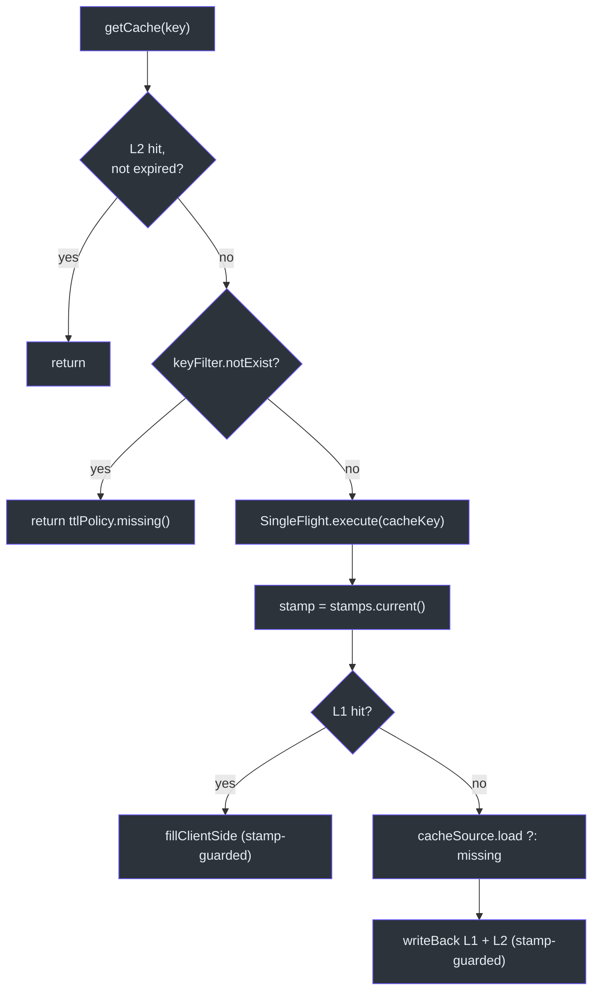
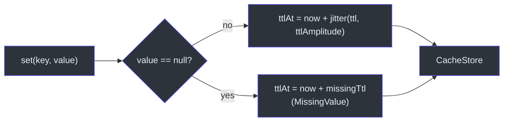
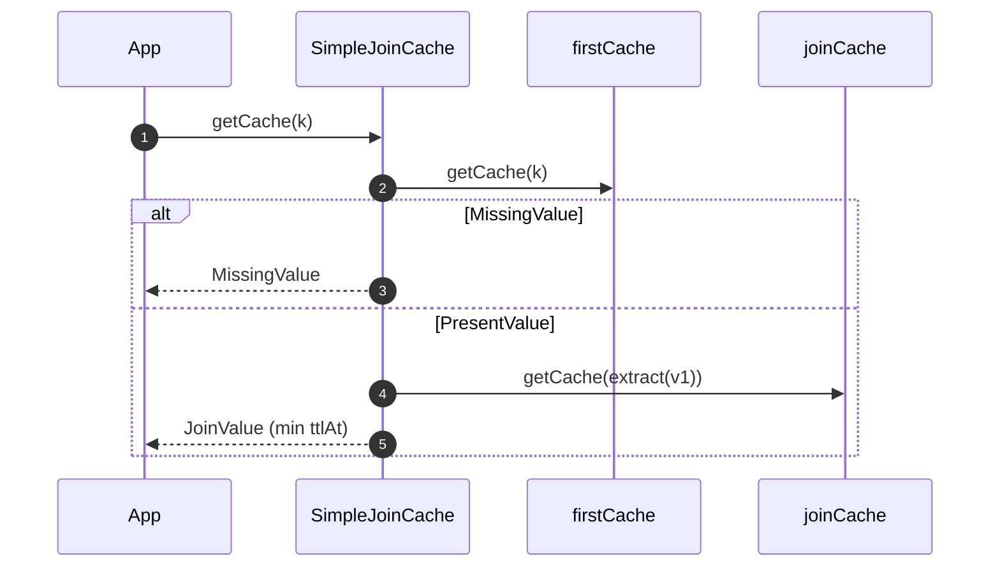

# cocache-core

`cocache-core` 在不依赖 Spring 和 Redis 的前提下实现 CoCache 契约。运行时依赖为 `cocache-api`、Caffeine（默认 L2）、Spring Expression（SpEL key）、kotlin-logging 和 CosId（clientId）。Guava 仅作为 compile-only 依赖，供 `BloomKeyFilter` 使用。

## 包概览

| 包 | 关键类型 | 源码 |
|----|----------|------|
| `me.ahoo.cache` | `TtlPolicy`、`CacheFactory` | [cache/](https://github.com/Ahoo-Wang/CoCache/tree/main/cocache-core/src/main/kotlin/me/ahoo/cache) |
| `me.ahoo.cache.consistency` | `CoherentCache`、`DefaultCoherentCache`、`CoherentCacheConfiguration`、`DefaultCoherentCacheFactory`、`InvalidationStamps`（internal）、`LocalCacheEvictedEventBus`、`NoOpCacheEvictedEventBus` | [consistency/](https://github.com/Ahoo-Wang/CoCache/tree/main/cocache-core/src/main/kotlin/me/ahoo/cache/consistency) |
| `me.ahoo.cache.concurrent` | `SingleFlight` | [concurrent/](https://github.com/Ahoo-Wang/CoCache/tree/main/cocache-core/src/main/kotlin/me/ahoo/cache/concurrent) |
| `me.ahoo.cache.client` | `CaffeineClientSideCache`、`MapClientSideCache`、`DefaultClientSideCacheFactory` | [client/](https://github.com/Ahoo-Wang/CoCache/tree/main/cocache-core/src/main/kotlin/me/ahoo/cache/client) |
| `me.ahoo.cache.distributed` | `InMemoryDistributedCache`、`DistributedCacheFactory` | [distributed/](https://github.com/Ahoo-Wang/CoCache/tree/main/cocache-core/src/main/kotlin/me/ahoo/cache/distributed) |
| `me.ahoo.cache.converter` | `ToStringKeyConverter`、`ExpKeyConverter`、`DefaultKeyConverterFactory` | [converter/](https://github.com/Ahoo-Wang/CoCache/tree/main/cocache-core/src/main/kotlin/me/ahoo/cache/converter) |
| `me.ahoo.cache.filter` | `BloomKeyFilter` | [filter/](https://github.com/Ahoo-Wang/CoCache/tree/main/cocache-core/src/main/kotlin/me/ahoo/cache/filter) |
| `me.ahoo.cache.annotation` | `CoCacheMetadata(Parser)`、`JoinCacheMetadata(Parser)` | [annotation/](https://github.com/Ahoo-Wang/CoCache/tree/main/cocache-core/src/main/kotlin/me/ahoo/cache/annotation) |
| `me.ahoo.cache.proxy` | `CacheInvocationHandler`、`DefaultCacheProxyFactory`、`CacheDelegated`、`CacheMetadataCapable` | [proxy/](https://github.com/Ahoo-Wang/CoCache/tree/main/cocache-core/src/main/kotlin/me/ahoo/cache/proxy) |
| `me.ahoo.cache.join` | `SimpleJoinCache`、`ExpJoinKeyExtractor`、`DefaultJoinCacheProxyFactory` | [join/](https://github.com/Ahoo-Wang/CoCache/tree/main/cocache-core/src/main/kotlin/me/ahoo/cache/join) |
| `me.ahoo.cache.util` | `ClientIdGenerator`（UUID / 主机） | [util/](https://github.com/Ahoo-Wang/CoCache/tree/main/cocache-core/src/main/kotlin/me/ahoo/cache/util) |

## DefaultCoherentCache

```mermaid
flowchart TD
    get["getCache(key)"] --> l2{"L2 hit,<br>not expired?"}
    l2 -->|yes| ret["return"]
    l2 -->|no| filter{"keyFilter.notExist?"}
    filter -->|yes| missing["return ttlPolicy.missing()"]
    filter -->|no| flight["SingleFlight.execute(cacheKey)"]
    flight --> stamp["stamp = stamps.current()"]
    stamp --> l1{"L1 hit?"}
    l1 -->|yes| fill["fillClientSide (stamp-guarded)"]
    l1 -->|no| load["cacheSource.load ?: missing"]
    load --> wb["writeBack L1 + L2 (stamp-guarded)"]

    style get fill:#2d333b,stroke:#6d5dfc,color:#e6edf3
    style l2 fill:#2d333b,stroke:#6d5dfc,color:#e6edf3
    style ret fill:#2d333b,stroke:#6d5dfc,color:#e6edf3
    style filter fill:#2d333b,stroke:#6d5dfc,color:#e6edf3
    style missing fill:#2d333b,stroke:#6d5dfc,color:#e6edf3
    style flight fill:#2d333b,stroke:#6d5dfc,color:#e6edf3
    style stamp fill:#2d333b,stroke:#6d5dfc,color:#e6edf3
    style l1 fill:#2d333b,stroke:#6d5dfc,color:#e6edf3
    style fill fill:#2d333b,stroke:#6d5dfc,color:#e6edf3
    style load fill:#2d333b,stroke:#6d5dfc,color:#e6edf3
    style wb fill:#2d333b,stroke:#6d5dfc,color:#e6edf3
```

| 机制 | 保证 | 源码 |
|------|------|------|
| `SingleFlight` | 同一实例内，同一 key 同一时刻只做一次 L1 读取 + 回源；等待者获得 leader 的值或**原始异常**；同 key 重入快速失败 | [SingleFlight.kt](https://github.com/Ahoo-Wang/CoCache/blob/main/cocache-core/src/main/kotlin/me/ahoo/cache/concurrent/SingleFlight.kt) |
| `InvalidationStamps` | 与该 key 任意失效（本地 `evict`/`setCache`、远端 `onEvicted`、`onReset`）重叠的写回会被跳过或撤销 | [InvalidationStamps.kt](https://github.com/Ahoo-Wang/CoCache/blob/main/cocache-core/src/main/kotlin/me/ahoo/cache/consistency/InvalidationStamps.kt) |
| `onReset` | 通道（重新）订阅时清空 L2 并使全部戳失效 | [DefaultCoherentCache.kt](https://github.com/Ahoo-Wang/CoCache/blob/main/cocache-core/src/main/kotlin/me/ahoo/cache/consistency/DefaultCoherentCache.kt) |
| `close()` | 幂等：注销订阅、关闭 L1 | [DefaultCoherentCache.kt](https://github.com/Ahoo-Wang/CoCache/blob/main/cocache-core/src/main/kotlin/me/ahoo/cache/consistency/DefaultCoherentCache.kt) |

### CoherentCacheConfiguration

| 字段 | 默认值 | 说明 |
|------|--------|------|
| `cacheName` | -- | 事件频道与逻辑名称 |
| `clientId` | -- | 用于识别自身发布的事件 |
| `keyConverter` | -- | 业务 key → 存储 key |
| `distributedCache` | -- | L1 |
| `clientSideCache` | `CaffeineClientSideCache.build()` | L2 |
| `cacheSource` | `CacheSource.noOp()` | L0 |
| `keyFilter` | `KeyFilter.NO_OP` | 存在性过滤 |
| `ttlPolicy` | `TtlPolicy()`（3600 / 60 / 60） | 命中值与负缓存的 TTL |

## TTL 策略

```mermaid
graph LR
    V["set(key, value)"] --> P{"value == null?"}
    P -->|no| T["ttlAt = now + jitter(ttl, ttlAmplitude)"]
    P -->|yes| M["ttlAt = now + missingTtl<br>(MissingValue)"]
    T --> S["CacheStore"]
    M --> S

    style V fill:#2d333b,stroke:#6d5dfc,color:#e6edf3
    style P fill:#2d333b,stroke:#6d5dfc,color:#e6edf3
    style T fill:#2d333b,stroke:#6d5dfc,color:#e6edf3
    style M fill:#2d333b,stroke:#6d5dfc,color:#e6edf3
    style S fill:#2d333b,stroke:#6d5dfc,color:#e6edf3
```

抖动后的 TTL 钳为正数；把 `ttl` 设为 `TtlAt.FOREVER` 表示永不过期。时间取自 `System.currentTimeMillis()`，精度为秒，不再使用后台时钟线程。

## L2 实现

| 类 | 说明 | 源码 |
|----|------|------|
| `CaffeineClientSideCache` | 默认实现。`build(maximumSize = 10_000, initialCapacity, expireAfterAccess)`；`TtlAtExpiry` 让每个条目在自身 `ttlAt` 到期（如设置了 `expireAfterAccess`，取两者较早者） | [CaffeineClientSideCache.kt](https://github.com/Ahoo-Wang/CoCache/blob/main/cocache-core/src/main/kotlin/me/ahoo/cache/client/CaffeineClientSideCache.kt) |
| `MapClientSideCache` | 无界 `ConcurrentHashMap`；仅用于测试或 key 集合固定且较小的场景 | [MapClientSideCache.kt](https://github.com/Ahoo-Wang/CoCache/blob/main/cocache-core/src/main/kotlin/me/ahoo/cache/client/MapClientSideCache.kt) |

## 代理与 Join

- `CacheInvocationHandler` 同时服务 `@CoCache` 与 `@JoinCacheable` 代理，解包 `InvocationTargetException`，并以身份语义实现 `equals`/`hashCode`。见[代理与注解](../architecture/proxy.md)。
- `SimpleJoinCache` 组合两个 `Cache`，但不持有它们的生命周期。`evict(key)` 只淘汰主缓存；主值为负缓存时返回 `MissingValue`。

```mermaid
sequenceDiagram
autonumber
    participant App
    participant SJC as SimpleJoinCache
    participant F as firstCache
    participant J as joinCache
    App->>SJC: getCache(k)
    SJC->>F: getCache(k)
    alt MissingValue
        SJC-->>App: MissingValue
    else PresentValue
        SJC->>J: getCache(extract(v1))
        SJC-->>App: JoinValue (min ttlAt)
    end
```

## 相关页面

- [cocache-api](./cocache-api.md)
- [缓存层级](../architecture/cache-layers.md)
- [缓存一致性](../architecture/coherence.md)
