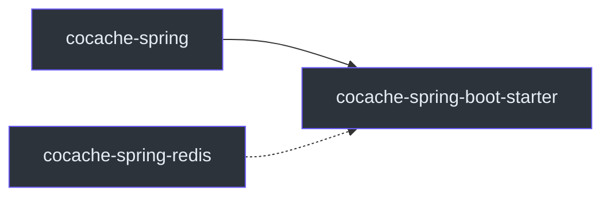

# cocache-spring-boot-starter

`cocache-spring-boot-starter` 模块提供 Spring Boot 自动配置，自动注册所有 CoCache 组件并提供 Actuator 端点。

## 依赖关系



主要依赖：
- `cocache-spring`
- `cocache-spring-redis`
- `cocache-spring-cache`
- Spring Boot Starter
- Spring Boot Actuator

## 包结构

```
me.ahoo.cache.spring.boot.starter
├── CoCacheAutoConfiguration.kt       # 自动配置类
├── CoCacheProperties.kt              # 配置属性
├── ConditionalOnCoCacheEnabled.kt    # 条件注解
├── EnabledSuffix.kt                  # Bean 名称后缀
├── AbstractCoCacheEndpoint.kt        # 端点基类
├── CoCacheEndpoint.kt                # 缓存端点
├── CoCacheClientEndpoint.kt          # 客户端端点
└── CoCacheEndpointAutoConfiguration.kt # 端点自动配置
```

## CoCacheAutoConfiguration

自动配置核心类，注册所有 CoCache 组件。

```kotlin
@AutoConfiguration(after = [DataRedisAutoConfiguration::class])
@ConditionalOnCoCacheEnabled
@EnableConfigurationProperties(CoCacheProperties::class)
class CoCacheAutoConfiguration {
    // 注册所有 Bean
}
```

### 自动注册的 Bean

| Bean | 条件 | 说明 |
|------|------|------|
| `ClientIdGenerator` | `@ConditionalOnMissingBean` | 默认使用主机名 |
| `CacheFactory` | `@ConditionalOnMissingBean` | SpringCacheFactory |
| `CoCacheManager` | 无 | Spring Cache 桥接 |
| `RedisMessageListenerContainer` | `@ConditionalOnSingleCandidate` | Redis 消息监听 |
| `CacheEvictedEventBus` | `@ConditionalOnMissingBean` | RedisCacheEvictedEventBus |
| `CoherentCacheFactory` | `@ConditionalOnMissingBean` | DefaultCoherentCacheFactory |
| `CacheSourceFactory` | `@ConditionalOnMissingBean` | SpringCacheSourceFactory |
| `ClientSideCacheFactory` | `@ConditionalOnMissingBean` | SpringClientSideCacheFactory |
| `DistributedCacheFactory` | `@ConditionalOnMissingBean` | RedisDistributedCacheFactory |
| `KeyConverterFactory` | `@ConditionalOnMissingBean` | SpringKeyConverterFactory |
| `CacheProxyFactory` | `@ConditionalOnMissingBean` | DefaultCacheProxyFactory |
| `JoinKeyExtractorFactory` | `@ConditionalOnMissingBean` | SpringJoinKeyExtractorFactory |
| `JoinCacheProxyFactory` | `@ConditionalOnMissingBean` | DefaultJoinCacheProxyFactory |

**源码参考**：[`cocache-spring-boot-starter/.../CoCacheAutoConfiguration.kt`](https://github.com/Ahoo-Wang/CoCache/blob/main/cocache-spring-boot-starter/src/main/kotlin/me/ahoo/cache/spring/boot/starter/CoCacheAutoConfiguration.kt)

## CoCacheProperties

配置属性类，前缀为 `cocache`。

```yaml
cocache:
  enabled: true  # 是否启用 CoCache，默认 true
```

**源码参考**：[`cocache-spring-boot-starter/.../CoCacheProperties.kt`](https://github.com/Ahoo-Wang/CoCache/blob/main/cocache-spring-boot-starter/src/main/kotlin/me/ahoo/cache/spring/boot/starter/CoCacheProperties.kt)

## Actuator 端点

### CoCacheEndpoint

端点 ID：`cocache`，提供缓存统计、查询和驱逐功能。

### CoCacheClientEndpoint

端点 ID：`cocacheClient`，提供客户端缓存统计。

详细说明参阅 [Actuator 端点](../api/actuator.md)。

**源码参考**：[`cocache-spring-boot-starter/.../CoCacheEndpoint.kt`](https://github.com/Ahoo-Wang/CoCache/blob/main/cocache-spring-boot-starter/src/main/kotlin/me/ahoo/cache/spring/boot/starter/CoCacheEndpoint.kt)

## CosId 集成

如果 classpath 中存在 CosId 的 `HostAddressSupplier`，自动配置会使用 CosId 生成客户端 ID：

```kotlin
@Configuration
@ConditionalOnClass(HostAddressSupplier::class)
class CosIdHostAddressSupplierAutoConfiguration {
    @Bean
    @ConditionalOnBean(HostAddressSupplier::class)
    fun inetUtilsHostClientIdGenerator(hostAddressSupplier: HostAddressSupplier): ClientIdGenerator {
        return HostClientIdGenerator { hostAddressSupplier.hostAddress }
    }
}
```

## 快速开始

```kotlin
// 1. 添加依赖
// implementation("me.ahoo.cococache:cocache-spring-boot-starter")

// 2. 配置 application.yaml
// spring.data.redis.host=localhost
// cocache.enabled=true

// 3. 定义缓存接口
@CoCache(keyPrefix = "user:", ttl = 120)
interface UserCache : Cache<String, User>

// 4. 启用
@EnableCoCache(caches = [UserCache::class])
@SpringBootApplication
class App
```

## 相关页面

- [配置指南](../guide/configuration.md) - 配置参数
- [Actuator 端点](../api/actuator.md) - 监控端点
- [cocache-spring](./cocache-spring.md) - Spring 集成模块
- [cocache-spring-redis](./cocache-spring-redis.md) - Redis 实现模块
