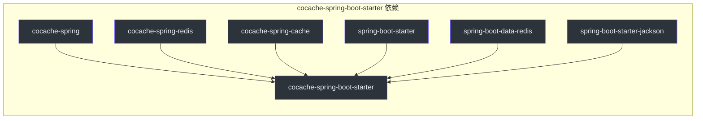
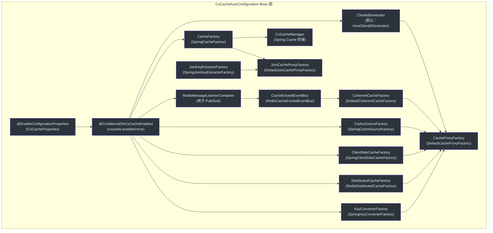
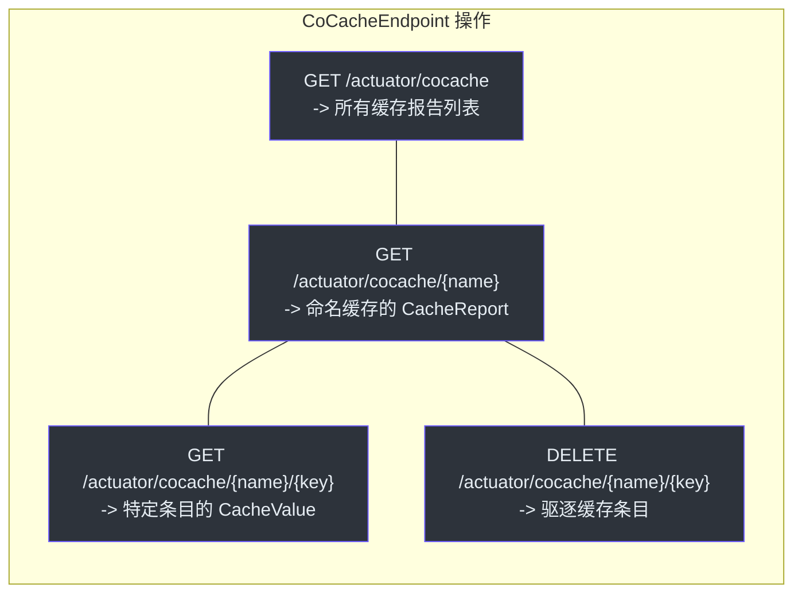
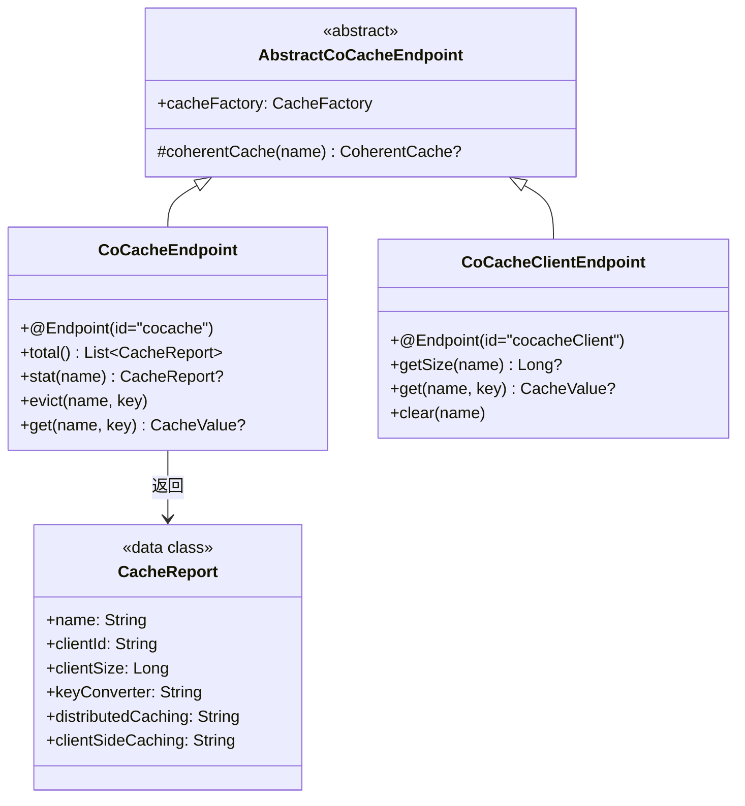
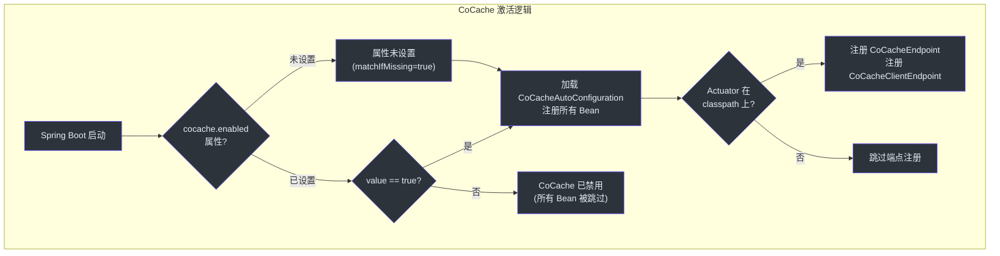
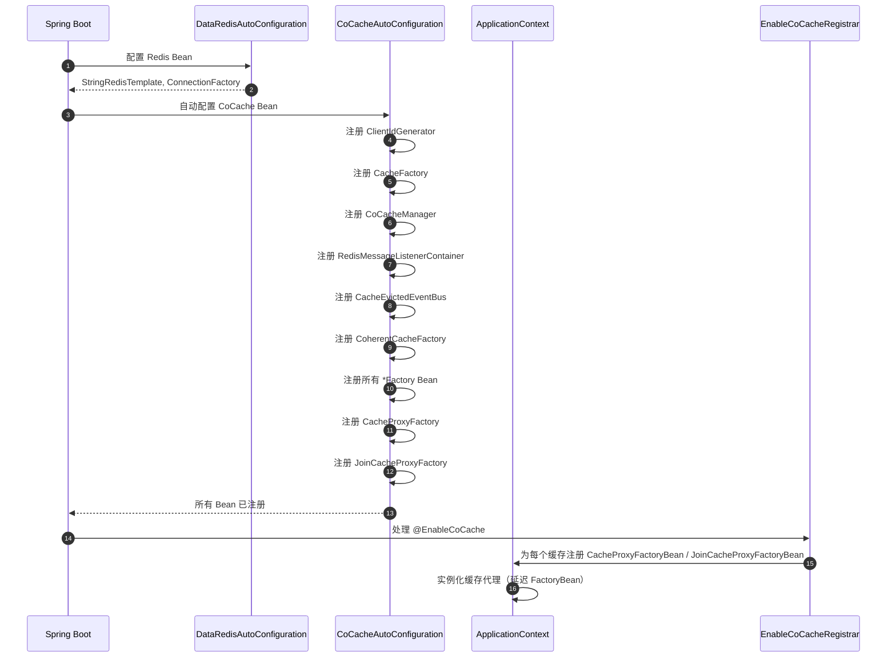

# cocache-spring-boot-starter 模块

`cocache-spring-boot-starter` 模块为 Spring Boot 应用中的 CoCache 提供零配置设置。它自动注册所有必需的 Bean（工厂、事件总线、一致性缓存工厂、代理工厂、缓存管理器），并暴露 Spring Boot Actuator 端点用于运行时缓存检查和管理。

## 模块依赖



## 源文件（8 个文件）

| 文件 | 包 | 说明 |
|------|-----|------|
| [CoCacheAutoConfiguration.kt](https://github.com/Ahoo-Wang/CoCache/blob/main/cocache-spring-boot-starter/src/main/kotlin/me/ahoo/cache/spring/boot/starter/CoCacheAutoConfiguration.kt#L61) | `...boot.starter` | 主自动配置类，注册所有 Bean |
| [CoCacheProperties.kt](https://github.com/Ahoo-Wang/CoCache/blob/main/cocache-spring-boot-starter/src/main/kotlin/me/ahoo/cache/spring/boot/starter/CoCacheProperties.kt#L23) | `...boot.starter` | `cocache.*` 前缀下的配置属性 |
| [ConditionalOnCoCacheEnabled.kt](https://github.com/Ahoo-Wang/CoCache/blob/main/cocache-spring-boot-starter/src/main/kotlin/me/ahoo/cache/spring/boot/starter/ConditionalOnCoCacheEnabled.kt#L23) | `...boot.starter` | 启用/禁用 CoCache 的条件注解 |
| [EnabledSuffix.kt](https://github.com/Ahoo-Wang/CoCache/blob/main/cocache-spring-boot-starter/src/main/kotlin/me/ahoo/cache/spring/boot/starter/EnabledSuffix.kt#L20) | `...boot.starter` | `.enabled` 后缀常量 |
| [CoCacheEndpoint.kt](https://github.com/Ahoo-Wang/CoCache/blob/main/cocache-spring-boot-starter/src/main/kotlin/me/ahoo/cache/spring/boot/starter/CoCacheEndpoint.kt#L27) | `...boot.starter` | 缓存统计和管理的 Actuator 端点 |
| [CoCacheClientEndpoint.kt](https://github.com/Ahoo-Wang/CoCache/blob/main/cocache-spring-boot-starter/src/main/kotlin/me/ahoo/cache/spring/boot/starter/CoCacheClientEndpoint.kt#L25) | `...boot.starter` | 客户端（L2）缓存检查的 Actuator 端点 |
| [AbstractCoCacheEndpoint.kt](https://github.com/Ahoo-Wang/CoCache/blob/main/cocache-spring-boot-starter/src/main/kotlin/me/ahoo/cache/spring/boot/starter/AbstractCoCacheEndpoint.kt#L19) | `...boot.starter` | 缓存端点的基类 |
| [CoCacheEndpointAutoConfiguration.kt](https://github.com/Ahoo-Wang/CoCache/blob/main/cocache-spring-boot-starter/src/main/kotlin/me/ahoo/cache/spring/boot/starter/CoCacheEndpointAutoConfiguration.kt#L27) | `...boot.starter` | Actuator 端点的自动配置 |

## 自动配置注册

CoCache 使用 Spring Boot 标准的 `AutoConfiguration.imports` 机制：

**文件**：`META-INF/spring/org.springframework.boot.autoconfigure.AutoConfiguration.imports`

```
me.ahoo.cache.spring.boot.starter.CoCacheAutoConfiguration
me.ahoo.cache.spring.boot.starter.CoCacheEndpointAutoConfiguration
```

## CoCacheAutoConfiguration -- Bean 装配

[CoCacheAutoConfiguration](https://github.com/Ahoo-Wang/CoCache/blob/main/cocache-spring-boot-starter/src/main/kotlin/me/ahoo/cache/spring/boot/starter/CoCacheAutoConfiguration.kt#L61) 是主自动配置类，使用 `@AutoConfiguration(after = [DataRedisAutoConfiguration::class])` 注解，确保 Redis 先被配置。



### 完整 Bean 列表

| Bean | 类型 | 条件 | 默认实现 |
|------|------|------|----------|
| `defaultHostClientIdGenerator` | `ClientIdGenerator` | `@ConditionalOnMissingBean(ClientIdGenerator, HostAddressSupplier)` | `ClientIdGenerator.HOST` |
| `cacheFactory` | `CacheFactory` | `@ConditionalOnMissingBean` | `SpringCacheFactory` |
| `coCacheManager` | `CoCacheManager` | （始终注册） | `CoCacheManager(cacheFactory)` |
| `cocacheRedisMessageListenerContainer` | `RedisMessageListenerContainer` | `@ConditionalOnMissingBean`、`@ConditionalOnSingleCandidate(RedisConnectionFactory)` | 使用 `redisConnectionFactory` 的容器 |
| `cacheEvictedEventBus` | `CacheEvictedEventBus` | `@ConditionalOnMissingBean` | `RedisCacheEvictedEventBus` |
| `coherentCacheFactory` | `CoherentCacheFactory` | `@ConditionalOnMissingBean` | `DefaultCoherentCacheFactory` |
| `cacheSourceFactory` | `CacheSourceFactory` | `@ConditionalOnMissingBean` | `SpringCacheSourceFactory` |
| `clientSideCacheFactory` | `ClientSideCacheFactory` | `@ConditionalOnMissingBean` | `SpringClientSideCacheFactory` |
| `distributedCacheFactory` | `DistributedCacheFactory` | `@ConditionalOnMissingBean` | `RedisDistributedCacheFactory` |
| `keyConverterFactory` | `KeyConverterFactory` | `@ConditionalOnMissingBean` | `SpringKeyConverterFactory` |
| `cacheProxyFactory` | `CacheProxyFactory` | `@ConditionalOnMissingBean` | `DefaultCacheProxyFactory` |
| `joinKeyExtractorFactory` | `JoinKeyExtractorFactory` | `@ConditionalOnMissingBean` | `SpringJoinKeyExtractorFactory` |
| `joinCacheProxyFactory` | `JoinCacheProxyFactory` | `@ConditionalOnMissingBean` | `DefaultJoinCacheProxyFactory` |

每个 Bean 都标注了 `@ConditionalOnMissingBean`，允许用户通过简单地声明自己的 Bean 来覆盖任何组件。

## CoCacheProperties

[CoCacheProperties](https://github.com/Ahoo-Wang/CoCache/blob/main/cocache-spring-boot-starter/src/main/kotlin/me/ahoo/cache/spring/boot/starter/CoCacheProperties.kt#L23) 映射到 `cocache.*` 前缀：

| 属性 | 类型 | 默认值 | 说明 |
|------|------|--------|------|
| `cocache.enabled` | `Boolean` | `true` | 启用/禁用 CoCache 的主开关 |

```yaml
# application.yml
cocache:
  enabled: true  # 设置为 false 可禁用所有 CoCache Bean
```

## @ConditionalOnCoCacheEnabled

[@ConditionalOnCoCacheEnabled](https://github.com/Ahoo-Wang/CoCache/blob/main/cocache-spring-boot-starter/src/main/kotlin/me/ahoo/cache/spring/boot/starter/ConditionalOnCoCacheEnabled.kt#L23) 是一个组合注解，检查 `cocache.enabled=true`。它使用 `matchIfMissing = true`，因此当属性未设置时 CoCache 默认启用。

## Actuator 端点

### CoCacheEndpoint (`/actuator/cocache`)

[CoCacheEndpoint](https://github.com/Ahoo-Wang/CoCache/blob/main/cocache-spring-boot-starter/src/main/kotlin/me/ahoo/cache/spring/boot/starter/CoCacheEndpoint.kt#L27) 提供全面的缓存管理：



端点返回的 `CacheReport` 数据类包含：

| 字段 | 说明 |
|------|------|
| `name` | 缓存名称 |
| `clientId` | 当前实例的客户端 ID |
| `clientSize` | L2 客户端缓存中的条目数量 |
| `keyConverter` | 键转换器的 `toString()` |
| `distributedCaching` | 分布式缓存的全限定类名 |
| `clientSideCaching` | 客户端缓存的全限定类名 |
| `cacheEvictedEventBus` | 事件总线的全限定类名 |
| `cacheSource` | 缓存数据源的全限定类名 |
| `keyFilter` | 键过滤器的全限定类名 |

### CoCacheClientEndpoint (`/actuator/cocacheClient`)

[CoCacheClientEndpoint](https://github.com/Ahoo-Wang/CoCache/blob/main/cocache-spring-boot-starter/src/main/kotlin/me/ahoo/cache/spring/boot/starter/CoCacheClientEndpoint.kt#L25) 提供 L2（客户端）缓存检查：

| 操作 | HTTP | 说明 |
|------|------|------|
| `getSize` | `GET /actuator/cocacheClient/{name}` | 返回 L2 客户端缓存的大小 |
| `get` | `GET /actuator/cocacheClient/{name}/{key}` | 返回特定键（经过键转换后）的 L2 缓存值 |
| `clear` | `DELETE /actuator/cocacheClient/{name}` | 清除指定缓存的整个 L2 客户端缓存 |

### 端点自动配置

[CoCacheEndpointAutoConfiguration](https://github.com/Ahoo-Wang/CoCache/blob/main/cocache-spring-boot-starter/src/main/kotlin/me/ahoo/cache/spring/boot/starter/CoCacheEndpointAutoConfiguration.kt#L27) 以 classpath 上存在 `Endpoint`（即包含 Spring Boot Actuator）为条件。它注册两个端点 Bean。

## 端点类层次结构



## 启用/禁用决策流程



## CosID 集成

自动配置在 [CoCacheAutoConfiguration.kt:176](https://github.com/Ahoo-Wang/CoCache/blob/main/cocache-spring-boot-starter/src/main/kotlin/me/ahoo/cache/spring/boot/starter/CoCacheAutoConfiguration.kt#L176) 包含一个嵌套的 `CosIdHostAddressSupplierAutoConfiguration` 类，当 [CosID](https://github.com/Ahoo-Wang/CosID) 可用时进行集成。如果存在来自 CosID 的 `HostAddressSupplier` Bean，它会创建一个使用 CosID 主机地址解析的 `HostClientIdGenerator`。

## 启动序列



## 在 Spring Boot 应用中启用 CoCache

最小化设置：

```kotlin
// 1. 添加依赖 (build.gradle.kts)
dependencies {
    implementation("me.ahoo.cococache:cocache-spring-boot-starter")
}

// 2. 定义缓存接口
@CoCache(name = "userCache", keyPrefix = "user:", ttl = 3600)
interface UserCache : Cache<String, User>

// 3. 启用 CoCache
@EnableCoCache(caches = [UserCache::class])
@SpringBootApplication
class MyApplication
```

自动配置会处理其余所有事情：Redis 连接、事件总线、代理创建和缓存管理器注册。

## 相关页面

- [模块概览](./index.md) -- 依赖关系图和模块说明
- [cocache-spring](./cocache-spring.md) -- @EnableCoCache 和 AbstractCacheFactory
- [cocache-spring-redis](./cocache-spring-redis.md) -- Redis 分布式缓存和事件总线
- [cocache-spring-cache](./cocache-spring-cache.md) -- Spring Cache 桥接（CoCacheManager）
