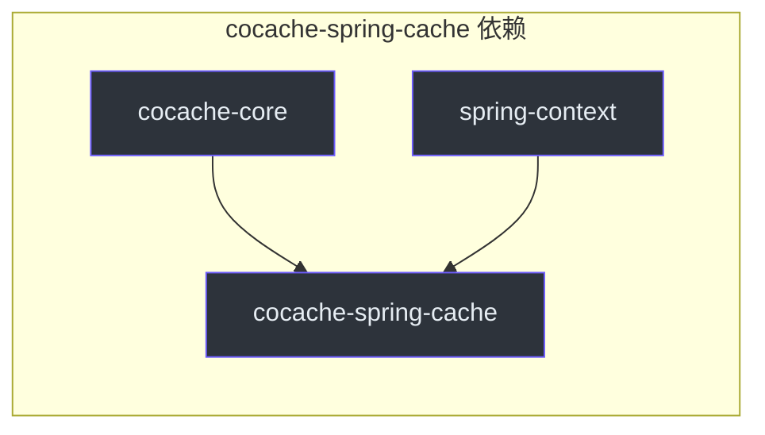
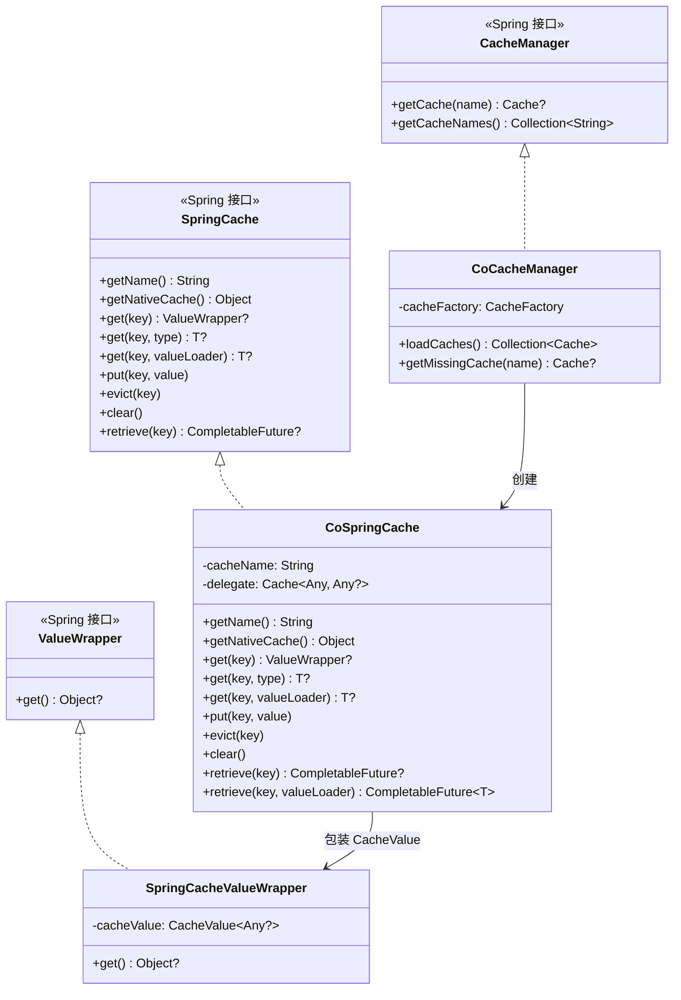
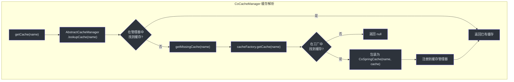
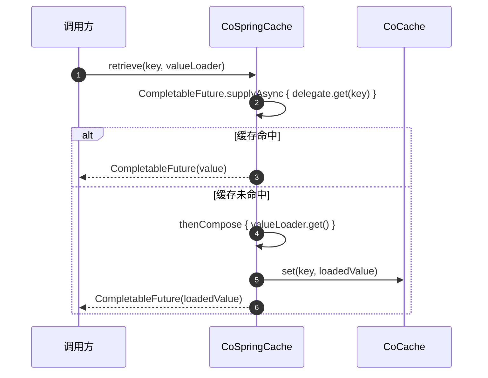
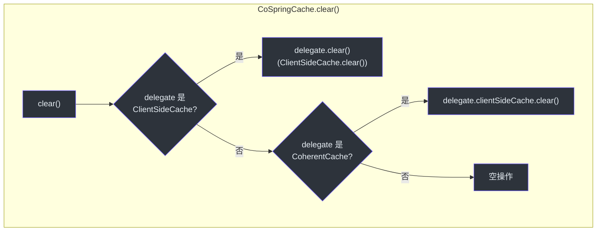
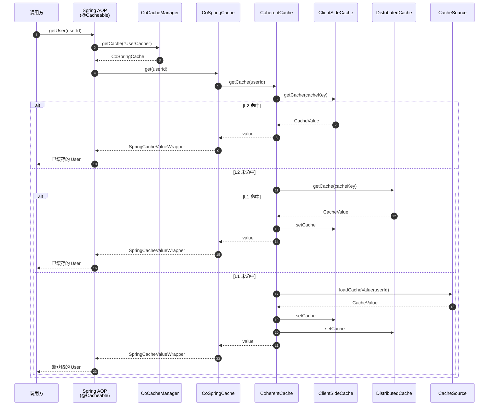

# cocache-spring-cache 模块

`cocache-spring-cache` 模块实现了 CoCache 与 Spring 的 `org.springframework.cache.CacheManager` 抽象之间的桥接。配置完成后，所有 CoCache 管理的缓存都可以通过 Spring 标准的 `@Cacheable`、`@CachePut` 和 `@CacheEvict` 注解访问，实现与现有 Spring Cache 基础设施的无缝集成。

## 模块依赖



## 源文件（3 个文件）

| 文件 | 包 | 用途 |
|------|-----|------|
| [CoCacheManager.kt](https://github.com/Ahoo-Wang/CoCache/blob/main/cocache-spring-cache/src/main/kotlin/me/ahoo/cache/spring/cache/CoCacheManager.kt#L21) | `me.ahoo.cache.spring.cache` | 由 CoCache 的 `CacheFactory` 支持的 Spring `CacheManager` |
| [CoSpringCache.kt](https://github.com/Ahoo-Wang/CoCache/blob/main/cocache-spring-cache/src/main/kotlin/me/ahoo/cache/spring/cache/CoSpringCache.kt#L27) | `me.ahoo.cache.spring.cache` | 包装 CoCache `Cache` 实例的 Spring `Cache` 适配器 |
| [SpringCacheValueWrapper.kt](https://github.com/Ahoo-Wang/CoCache/blob/main/cocache-spring-cache/src/main/kotlin/me/ahoo/cache/spring/cache/SpringCacheValueWrapper.kt#L19) | `me.ahoo.cache.spring.cache` | `CacheValue` 的 `Cache.ValueWrapper` 适配器 |

## 架构概览



## CoCacheManager

[CoCacheManager](https://github.com/Ahoo-Wang/CoCache/blob/main/cocache-spring-cache/src/main/kotlin/me/ahoo/cache/spring/cache/CoCacheManager.kt#L21) 继承 Spring 的 `AbstractCacheManager`，并委托给 CoCache 的 `CacheFactory` 进行缓存解析。

### 缓存解析策略



### loadCaches()

[CoCacheManager.kt:23](https://github.com/Ahoo-Wang/CoCache/blob/main/cocache-spring-cache/src/main/kotlin/me/ahoo/cache/spring/cache/CoCacheManager.kt#L23) 中的 `loadCaches()` 方法在启动时从 `CacheFactory` 急切加载所有已注册的缓存，并将每个缓存包装在 `CoSpringCache` 中。这使得缓存管理器在启动时就填充了所有已知缓存。

## CoSpringCache

[CoSpringCache](https://github.com/Ahoo-Wang/CoCache/blob/main/cocache-spring-cache/src/main/kotlin/me/ahoo/cache/spring/cache/CoSpringCache.kt#L27) 将 CoCache `Cache<Any, Any?>` 适配为 Spring 的 `Cache` 接口。它实现了 `CacheDelegated` 和 `NamedCache`，以访问底层的 CoCache 基础设施。

### 方法映射

| Spring Cache 方法 | CoSpringCache 实现 | CoCache 操作 |
|-------------------|-------------------|-------------|
| `getName()` | 返回 `cacheName` | -- |
| `getNativeCache()` | 返回代理 `Cache` | -- |
| `get(key)` | `delegate.getCache(key)` -> `SpringCacheValueWrapper` | `CacheGetter.getCache()` |
| `get(key, type)` | `delegate.get(key)` 转换为 `T` | `CacheGetter.get()` |
| `get(key, valueLoader)` | 获取或加载模式 | 获取 -> 如果为 null，调用 `valueLoader.call()`，设置，返回 |
| `put(key, value)` | `delegate.set(key, value)` | `CacheSetter.set()` |
| `evict(key)` | `delegate.evict(key)` | `CacheSetter.evict()` |
| `clear()` | `ClientSideCache.clear()` 或 `CoherentCache.clientSideCache.clear()` | 仅 L2 |
| `retrieve(key)` | `CompletableFuture.supplyAsync { delegate.get(key) }` | 异步获取 |
| `retrieve(key, valueLoader)` | 使用 `thenCompose` 的异步获取或加载 | 异步获取 -> 如果为空则加载 |

### 异步 Retrieve 支持

CoSpringCache 支持 Spring 6.1 的 `Cache.retrieve()` 方法，用于异步缓存访问：



[CoSpringCache.kt:82](https://github.com/Ahoo-Wang/CoCache/blob/main/cocache-spring-cache/src/main/kotlin/me/ahoo/cache/spring/cache/CoSpringCache.kt#L82) 中的 `retrieve(key, valueLoader)` 实现使用 `CompletableFuture.thenCompose()` 将缓存检查与值加载器链接起来，避免在缓存未命中时阻塞调用方线程。

### Clear 行为

[CoSpringCache.kt:66](https://github.com/Ahoo-Wang/CoCache/blob/main/cocache-spring-cache/src/main/kotlin/me/ahoo/cache/spring/cache/CoSpringCache.kt#L66) 中的 `clear()` 方法仅清除 L2（客户端）缓存，不清除 L1（分布式）缓存。这是有意为之的——清除分布式缓存会影响所有实例，这通常不是期望的行为。



## SpringCacheValueWrapper

[SpringCacheValueWrapper](https://github.com/Ahoo-Wang/CoCache/blob/main/cocache-spring-cache/src/main/kotlin/me/ahoo/cache/spring/cache/SpringCacheValueWrapper.kt#L19) 是从 CoCache 的 `CacheValue<Any?>` 到 Spring 的 `Cache.ValueWrapper` 的最小适配器。`get()` 方法返回 `cacheValue.value`，对于缺失守卫值可能为 `null`。

## 与 Spring Cache 注解配合使用

一旦 `CoCacheManager` 注册为 Bean（由 `cocache-spring-boot-starter` 自动完成），标准的 Spring Cache 注解即可开箱即用：

```kotlin
@Service
class UserService(
    private val userRepository: UserRepository
) {
    @Cacheable(cacheNames = ["UserCache"], key = "#userId")
    fun getUser(userId: String): User {
        return userRepository.findById(userId).orElseThrow()
    }

    @CachePut(cacheNames = ["UserCache"], key = "#user.id")
    fun updateUser(user: User): User {
        return userRepository.save(user)
    }

    @CacheEvict(cacheNames = ["UserCache"], key = "#userId")
    fun deleteUser(userId: String) {
        userRepository.deleteById(userId)
    }

    @CacheEvict(cacheNames = ["UserCache"], allEntries = true)
    fun clearAllUsers() {
        // 仅清除 L2，通过 CoSpringCache.clear()
    }
}
```

这种方式可以与 CoCache 原生的基于代理的缓存机制并行工作——两种机制共享相同的底层 `CoherentCache` 实例，因此通过任一路径的缓存操作都是一致的。

## 数据流：@Cacheable 通过 CoSpringCache 的完整路径



## 自动配置中的注册

`CoCacheManager` Bean 在 [CoCacheAutoConfiguration.kt:81](https://github.com/Ahoo-Wang/CoCache/blob/main/cocache-spring-boot-starter/src/main/kotlin/me/ahoo/cache/spring/boot/starter/CoCacheAutoConfiguration.kt#L81) 中注册：

```kotlin
@Bean
fun coCacheManager(cacheFactory: CacheFactory): CoCacheManager {
    return CoCacheManager(cacheFactory)
}
```

在 Spring Boot 自动配置中，此 Bean 会自动创建。对于非 Boot 的 Spring 应用，用户必须手动注册 `CoCacheManager`：

```kotlin
@Configuration
@EnableCaching
class CacheConfig {
    @Bean
    fun cacheManager(cacheFactory: CacheFactory): CoCacheManager {
        return CoCacheManager(cacheFactory)
    }
}
```

## 相关页面

- [模块概览](./index.md) -- 依赖关系图和模块说明
- [cocache-core](./cocache-core.md) -- CoherentCache、Cache 接口、CacheFactory
- [cocache-spring](./cocache-spring.md) -- SpringCacheFactory（CacheFactory 的实现）
- [cocache-spring-boot-starter](./cocache-spring-boot-starter.md) -- 注册 CoCacheManager 的自动配置
