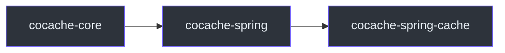

# cocache-spring-cache

`cocache-spring-cache` 模块将 CoCache 缓存接口适配为 Spring Cache 抽象（`org.springframework.cache.Cache` 和 `CacheManager`），使 CoCache 缓存可以配合 `@Cacheable`、`@CacheEvict` 等 Spring Cache 注解使用。

## 依赖关系



主要依赖：
- `cocache-spring`
- Spring Context（`spring-cache` 抽象）

## 包结构

```
me.ahoo.cache.spring.cache
├── CoCacheManager.kt          # Spring CacheManager 实现
├── CoSpringCache.kt           # Spring Cache 适配器
└── SpringCacheValueWrapper.kt # CacheValue 包装器
```

## CoCacheManager

Spring `CacheManager` 实现，通过 `CacheFactory` 获取缓存实例并包装为 `CoSpringCache`。

```kotlin
class CoCacheManager(private val cacheFactory: CacheFactory) : CacheManager {
    override fun getCache(name: String): Cache? {
        val cache = cacheFactory.getCache(name) ?: return null
        return CoSpringCache(cache)
    }

    override fun getCacheNames(): Collection<String> {
        return cacheFactory.caches.keys
    }
}
```

**源码参考**：[`cocache-spring-cache/.../CoCacheManager.kt`](https://github.com/Ahoo-Wang/CoCache/blob/main/cocache-spring-cache/src/main/kotlin/me/ahoo/cache/spring/cache/CoCacheManager.kt)

## CoSpringCache

将 CoCache `Cache<K, V>` 适配为 Spring `org.springframework.cache.Cache`。

```kotlin
class CoSpringCache(private val cache: Cache<*, *>) : org.springframework.cache.Cache {
    override fun getName(): String { ... }
    override fun getNativeCache(): Any { ... }
    override fun lookup(key: Any): Any? { ... }
    override fun put(key: Any, value: Any?) { ... }
    override fun evict(key: Any) { ... }
    override fun clear() { ... }
}
```

**源码参考**：[`cocache-spring-cache/.../CoSpringCache.kt`](https://github.com/Ahoo-Wang/CoCache/blob/main/cocache-spring-cache/src/main/kotlin/me/ahoo/cache/spring/cache/CoSpringCache.kt)

## 使用方式

### 启用 Spring Cache

```kotlin
@EnableCoCache(caches = [UserCache::class])
@EnableCaching
@SpringBootApplication
class AppServer
```

### 使用 Spring Cache 注解

```kotlin
@Service
class UserService {

    @Cacheable(value = ["UserCache"], key = "#userId")
    fun getUser(userId: String): User? {
        // 数据库查询
        return userRepository.findById(userId).orElse(null)
    }

    @CacheEvict(value = ["UserCache"], key = "#userId")
    fun evictUser(userId: String) {
        // 驱逐缓存
    }
}
```

### 两种使用方式的对比

| 方式 | 优点 | 缺点 |
|------|------|------|
| 直接注入缓存接口 | 类型安全、IDE 支持好 | 需要手动管理缓存 |
| Spring Cache 注解 | 声明式、与 AOP 集成 | 类型不安全、键为字符串 |

## 相关页面

- [Spring 集成](../api/spring-integration.md) - Spring 集成详解
- [cocache-spring](./cocache-spring.md) - Spring 集成模块
- [cocache-spring-boot-starter](./cocache-spring-boot-starter.md) - 自动配置模块
