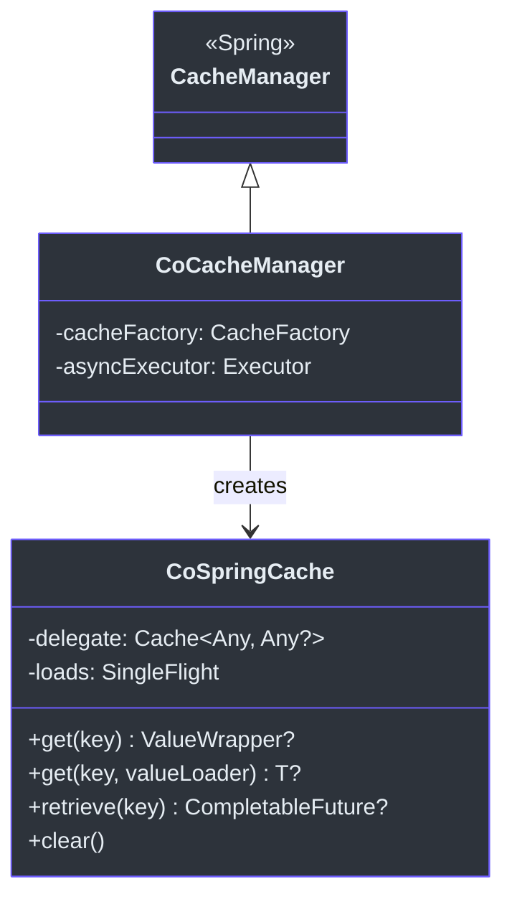
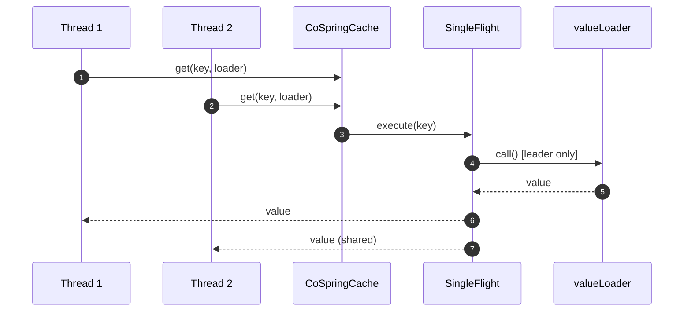

# cocache-spring-cache

本模块把 CoCache 缓存适配为 Spring 的 `CacheManager` / `Cache` 抽象，使 `@Cacheable`、`@CachePut`、`@CacheEvict` 与代理 API 运行在同一批 `CoherentCache` 实例上。

## 组件

| 类 | 职责 | 源码 |
|----|------|------|
| `CoCacheManager` | 基于 `CacheFactory` 的 `AbstractCacheManager`，把每个 CoCache bean 包装为 `CoSpringCache` | [CoCacheManager.kt](https://github.com/Ahoo-Wang/CoCache/blob/main/cocache-spring-cache/src/main/kotlin/me/ahoo/cache/spring/cache/CoCacheManager.kt) |
| `CoSpringCache` | 基于 `Cache<Any, Any?>` 的 Spring `Cache` 适配器 | [CoSpringCache.kt](https://github.com/Ahoo-Wang/CoCache/blob/main/cocache-spring-cache/src/main/kotlin/me/ahoo/cache/spring/cache/CoSpringCache.kt) |


```mermaid
classDiagram
    class CacheManager {
        <<Spring>>
    }
    class CoCacheManager {
        -cacheFactory: CacheFactory
        -asyncExecutor: Executor
    }
    class CoSpringCache {
        -delegate: Cache~Any, Any?~
        -loads: SingleFlight
        +get(key) ValueWrapper?
        +get(key, valueLoader) T?
        +retrieve(key) CompletableFuture?
        +clear()
    }
    CacheManager <|-- CoCacheManager
    CoCacheManager --> CoSpringCache : creates

    style CacheManager fill:#2d333b,stroke:#6d5dfc,color:#e6edf3
    style CoCacheManager fill:#2d333b,stroke:#6d5dfc,color:#e6edf3
    style CoSpringCache fill:#2d333b,stroke:#6d5dfc,color:#e6edf3
```

## 语义

| Spring 方法 | 行为 |
|-------------|------|
| `get(key)` | 命中时返回 `SimpleValueWrapper(value)`；不存在、已过期和**负缓存**都返回 `null`（未命中） |
| `get(key, type)` | 同 `get(key)`，并做类型检查（不匹配抛 `IllegalStateException`） |
| `get(key, valueLoader)` | 同一 key 的并发调用者共享**一次**加载（`SingleFlight`），满足 `@Cacheable(sync = true)`；加载器异常包装为 `ValueRetrievalException` |
| `put(key, value)` | 按缓存的 `TtlPolicy` 执行 `delegate[key] = value`；`null` 写为负缓存 |
| `evict(key)` | `delegate.evict(key)`（L2 + L1 + 广播） |
| `clear()` | 只清空本实例 L2，会解开代理和 Join 缓存；L1 是共享存储，不能整体清空 |
| `retrieve(key)` / `retrieve(key, loader)` | 阻塞查找在 `asyncExecutor` 上执行（默认是守护线程的 cached 线程池，而非 ForkJoin 公共池） |

负缓存视为未命中的原因：`CoherentCache` 未命中时会从 `CacheSource` 回源，找不到时写入 `MissingValue`。如果把它当作“缓存的 null”返回，那么对于数据源为 `noOp` 的缓存，`@Cacheable` 将永远不会调用被注解的方法。


```mermaid
sequenceDiagram
autonumber
    participant T1 as Thread 1
    participant T2 as Thread 2
    participant CSC as CoSpringCache
    participant SF as SingleFlight
    participant L as valueLoader

    T1->>CSC: get(key, loader)
    T2->>CSC: get(key, loader)
    CSC->>SF: execute(key)
    SF->>L: call() [leader only]
    L-->>SF: value
    SF-->>T1: value
    SF-->>T2: value (shared)
```

## 使用

```kotlin
@Service
class UserService(private val userRepository: UserRepository) {
    @Cacheable(cacheNames = ["UserCache"], key = "#userId", sync = true)
    fun getUser(userId: String): User = userRepository.findById(userId).orElseThrow()

    @CacheEvict(cacheNames = ["UserCache"], key = "#user.id")
    fun updateUser(user: User): User = userRepository.save(user)
}
```

写入后优先用 `@CacheEvict` 而不是 `@CachePut`：淘汰会迫使下一次读取加载已提交的状态。

## 注册

没有其它 `CacheManager` 时，`cocache-spring-boot-starter` 会注册 `CoCacheManager`。非 Boot 应用：

```kotlin
@Configuration
@EnableCaching
class CacheConfig {
    @Bean
    fun cacheManager(cacheFactory: CacheFactory, executor: Executor): CoCacheManager = CoCacheManager(cacheFactory, executor)
}
```

## 相关页面

- [模块概览](./index.md)
- [cocache-core](./cocache-core.md)
- [Spring 集成 API](../api/spring-integration.md)
