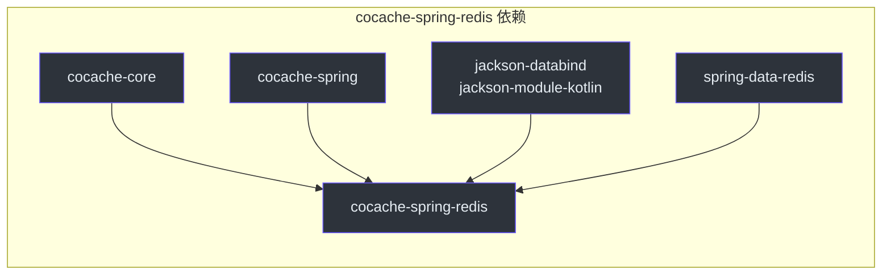
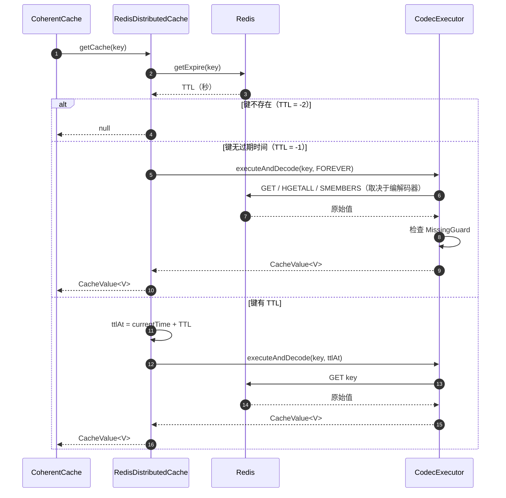
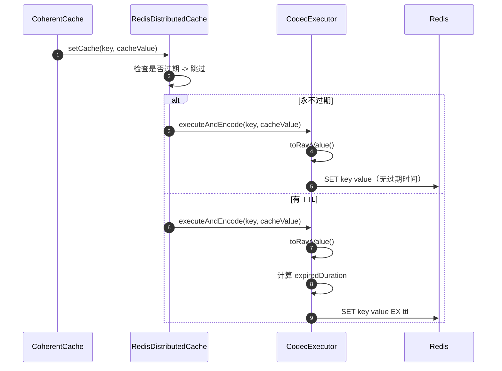
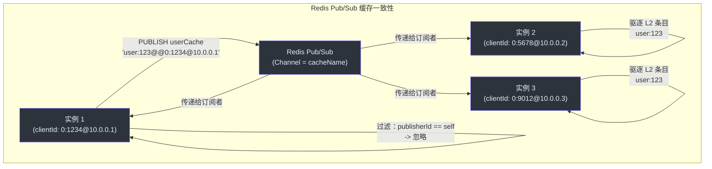
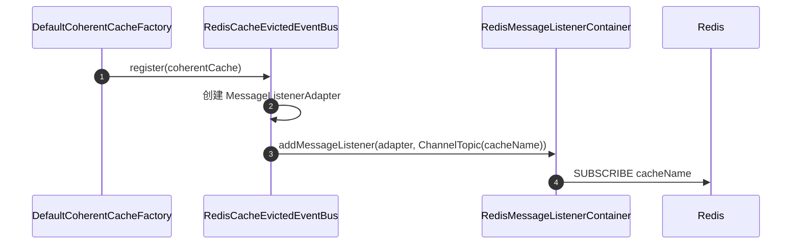
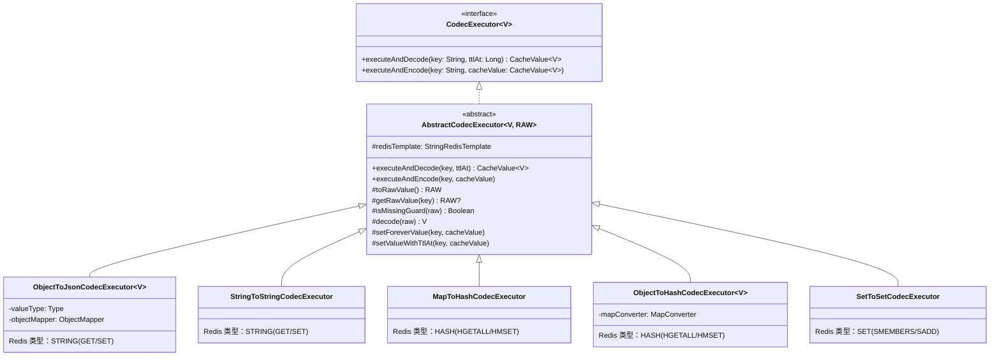
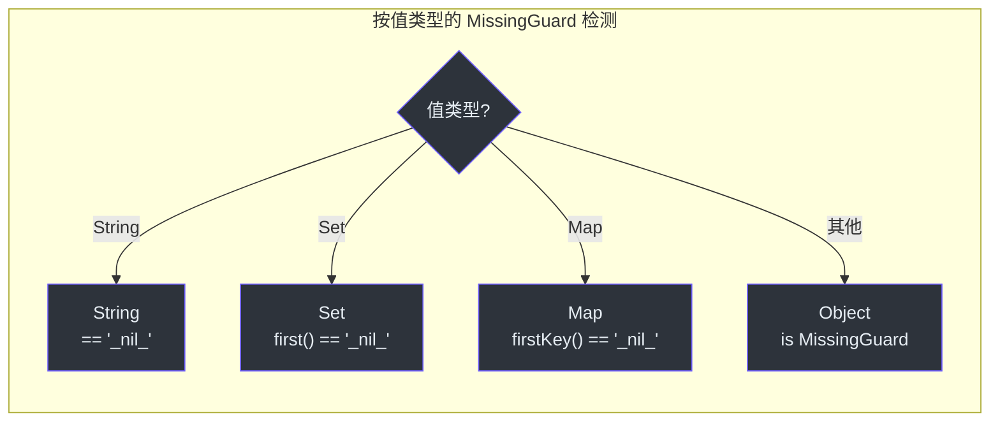
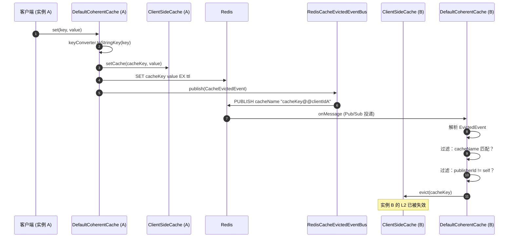

# cocache-spring-redis 模块

`cocache-spring-redis` 模块使用 Redis 实现分布式缓存层（L1），使用 Redis Pub/Sub 实现跨实例缓存一致性机制。它提供了使 CoCache 成为真正的分布式缓存框架的生产级实现。

## 模块依赖



## 源文件

| 文件 | 包 | 说明 |
|------|-----|------|
| [RedisDistributedCache.kt](https://github.com/Ahoo-Wang/CoCache/blob/main/cocache-spring-redis/src/main/kotlin/me/ahoo/cache/spring/redis/RedisDistributedCache.kt#L28) | `me.ahoo.cache.spring.redis` | 使用 `StringRedisTemplate` 的 L1 分布式缓存实现 |
| [RedisCacheEvictedEventBus.kt](https://github.com/Ahoo-Wang/CoCache/blob/main/cocache-spring-redis/src/main/kotlin/me/ahoo/cache/spring/redis/RedisCacheEvictedEventBus.kt#L32) | `me.ahoo.cache.spring.redis` | 使用 Redis Pub/Sub 的跨实例事件总线 |
| [RedisDistributedCacheFactory.kt](https://github.com/Ahoo-Wang/CoCache/blob/main/cocache-spring-redis/src/main/kotlin/me/ahoo/cache/spring/redis/RedisDistributedCacheFactory.kt#L27) | `me.ahoo.cache.spring.redis` | 通过 `AbstractCacheFactory` 创建 `RedisDistributedCache` 实例的工厂 |
| [CodecExecutor.kt](https://github.com/Ahoo-Wang/CoCache/blob/main/cocache-spring-redis/src/main/kotlin/me/ahoo/cache/spring/redis/codec/CodecExecutor.kt#L22) | `me.ahoo.cache.spring.redis.codec` | 缓存值编解码接口 |
| [AbstractCodecExecutor.kt](https://github.com/Ahoo-Wang/CoCache/blob/main/cocache-spring-redis/src/main/kotlin/me/ahoo/cache/spring/redis/codec/AbstractCodecExecutor.kt#L21) | `me.ahoo.cache.spring.redis.codec` | 抽象基类，提供管道写入和 MissingGuard 处理 |
| [ObjectToJsonCodecExecutor.kt](https://github.com/Ahoo-Wang/CoCache/blob/main/cocache-spring-redis/src/main/kotlin/me/ahoo/cache/spring/redis/codec/ObjectToJsonCodecExecutor.kt#L27) | `me.ahoo.cache.spring.redis.codec` | 通过 Jackson 进行 JSON 序列化（默认编解码器） |
| [StringToStringCodecExecutor.kt](https://github.com/Ahoo-Wang/CoCache/blob/main/cocache-spring-redis/src/main/kotlin/me/ahoo/cache/spring/redis/codec/StringToStringCodecExecutor.kt#L25) | `me.ahoo.cache.spring.redis.codec` | `String` 值的直接字符串存储 |
| [MapToHashCodecExecutor.kt](https://github.com/Ahoo-Wang/CoCache/blob/main/cocache-spring-redis/src/main/kotlin/me/ahoo/cache/spring/redis/codec/MapToHashCodecExecutor.kt#L26) | `me.ahoo.cache.spring.redis.codec` | `Map<String, String>` 值的 Redis Hash 存储 |
| [ObjectToHashCodecExecutor.kt](https://github.com/Ahoo-Wang/CoCache/blob/main/cocoa-spring-redis/src/main/kotlin/me/ahoo/cache/spring/redis/codec/ObjectToHashCodecExecutor.kt#L26) | `me.ahoo.cache.spring.redis.codec` | 通过 `MapConverter` 的任意对象的 Hash 存储 |
| [SetToSetCodecExecutor.kt](https://github.com/Ahoo-Wang/CoCache/blob/main/cocache-spring-redis/src/main/kotlin/me/ahoo/cache/spring/redis/codec/SetToSetCodecExecutor.kt#L25) | `me.ahoo.cache.spring.redis.codec` | `Set<String>` 值的 Redis Set 存储 |
| [EvictedEvents.kt](https://github.com/Ahoo-Wang/CoCache/blob/main/cocache-spring-redis/src/main/kotlin/me/ahoo/cache/spring/redis/codec/EvictedEvents.kt#L19) | `me.ahoo.cache.spring.redis.codec` | 驱逐事件的消息格式（key@@clientId 编码） |

## RedisDistributedCache

[RedisDistributedCache](https://github.com/Ahoo-Wang/CoCache/blob/main/cocache-spring-redis/src/main/kotlin/me/ahoo/cache/spring/redis/RedisDistributedCache.kt#L28) 使用 Spring 的 `StringRedisTemplate` 和可插拔的 `CodecExecutor` 实现 `DistributedCache<V>`。

### 缓存读取流程



### 缓存写入流程



## RedisCacheEvictedEventBus

[RedisCacheEvictedEventBus](https://github.com/Ahoo-Wang/CoCache/blob/main/cocache-spring-redis/src/main/kotlin/me/ahoo/cache/spring/redis/RedisCacheEvictedEventBus.kt#L32) 使用 Redis Pub/Sub 在所有应用实例间分发缓存驱逐事件。



### 事件注册

当 `CoherentCache` 由 `DefaultCoherentCacheFactory` 创建时，它会注册到事件总线：



### MessageListenerAdapter

[MessageListenerAdapter](https://github.com/Ahoo-Wang/CoCache/blob/main/cocache-spring-redis/src/main/kotlin/me/ahoo/cache/spring/redis/RedisCacheEvictedEventBus.kt#L67) 包装 `CacheEvictedSubscriber` 以实现 Spring 的 `MessageListener` 接口。在收到 Redis 消息时，它委托给 `EvictedEvents.fromMessage()` 解析消息，然后调用 `subscriber.onEvicted()`。

## EvictedEvents 消息格式

[EvictedEvents](https://github.com/Ahoo-Wang/CoCache/blob/main/cocache-spring-redis/src/main/kotlin/me/ahoo/cache/spring/redis/codec/EvictedEvents.kt#L19) 定义了缓存驱逐消息的传输格式：

| 字段 | 编码 | 示例 |
|------|------|------|
| Channel | 缓存名称（来自 `NamedCache.cacheName`） | `userCache` |
| Body | `key + "@@" + clientId` | `user:123@@0:1234@10.0.0.1` |

[EvictedEvents.fromMessage()](https://github.com/Ahoo-Wang/CoCache/blob/main/cocache-spring-redis/src/main/kotlin/me/ahoo/cache/spring/redis/codec/EvictedEvents.kt#L22) 中的解析逻辑：
- `cacheName` = `message.channel.decodeToString()`
- 以 `"@@"` 分割 `message.body.decodeToString()` 得到 `[key, clientId]`
- 构造 `CacheEvictedEvent(cacheName, key, clientId)`

## 编解码器层次结构

编解码器系统处理缓存值与 Redis 数据结构之间的序列化。每个编解码器将特定的值类型映射到 Redis 数据类型。



### 编解码器详情

| 编解码器 | 值类型 | Redis 类型 | 序列化方式 | MissingGuard 编码 |
|---------|--------|-----------|-----------|------------------|
| `ObjectToJsonCodecExecutor` | 任意 POJO | STRING | Jackson ObjectMapper JSON | `"_nil_"` 字符串 |
| `StringToStringCodecExecutor` | `String` | STRING | 直接存储（无转换） | `"_nil_"` 字符串 |
| `MapToHashCodecExecutor` | `Map<String, String>` | HASH | 直接键值映射 | `{"_nil_": "<timestamp>"}` |
| `ObjectToHashCodecExecutor` | 通过 `MapConverter` 的任意类型 | HASH | 对象 <-> Map 转换 | `{"_nil_": "<timestamp>"}` |
| `SetToSetCodecExecutor` | `Set<String>` | SET | 直接集合成员 | `{"_nil_"}` 单元素集合 |

### AbstractCodecExecutor 写入管道

[AbstractCodecExecutor](https://github.com/Ahoo-Wang/CoCache/blob/main/cocache-spring-redis/src/main/kotlin/me/ahoo/cache/spring/redis/codec/AbstractCodecExecutor.kt#L21) 在[第 45 行](https://github.com/Ahoo-Wang/CoCache/blob/main/cocache-spring-redis/src/main/kotlin/me/ahoo/cache/spring/redis/codec/AbstractCodecExecutor.kt#L45)提供了 `setPipelined()` 辅助方法，它在一个 Redis 管道中原子性地删除旧键并写入新值，防止写入窗口期间的脏读。

### 各编解码器的 MissingGuard 检测

每个编解码器有特定于编解码器的缺失守卫哨兵值检测方式，与多态的 `MissingGuard.Companion.isMissingGuard` 扩展相匹配：



## RedisDistributedCacheFactory

[RedisDistributedCacheFactory](https://github.com/Ahoo-Wang/CoCache/blob/main/cocache-spring-redis/src/main/kotlin/me/ahoo/cache/spring/redis/RedisDistributedCacheFactory.kt#L27) 继承 `AbstractCacheFactory`，创建 `RedisDistributedCache` 实例。它在[第 47 行](https://github.com/Ahoo-Wang/CoCache/blob/main/cocache-spring-redis/src/main/kotlin/me/ahoo/cache/spring/redis/RedisDistributedCacheFactory.kt#L47)的 `fallback()` 方法创建一个使用 `ObjectToJsonCodecExecutor`（JSON 序列化）作为默认编解码器的 `RedisDistributedCache`。

用户可以通过声明名为 `"{cacheName}.DistributedCache"` 的 Spring Bean 来自定义分布式缓存：

```kotlin
@Bean("UserCache.DistributedCache")
fun userDistributedCache(
    redisTemplate: StringRedisTemplate
): DistributedCache<User> {
    val codec = ObjectToHashCodecExecutor(
        mapConverter = object : ObjectToHashCodecExecutor.MapConverter<User> {
            override fun asValue(map: Map<String, String>): User = /* 将 map 转换为 User */
            override fun asMap(value: User): Map<String, String> = /* 将 User 转换为 map */
        },
        redisTemplate = redisTemplate
    )
    return RedisDistributedCache(redisTemplate, codec, ttl = 7200, ttlAmplitude = 60)
}
```

## 跨实例一致性流程

带跨实例失效的缓存写入完整流程：



## 相关页面

- [模块概览](./index.md) -- 依赖关系图和模块说明
- [cocache-core](./cocache-core.md) -- DefaultCoherentCache、DistributedCache 接口、CacheEvictedEventBus
- [cocache-spring](./cocache-spring.md) -- AbstractCacheFactory 基类、Spring 集成
- [cocache-spring-boot-starter](./cocache-spring-boot-starter.md) -- 连接 RedisDistributedCacheFactory 的自动配置
