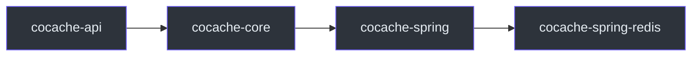

# cocache-spring-redis

`cocache-spring-redis` 模块提供基于 Redis 的 L1 分布式缓存（`RedisDistributedCache`）和分布式事件总线（`RedisCacheEvictedEventBus`）实现。

## 依赖关系



主要依赖：
- `cocache-spring`
- Spring Data Redis（`spring-data-redis`）
- Redis 客户端（Lettuce）

## 包结构

```
me.ahoo.cache.spring.redis
├── RedisDistributedCache.kt          # Redis L1 缓存实现
├── RedisDistributedCacheFactory.kt   # L1 缓存工厂
├── RedisCacheEvictedEventBus.kt      # Redis 事件总线
└── codec/
    ├── CodecExecutor.kt              # 编解码器接口
    ├── AbstractCodecExecutor.kt      # 抽象基类
    ├── ObjectToJsonCodecExecutor.kt  # 对象 <-> JSON
    ├── ObjectToHashCodecExecutor.kt  # 对象 <-> Hash
    ├── StringToStringCodecExecutor.kt # 字符串 <-> 字符串
    ├── MapToHashCodecExecutor.kt     # Map <-> Hash
    ├── SetToSetCodecExecutor.kt      # Set <-> Set
    └── EvictedEvents.kt             # 事件消息序列化
```

## RedisDistributedCache

基于 Spring Data Redis 的 `StringRedisTemplate` 实现的 L1 分布式缓存。

```kotlin
class RedisDistributedCache<V>(
    private val redisTemplate: StringRedisTemplate,
    private val codecExecutor: CodecExecutor<V>,
    override val ttl: Long = CoCache.DEFAULT_TTL,
    override val ttlAmplitude: Long = CoCache.DEFAULT_TTL_AMPLITUDE
) : DistributedCache<V>
```

### 读取流程

1. 通过 `redisTemplate.getExpire(key)` 获取 TTL
2. 如果 TTL = -2（不存在），返回 `null`
3. 如果 TTL = -1（永不过期），使用 `FOREVER` 标记
4. 否则计算 `ttlAt = currentTime + ttl`
5. 通过 `CodecExecutor` 反序列化值

### 写入流程

1. 检查缓存值是否已过期
2. 通过 `CodecExecutor` 序列化值
3. 使用 `redisTemplate` 写入 Redis（带 TTL）

**源码参考**：[`cocache-spring-redis/.../RedisDistributedCache.kt`](https://github.com/Ahoo-Wang/CoCache/blob/main/cocache-spring-redis/src/main/kotlin/me/ahoo/cache/spring/redis/RedisDistributedCache.kt)

## RedisCacheEvictedEventBus

基于 Redis Pub/Sub 的分布式事件总线。

```kotlin
class RedisCacheEvictedEventBus(
    private val redisTemplate: StringRedisTemplate,
    private val listenerContainer: RedisMessageListenerContainer
) : CacheEvictedEventBus
```

### 工作原理

- **发布**：使用 `redisTemplate.convertAndSend(cacheName, message)` 发布事件
- **订阅**：通过 `RedisMessageListenerContainer` 监听以 `cacheName` 为 Channel 的消息
- **消息格式**：通过 `EvictedEvents` 序列化/反序列化事件（包含 key 和 publisherId）

每个缓存名称对应一个独立的 Redis Channel，实现事件路由。

**源码参考**：[`cocache-spring-redis/.../RedisCacheEvictedEventBus.kt`](https://github.com/Ahoo-Wang/CoCache/blob/main/cocache-spring-redis/src/main/kotlin/me/ahoo/cache/spring/redis/RedisCacheEvictedEventBus.kt)

## CodecExecutor

编解码器接口，支持多种序列化格式。

| 实现 | 序列化方式 | 适用场景 |
|------|-----------|----------|
| `ObjectToJsonCodecExecutor` | 对象 -> JSON 字符串 | 通用对象（默认） |
| `ObjectToHashCodecExecutor` | 对象 -> Redis Hash | 需要按字段查询 |
| `StringToStringCodecExecutor` | 字符串 -> 字符串 | 简单字符串值 |
| `MapToHashCodecExecutor` | Map -> Redis Hash | Map 类型值 |
| `SetToSetCodecExecutor` | Set -> Redis Set | 集合类型值 |

**源码参考**：[`cocache-spring-redis/.../codec/`](https://github.com/Ahoo-Wang/CoCache/tree/main/cocache-spring-redis/src/main/kotlin/me/ahoo/cache/spring/redis/codec)

## RedisDistributedCacheFactory

工厂类，从 Spring 容器查找 `ObjectMapper` 和 `StringRedisTemplate`，创建 `RedisDistributedCache` 实例。

**源码参考**：[`cocache-spring-redis/.../RedisDistributedCacheFactory.kt`](https://github.com/Ahoo-Wang/CoCache/blob/main/cocache-spring-redis/src/main/kotlin/me/ahoo/cache/spring/redis/RedisDistributedCacheFactory.kt)

## 相关页面

- [缓存层级](../architecture/cache-layers.md) - L1 缓存层详解
- [一致性与事件总线](../architecture/coherence.md) - 事件总线机制
- [cocache-spring](./cocache-spring.md) - Spring 集成模块
- [cocache-spring-boot-starter](./cocache-spring-boot-starter.md) - 自动配置模块
