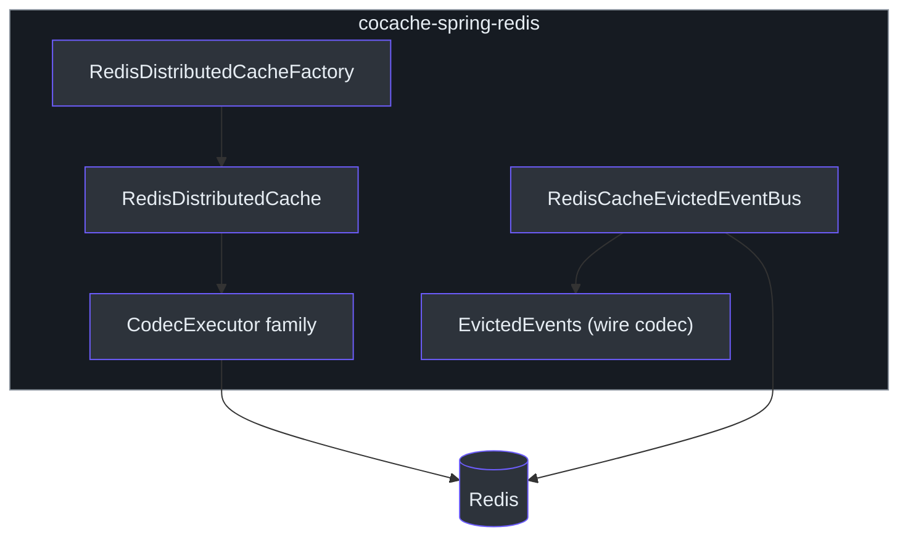
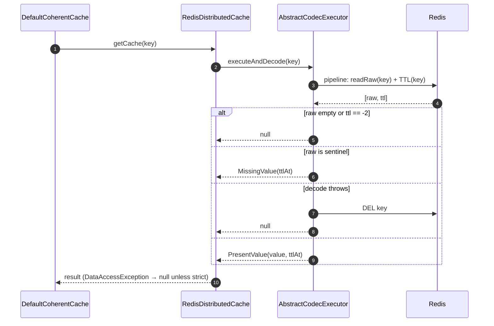
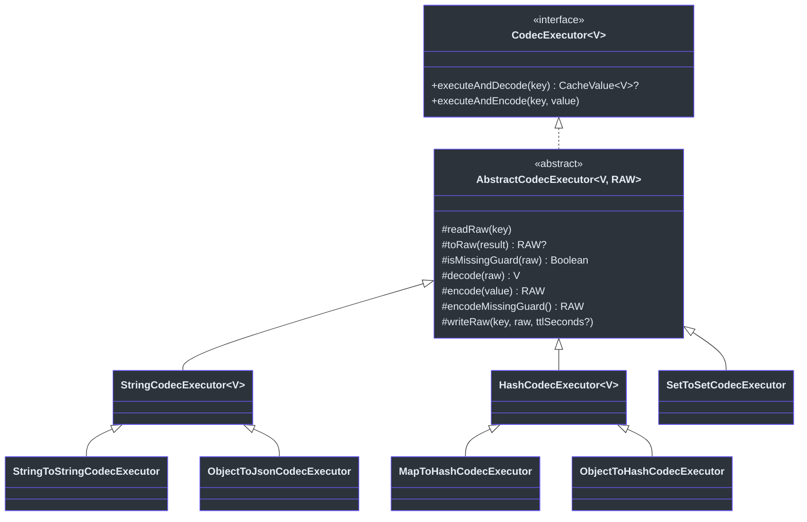

# cocache-spring-redis

本模块提供两个 SPI 的 Redis 实现：L1 存储（`DistributedCache`）和失效通道（`CacheEvictedEventBus`）。依赖 `cocache-spring`、Spring Data Redis 和 Jackson。

```mermaid
graph TB
    subgraph redis_mod ["cocache-spring-redis"]
        RDC["RedisDistributedCache"]
        RDCF["RedisDistributedCacheFactory"]
        CE["CodecExecutor family"]
        Bus["RedisCacheEvictedEventBus"]
        EE["EvictedEvents (wire codec)"]
    end
    RDCF --> RDC
    RDC --> CE
    Bus --> EE
    CE --> R[("Redis")]
    Bus --> R

    style RDC fill:#2d333b,stroke:#6d5dfc,color:#e6edf3
    style RDCF fill:#2d333b,stroke:#6d5dfc,color:#e6edf3
    style CE fill:#2d333b,stroke:#6d5dfc,color:#e6edf3
    style Bus fill:#2d333b,stroke:#6d5dfc,color:#e6edf3
    style EE fill:#2d333b,stroke:#6d5dfc,color:#e6edf3
    style R fill:#2d333b,stroke:#6d5dfc,color:#e6edf3
    style redis_mod fill:#161b22,stroke:#8b949e,color:#e6edf3
```

## 源文件

| 文件 | 说明 |
|------|------|
| [RedisDistributedCache.kt](https://github.com/Ahoo-Wang/CoCache/blob/main/cocache-spring-redis/src/main/kotlin/me/ahoo/cache/spring/redis/RedisDistributedCache.kt) | L1 存储；故障降级（`strictFailure`） |
| [RedisDistributedCacheFactory.kt](https://github.com/Ahoo-Wang/CoCache/blob/main/cocache-spring-redis/src/main/kotlin/me/ahoo/cache/spring/redis/RedisDistributedCacheFactory.kt) | `{cacheName}.DistributedCache` bean 或默认的 JSON codec |
| [CodecExecutor.kt](https://github.com/Ahoo-Wang/CoCache/blob/main/cocache-spring-redis/src/main/kotlin/me/ahoo/cache/spring/redis/codec/CodecExecutor.kt) | `executeAndDecode(key)` / `executeAndEncode(key, value)` |
| [AbstractCodecExecutor.kt](https://github.com/Ahoo-Wang/CoCache/blob/main/cocache-spring-redis/src/main/kotlin/me/ahoo/cache/spring/redis/codec/AbstractCodecExecutor.kt) | 统一的读写协议 |
| [StringCodecExecutor.kt](https://github.com/Ahoo-Wang/CoCache/blob/main/cocache-spring-redis/src/main/kotlin/me/ahoo/cache/spring/redis/codec/StringCodecExecutor.kt) | String 结构基类 + `StringToStringCodecExecutor` |
| [ObjectToJsonCodecExecutor.kt](https://github.com/Ahoo-Wang/CoCache/blob/main/cocache-spring-redis/src/main/kotlin/me/ahoo/cache/spring/redis/codec/ObjectToJsonCodecExecutor.kt) | Jackson JSON（默认） |
| [HashCodecExecutor.kt](https://github.com/Ahoo-Wang/CoCache/blob/main/cocache-spring-redis/src/main/kotlin/me/ahoo/cache/spring/redis/codec/HashCodecExecutor.kt) | Hash 基类 + `MapToHashCodecExecutor`、`ObjectToHashCodecExecutor` |
| [SetToSetCodecExecutor.kt](https://github.com/Ahoo-Wang/CoCache/blob/main/cocache-spring-redis/src/main/kotlin/me/ahoo/cache/spring/redis/codec/SetToSetCodecExecutor.kt) | Redis Set |
| [RedisCacheEvictedEventBus.kt](https://github.com/Ahoo-Wang/CoCache/blob/main/cocache-spring-redis/src/main/kotlin/me/ahoo/cache/spring/redis/RedisCacheEvictedEventBus.kt) | 每个缓存一个 Pub/Sub 频道 |
| [EvictedEvents.kt](https://github.com/Ahoo-Wang/CoCache/blob/main/cocache-spring-redis/src/main/kotlin/me/ahoo/cache/spring/redis/codec/EvictedEvents.kt) | `key@@publisherId` 消息格式 |

## 读取协议

```mermaid
sequenceDiagram
autonumber
    participant CC as DefaultCoherentCache
    participant RDC as RedisDistributedCache
    participant CE as AbstractCodecExecutor
    participant R as Redis

    CC->>RDC: getCache(key)
    RDC->>CE: executeAndDecode(key)
    CE->>R: pipeline: readRaw(key) + TTL(key)
    R-->>CE: [raw, ttl]
    alt raw empty or ttl == -2
        CE-->>RDC: null
    else raw is sentinel
        CE-->>RDC: MissingValue(ttlAt)
    else decode throws
        CE->>R: DEL key
        CE-->>RDC: null
    else
        CE-->>RDC: PresentValue(value, ttlAt)
    end
    RDC-->>CC: result (DataAccessException → null unless strict)
```

- 每次 L1 读取只需一次往返。
- **key 不存在就是未命中，绝不当作负缓存。** 在 4.x 中，若 key 在分开执行的 `TTL` 与 `GET` 之间被删除，会被解码为负缓存，可能把“不存在”钉在 L2 中直到旧 TTL 到期。
- `ttlAt = now + ttl`，TTL 为 `-1` 时为 `FOREVER`。该值由 Redis 剩余 TTL 重建，可能有 ±1 秒漂移。

## 写入协议

| 值 | 动作 |
|----|------|
| 已过期 | `DEL key` |
| `MissingValue` | 写入该 codec 的哨兵形态 |
| `PresentValue` | 写入编码后的值 |
| TTL | `FOREVER` 时不设过期（`null`）；否则剩余秒数，至少钳为 1 |

Hash / Set 写入通过一个原子 Lua 脚本完成（`DEL` + `HSET`/`SADD` + 可选 `EXPIRE`）。写入空 Map/Set 会删除该 key。

## Codec

```mermaid
classDiagram
    class CodecExecutor~V~ {
        <<interface>>
        +executeAndDecode(key) CacheValue~V~?
        +executeAndEncode(key, value)
    }
    class AbstractCodecExecutor~V, RAW~ {
        <<abstract>>
        #readRaw(key)
        #toRaw(result) RAW?
        #isMissingGuard(raw) Boolean
        #decode(raw) V
        #encode(value) RAW
        #encodeMissingGuard() RAW
        #writeRaw(key, raw, ttlSeconds?)
    }
    class StringCodecExecutor~V~
    class HashCodecExecutor~V~
    CodecExecutor <|.. AbstractCodecExecutor
    AbstractCodecExecutor <|-- StringCodecExecutor
    AbstractCodecExecutor <|-- HashCodecExecutor
    AbstractCodecExecutor <|-- SetToSetCodecExecutor
    StringCodecExecutor <|-- StringToStringCodecExecutor
    StringCodecExecutor <|-- ObjectToJsonCodecExecutor
    HashCodecExecutor <|-- MapToHashCodecExecutor
    HashCodecExecutor <|-- ObjectToHashCodecExecutor

    style CodecExecutor fill:#2d333b,stroke:#6d5dfc,color:#e6edf3
    style AbstractCodecExecutor fill:#2d333b,stroke:#6d5dfc,color:#e6edf3
    style StringCodecExecutor fill:#2d333b,stroke:#6d5dfc,color:#e6edf3
    style HashCodecExecutor fill:#2d333b,stroke:#6d5dfc,color:#e6edf3
    style SetToSetCodecExecutor fill:#2d333b,stroke:#6d5dfc,color:#e6edf3
    style StringToStringCodecExecutor fill:#2d333b,stroke:#6d5dfc,color:#e6edf3
    style ObjectToJsonCodecExecutor fill:#2d333b,stroke:#6d5dfc,color:#e6edf3
    style MapToHashCodecExecutor fill:#2d333b,stroke:#6d5dfc,color:#e6edf3
    style ObjectToHashCodecExecutor fill:#2d333b,stroke:#6d5dfc,color:#e6edf3
```

| Codec | 值类型 | Redis 类型 | 负缓存线格式 |
|-------|--------|------------|--------------|
| `ObjectToJsonCodecExecutor`（默认） | 任意 POJO | String | `_nil_` |
| `StringToStringCodecExecutor` | `String` | String | `_nil_`（与哨兵相等的业务字符串读回时视为负缓存） |
| `MapToHashCodecExecutor` | `Map<String, String>` | Hash | `{_nil_: <写入时间>}` |
| `ObjectToHashCodecExecutor` | 经 `MapConverter` 的任意对象 | Hash | `{_nil_: <写入时间>}` |
| `SetToSetCodecExecutor` | `Set<String>` | Set | `{_nil_}` |

哨兵可通过构造参数注入（`missingGuardSentinel`，属性 `cocache.redis.missing-guard-sentinel`）。自定义哨兵与默认哨兵互不识别，切换时需全集群同时变更。

要为其它数据结构编写 codec，继承 `AbstractCodecExecutor` 并实现 `readRaw`（在 pipeline 中排入读命令）、`toRaw`、`isMissingGuard`、`decode`、`encode`、`encodeMissingGuard`、`writeRaw`。

## RedisCacheEvictedEventBus

- 频道 = `cacheName`，消息 = `key@@publisherId`，按最后一个 `@@` 切分。
- `publish` 吞掉 `DataAccessException` 并告警。
- 每个注册的订阅者都包装为同时实现 `MessageListener` **和** `SubscriptionListener` 的监听器。容器在初次订阅后、每次重连后、以及同一频道加入新监听器时调用 `onChannelSubscribed`，每次调用都映射为 `CacheEvictedSubscriber.onReset()`，从而清空 L2。
- 订阅通知经由容器的 `TaskExecutor` 分发。测试使用 `SyncTaskExecutor`，使 `register()` 返回时重置已经执行完。

## 故障降级

| 操作 | 默认（`strictFailure = false`） | 严格 |
|------|---------------------------------|------|
| 读 | `null`（未命中 → 回源）+ `WARN` | 重抛 |
| 写 / 淘汰 | `WARN`，吞掉异常 | 重抛 |

这些设置只作用于默认（回退创建）的缓存。自定义的 `{cacheName}.DistributedCache` bean 自行决定策略。

## 相关页面

- [缓存层级](../architecture/cache-layers.md)
- [缓存一致性](../architecture/coherence.md)
- [配置](../guide/configuration.md)
