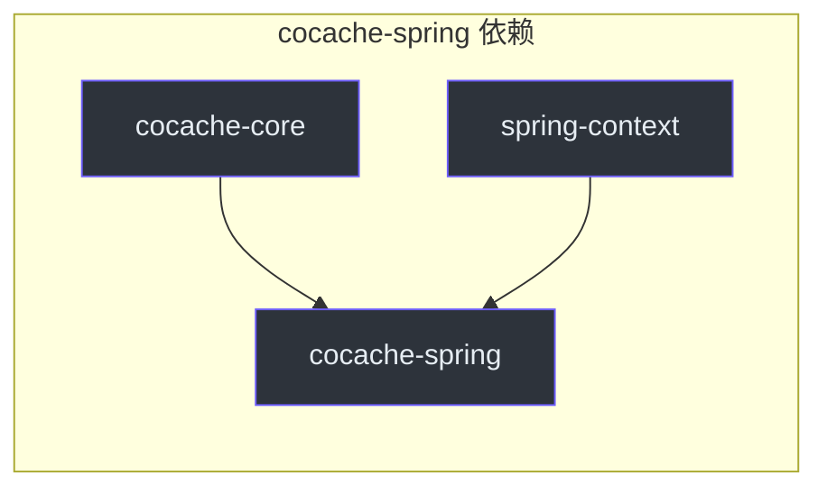
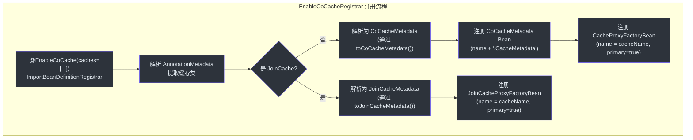
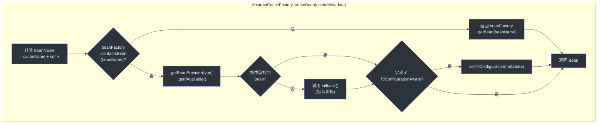
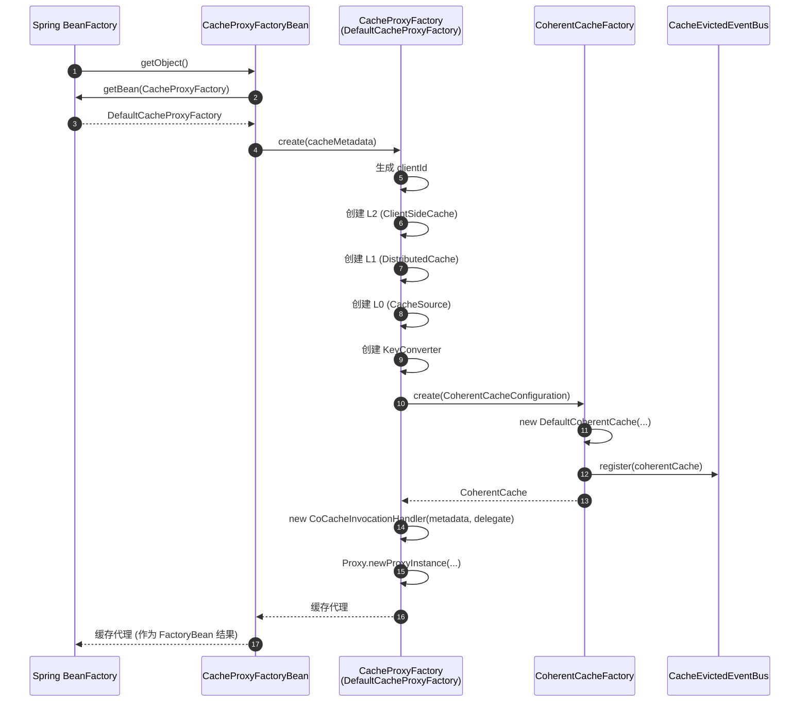
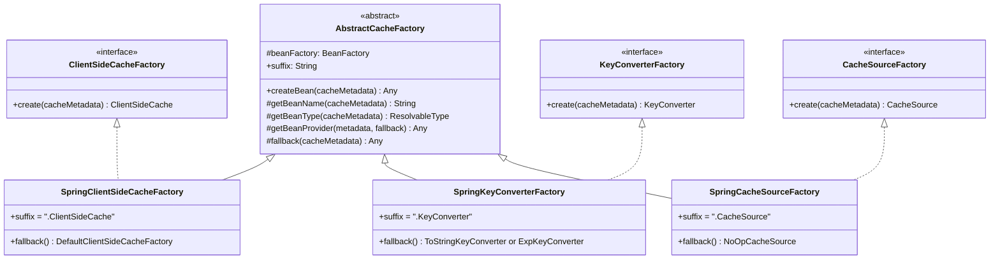
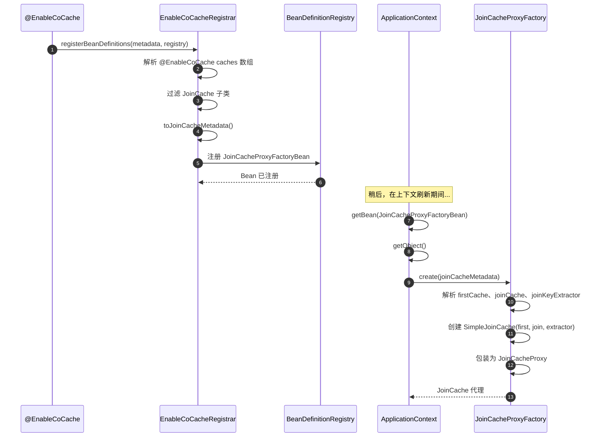

# cocache-spring 模块

`cocache-spring` 模块将 CoCache 的核心抽象与 Spring 框架的依赖注入容器桥接起来。它通过 `@EnableCoCache` 实现声明式缓存注册，为所有缓存组件提供自动的 Spring Bean 解析，并基于 FactoryBean 创建缓存代理。

## 模块依赖



## 源文件（10 个文件）

| 文件 | 包 | 用途 |
|------|-----|------|
| [EnableCoCache.kt](https://github.com/Ahoo-Wang/CoCache/blob/main/cocache-spring/src/main/kotlin/me/ahoo/cache/spring/EnableCoCache.kt#L22) | `me.ahoo.cache.spring` | `@EnableCoCache` 注解，触发缓存注册 |
| [EnableCoCacheRegistrar.kt](https://github.com/Ahoo-Wang/CoCache/blob/main/cocache-spring/src/main/kotlin/me/ahoo/cache/spring/EnableCoCacheRegistrar.kt#L31) | `me.ahoo.cache.spring` | `ImportBeanDefinitionRegistrar` 实现，解析缓存类并注册 Bean |
| [AbstractCacheFactory.kt](https://github.com/Ahoo-Wang/CoCache/blob/main/cocache-spring/src/main/kotlin/me/ahoo/cache/spring/AbstractCacheFactory.kt#L21) | `me.ahoo.cache.spring` | Spring 感知工厂模式的基类，支持 Bean 名称查找 |
| [SpringCacheFactory.kt](https://github.com/Ahoo-Wang/CoCache/blob/main/cocache-spring/src/main/kotlin/me/ahoo/cache/spring/SpringCacheFactory.kt#L24) | `me.ahoo.cache.spring` | 使用 Spring `ListableBeanFactory` 的 `CacheFactory` 实现 |
| [CacheProxyFactoryBean.kt](https://github.com/Ahoo-Wang/CoCache/blob/main/cocache-spring/src/main/kotlin/me/ahoo/cache/spring/proxy/CacheProxyFactoryBean.kt#L23) | `me.ahoo.cache.spring.proxy` | 标准 `Cache` 代理的 `FactoryBean` |
| [JoinCacheProxyFactoryBean.kt](https://github.com/Ahoo-Wang/CoCache/blob/main/cocache-spring/src/main/kotlin/me/ahoo/cache/spring/join/JoinCacheProxyFactoryBean.kt#L23) | `me.ahoo.cache.spring.join` | `JoinCache` 代理的 `FactoryBean` |
| [SpringClientSideCacheFactory.kt](https://github.com/Ahoo-Wang/CoCache/blob/main/cocache-spring/src/main/kotlin/me/ahoo/cache/spring/client/SpringClientSideCacheFactory.kt#L25) | `me.ahoo.cache.spring.client` | 解析 `ClientSideCache` Bean，否则回退到默认实现 |
| [SpringKeyConverterFactory.kt](https://github.com/Ahoo-Wang/CoCache/blob/main/cocache-spring/src/main/kotlin/me/ahoo/cache/spring/converter/SpringKeyConverterFactory.kt#L27) | `me.ahoo.cache.spring.converter` | 解析 `KeyConverter` Bean 或创建 `ToStringKeyConverter`/`ExpKeyConverter` |
| [SpringCacheSourceFactory.kt](https://github.com/Ahoo-Wang/CoCache/blob/main/cocache-spring/src/main/kotlin/me/ahoo/cache/spring/source/SpringCacheSourceFactory.kt#L24) | `me.ahoo.cache.spring.source` | 解析 `CacheSource` Bean 或默认使用 `NoOpCacheSource` |
| [SpringJoinKeyExtractorFactory.kt](https://github.com/Ahoo-Wang/CoCache/blob/main/cocache-spring/src/main/kotlin/me/ahoo/cache/spring/join/SpringJoinKeyExtractorFactory.kt#L24) | `me.ahoo.cache.spring.join` | 解析 `JoinKeyExtractor` Bean 或根据表达式创建 `ExpJoinKeyExtractor` |

## @EnableCoCache -- 注册入口

[@EnableCoCache](https://github.com/Ahoo-Wang/CoCache/blob/main/cocache-spring/src/main/kotlin/me/ahoo/cache/spring/EnableCoCache.kt#L22) 是主要的入口点：

```kotlin
@Import(EnableCoCacheRegistrar::class)
@Target(AnnotationTarget.CLASS)
annotation class EnableCoCache(
    val caches: Array<KClass<out Cache<*, *>>> = []
)
```

使用方式：

```kotlin
@EnableCoCache(caches = [UserCache::class, ProductCache::class, UserProductJoinCache::class])
@Configuration
class CacheConfiguration
```

## 注册流程



[EnableCoCacheRegistrar.kt:45](https://github.com/Ahoo-Wang/CoCache/blob/main/cocache-spring/src/main/kotlin/me/ahoo/cache/spring/EnableCoCacheRegistrar.kt#L45) 中的注册器执行以下步骤：

1. 从 `@EnableCoCache` 注解属性中提取 `caches` 数组。
2. 将缓存类分为两组：实现 `JoinCache` 的和未实现的。
3. 对于非 JoinCache 类：通过 `KClass.toCoCacheMetadata()` 解析 `CoCacheMetadata`，注册元数据 Bean 和 `CacheProxyFactoryBean`。
4. 对于 JoinCache 类：通过 `KClass.toJoinCacheMetadata()` 解析 `JoinCacheMetadata`，注册 `JoinCacheProxyFactoryBean`。

## AbstractCacheFactory 模式

[AbstractCacheFactory](https://github.com/Ahoo-Wang/CoCache/blob/main/cocache-spring/src/main/kotlin/me/ahoo/cache/spring/AbstractCacheFactory.kt#L21) 是所有 Spring 感知组件工厂的共享基类。它实现了三级解析策略：



每个子类定义：
- **`suffix`**：基于约定的 Bean 名称后缀（例如 `".ClientSideCache"`、`".DistributedCache"`、`".KeyConverter"`、`".CacheSource"`、`".JoinKeyExtractor"`）
- **`getBeanType()`**：用于基于类型查找 Bean 的 `ResolvableType`
- **`fallback()`**：未找到 Spring Bean 时的默认工厂方法

### 工厂后缀与 Bean 命名

| 工厂 | 后缀 | Bean 名称示例 |
|------|------|---------------|
| `SpringClientSideCacheFactory` | `.ClientSideCache` | `UserCache.ClientSideCache` |
| `SpringKeyConverterFactory` | `.KeyConverter` | `UserCache.KeyConverter` |
| `SpringCacheSourceFactory` | `.CacheSource` | `UserCache.CacheSource` |
| `RedisDistributedCacheFactory`（在 cocache-spring-redis 中） | `.DistributedCache` | `UserCache.DistributedCache` |
| `SpringJoinKeyExtractorFactory` | `.JoinKeyExtractor` | `UserProductJoinCache.JoinKeyExtractor` |

这种命名约定允许用户通过声明一个具有预期名称的 Spring Bean 来覆盖任何组件。

## CacheProxyFactoryBean

[CacheProxyFactoryBean](https://github.com/Ahoo-Wang/CoCache/blob/main/cocache-spring/src/main/kotlin/me/ahoo/cache/spring/proxy/CacheProxyFactoryBean.kt#L23) 是一个 Spring `FactoryBean`，用于创建缓存代理实例。它从 `ApplicationContext` 中延迟获取 `CacheProxyFactory` 并委托创建：



## JoinCacheProxyFactoryBean

[JoinCacheProxyFactoryBean](https://github.com/Ahoo-Wang/CoCache/blob/main/cocache-spring/src/main/kotlin/me/ahoo/cache/spring/join/JoinCacheProxyFactoryBean.kt#L23) 遵循相同的模式，但获取的是 `JoinCacheProxyFactory`，并创建与第一个缓存、join 缓存和 join 键提取器连接的 JoinCache 代理。

## SpringCacheFactory

[SpringCacheFactory](https://github.com/Ahoo-Wang/CoCache/blob/main/cocache-spring/src/main/kotlin/me/ahoo/cache/spring/SpringCacheFactory.kt#L24) 使用 Spring 的 `ListableBeanFactory` 实现 `CacheFactory` 接口：

| 方法 | 策略 |
|------|------|
| `caches` | `beanFactory.getBeansOfType(Cache::class.java)` |
| `getCache(name, type)` | `beanFactory.getBean(name, type)` 并处理 `NoSuchBeanDefinitionException` |
| `getCache(keyType, valueType)` | `beanFactory.getBeanProvider(ResolvableType)` 用于泛型类型匹配 |

## SpringKeyConverterFactory

[SpringKeyConverterFactory](https://github.com/Ahoo-Wang/CoCache/blob/main/cocache-spring/src/main/kotlin/me/ahoo/cache/spring/converter/SpringKeyConverterFactory.kt#L27) 对 `String` 键类型有特殊处理——当键类型为 `String` 时，它跳过 Bean 提供者查找，直接进入 `fallback()`，因为 `String` 键不需要类型化转换器。

[SpringKeyConverterFactory.kt:50](https://github.com/Ahoo-Wang/CoCache/blob/main/cocache-spring/src/main/kotlin/me/ahoo/cache/spring/converter/SpringKeyConverterFactory.kt#L50) 中的回退逻辑：

1. 从 `@CoCache` 中解析 `keyPrefix`（支持 Spring 属性占位符）。
2. 如果没有前缀，默认使用 `"cocache:{cacheName}:"`。
3. 如果设置了 `keyExpression`，创建 `ExpKeyConverter`。
4. 否则，创建 `ToStringKeyConverter`。

## SpringJoinKeyExtractorFactory

[SpringJoinKeyExtractorFactory](https://github.com/Ahoo-Wang/CoCache/blob/main/cocache-spring/src/main/kotlin/me/ahoo/cache/spring/join/SpringJoinKeyExtractorFactory.kt#L24) 按以下顺序解析 join 键提取器：

1. 如果 `@JoinCacheable` 中设置了 `joinKeyExpression`，创建 `ExpJoinKeyExtractor`。
2. 按名称查找 Bean（`cacheName + ".JoinKeyExtractor"`）。
3. 按类型查找唯一 Bean（`JoinKeyExtractor<V1, K2>`）。
4. 如果都未找到，抛出错误。

## 工厂层次结构



## JoinCache 注册流程



## 自定义示例

用户可以通过声明 Spring Bean 来覆盖任何组件：

```kotlin
@Configuration
class CustomCacheConfig {

    // 覆盖 UserCache 的客户端缓存
    @Bean("UserCache.ClientSideCache")
    fun userCacheClientSide(): ClientSideCache<User> {
        return CaffeineClientSideCache(
            Caffeine.newBuilder()
                .maximumSize(50_000)
                .expireAfterWrite(Duration.ofMinutes(30))
                .build()
        )
    }

    // 覆盖 UserCache 的缓存数据源
    @Bean("UserCache.CacheSource")
    fun userCacheSource(userRepository: UserRepository): CacheSource<String, User> {
        return CacheSource { key ->
            val user = userRepository.findById(key)
            user.map { DefaultCacheValue.ttlAt(it, 3600) }.orElse(null)
        }
    }
}
```

## 相关页面

- [模块概览](./index.md) -- 依赖关系图和模块说明
- [cocache-api](./cocache-api.md) -- 接口和注解
- [cocache-core](./cocache-core.md) -- 默认实现
- [cocache-spring-redis](./cocache-spring-redis.md) -- Redis 分布式缓存实现
- [cocache-spring-boot-starter](./cocache-spring-boot-starter.md) -- 自动配置
- [cocache-spring-cache](./cocache-spring-cache.md) -- Spring Cache 抽象桥接
