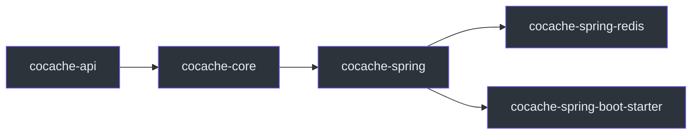

# cocache-spring

`cocache-spring` 模块提供 CoCache 与 Spring 框架的集成，包括注解驱动的缓存注册和 Spring 工厂组件。

## 依赖关系



主要依赖：
- `cocache-core`
- Spring Framework（`spring-context`, `spring-beans`）

## 包结构

```
me.ahoo.cache.spring
├── EnableCoCache.kt              # @EnableCoCache 注解
├── EnableCoCacheRegistrar.kt     # Bean 注册器
├── AbstractCacheFactory.kt       # 抽象缓存工厂
├── SpringCacheFactory.kt         # Spring 缓存工厂
├── client/
│   └── SpringClientSideCacheFactory.kt  # L2 工厂
├── converter/
│   └── SpringKeyConverterFactory.kt     # 键转换器工厂
├── join/
│   ├── JoinCacheProxyFactoryBean.kt     # JoinCache FactoryBean
│   └── SpringJoinKeyExtractorFactory.kt
├── proxy/
│   └── CacheProxyFactoryBean.kt  # Cache FactoryBean
└── source/
    └── SpringCacheSourceFactory.kt # 数据源工厂
```

## 核心组件

### @EnableCoCache

入口注解，通过 `@Import` 触发 `EnableCoCacheRegistrar`。

```kotlin
@EnableCoCache(caches = [UserCache::class])
@Configuration
class CacheConfiguration
```

**源码参考**：[`cocache-spring/.../EnableCoCache.kt`](https://github.com/Ahoo-Wang/CoCache/blob/main/cocache-spring/src/main/kotlin/me/ahoo/cache/spring/EnableCoCache.kt)

### EnableCoCacheRegistrar

`ImportBeanDefinitionRegistrar` 实现，解析缓存接口并注册 Bean 定义。

**源码参考**：[`cocache-spring/.../EnableCoCacheRegistrar.kt`](https://github.com/Ahoo-Wang/CoCache/blob/main/cocache-spring/src/main/kotlin/me/ahoo/cache/spring/EnableCoCacheRegistrar.kt)

### CacheProxyFactoryBean

Spring `FactoryBean`，创建缓存代理实例。

**源码参考**：[`cocache-spring/.../CacheProxyFactoryBean.kt`](https://github.com/Ahoo-Wang/CoCache/blob/main/cocache-spring/src/main/kotlin/me/ahoo/cache/spring/proxy/CacheProxyFactoryBean.kt)

### SpringCacheFactory

基于 `ListableBeanFactory` 的缓存工厂，从 Spring 容器获取缓存实例。

**源码参考**：[`cocache-spring/.../SpringCacheFactory.kt`](https://github.com/Ahoo-Wang/CoCache/blob/main/cocache-spring/src/main/kotlin/me/ahoo/cache/spring/SpringCacheFactory.kt)

### SpringClientSideCacheFactory

从 Spring 容器查找 `ClientSideCache` Bean，按缓存名称匹配。如果容器中没有匹配的 Bean，则使用默认实现（`MapClientSideCache`）。

**源码参考**：[`cocache-spring/.../SpringClientSideCacheFactory.kt`](https://github.com/Ahoo-Wang/CoCache/blob/main/cocache-spring/src/main/kotlin/me/ahoo/cache/spring/client/SpringClientSideCacheFactory.kt)

### SpringKeyConverterFactory

创建 `KeyConverter`，支持 `keyPrefix` 和 SpEL `keyExpression`。

**源码参考**：[`cocache-spring/.../SpringKeyConverterFactory.kt`](https://github.com/Ahoo-Wang/CoCache/blob/main/cocache-spring/src/main/kotlin/me/ahoo/cache/spring/converter/SpringKeyConverterFactory.kt)

## Bean 查找机制

Spring 工厂组件通过名称匹配来查找自定义 Bean。例如，对于缓存接口 `UserCache`：

1. 首先查找名为 `UserCache` 的 `ClientSideCache` Bean
2. 如果未找到，查找名为 `userCache` 的 Bean
3. 如果仍未找到，使用默认实现

同样适用于 `CacheSource`、`JoinKeyExtractor` 等。

## 相关页面

- [Spring 集成](../api/spring-integration.md) - 集成详解
- [cocache-core](./cocache-core.md) - 核心实现模块
- [cocache-spring-boot-starter](./cocache-spring-boot-starter.md) - 自动配置模块
- [代理与注解](../architecture/proxy.md) - 代理机制
