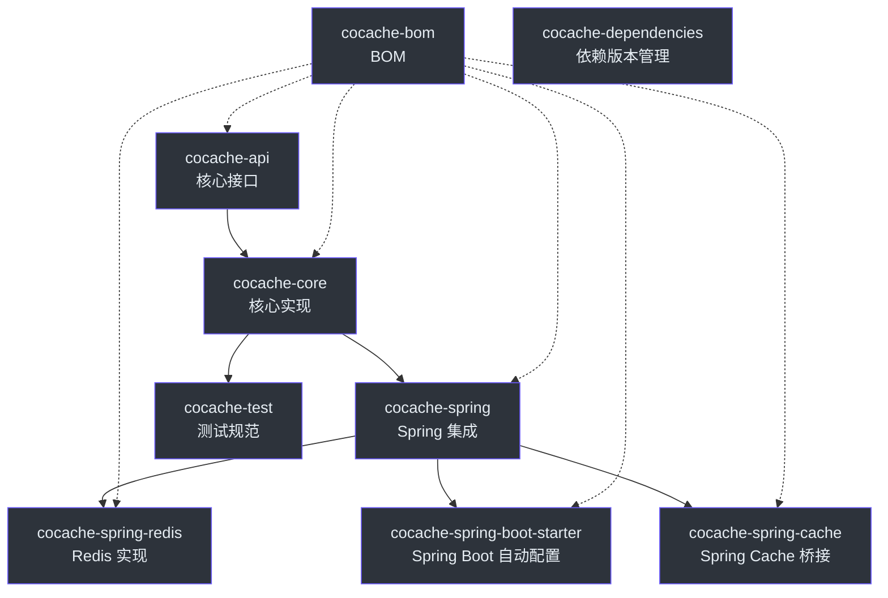

# 模块概览

CoCache 采用模块化设计，各模块职责清晰，可按需引入依赖。

## 模块依赖图



## 模块列表

| 模块 | 类型 | 说明 |
|------|------|------|
| [cocache-api](./cocache-api.md) | 库 | 核心接口定义 |
| [cocache-core](./cocache-core.md) | 库 | 默认实现 |
| [cocache-spring](./cocache-spring.md) | 库 | Spring 集成 |
| [cocache-spring-redis](./cocache-spring-redis.md) | 库 | Redis 实现 |
| [cocache-spring-boot-starter](./cocache-spring-boot-starter.md) | Starter | Spring Boot 自动配置 |
| [cocache-spring-cache](./cocache-spring-cache.md) | 库 | Spring Cache 桥接 |
| cocache-test | 测试 | 共享测试规范 |
| cocache-bom | BOM | 版本管理 |
| cocache-dependencies | 依赖 | 中央版本目录 |
| cocache-example | 示例 | 示例应用 |
| code-coverage-report | 报告 | JaCoCo 覆盖率聚合 |

## 最小依赖

如果只需要核心缓存能力（不依赖 Spring）：

```kotlin
implementation("me.ahoo.cococache:cocache-core")
```

## Spring Boot 项目

推荐使用 Spring Boot Starter：

```kotlin
implementation(platform("me.ahoo.cococache:cocache-bom:latest.version"))
implementation("me.ahoo.cococache:cocache-spring-boot-starter")
```

## 相关页面

- [cocache-api](./cocache-api.md) - 核心接口模块
- [cocache-core](./cocache-core.md) - 核心实现模块
- [cocache-spring](./cocache-spring.md) - Spring 集成模块
- [cocache-spring-redis](./cocache-spring-redis.md) - Redis 实现模块
- [cocache-spring-boot-starter](./cocache-spring-boot-starter.md) - 自动配置模块
- [cocache-spring-cache](./cocache-spring-cache.md) - Spring Cache 桥接模块
