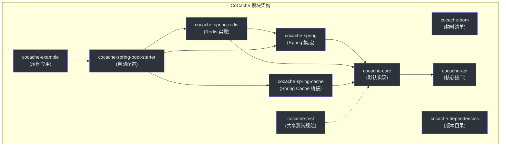
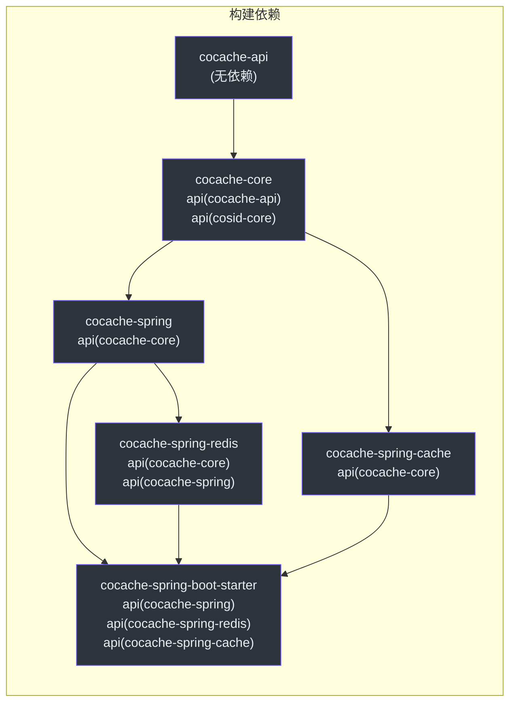
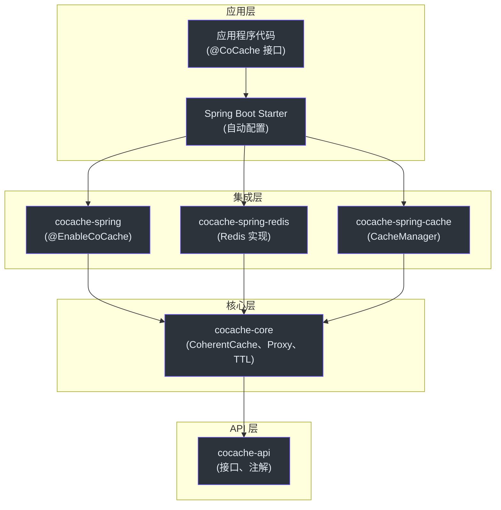
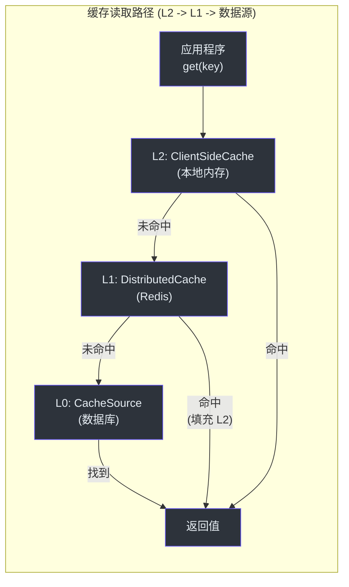
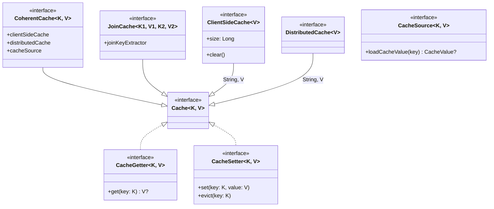

# 模块概览

CoCache 由一组专注的 Gradle 模块组成，从纯 API 定义到核心逻辑、Spring 集成、Redis 持久化和 Spring Boot 自动配置逐层叠加。每个模块具有单一职责，仅依赖依赖图中位于其下方的模块。

## 模块依赖图



## 模块说明

| 模块 | 用途 | 关键内容 | 源码 |
|------|------|----------|------|
| **cocache-api** | 纯接口和注解，零实现依赖 | `Cache`、`CacheValue`、`ClientSideCache`、`CacheSource`、`JoinCache`、`@CoCache`、`@JoinCacheable` | [cocache-api/](https://github.com/Ahoo-Wang/CoCache/tree/main/cocache-api) |
| **cocache-core** | 所有核心抽象的默认实现 | `DefaultCoherentCache`、`CoCacheProxy`、`SimpleJoinCache`、`MapClientSideCache`、`GuavaClientSideCache`、`CaffeineClientSideCache`、`BloomKeyFilter`、`CacheEvictedEventBus` | [cocache-core/](https://github.com/Ahoo-Wang/CoCache/tree/main/cocache-core) |
| **cocache-spring** | Spring 框架集成，基于 DI 的缓存创建 | `@EnableCoCache`、`EnableCoCacheRegistrar`、`AbstractCacheFactory`、`CacheProxyFactoryBean`、`JoinCacheProxyFactoryBean` | [cocache-spring/](https://github.com/Ahoo-Wang/CoCache/tree/main/cocache-spring) |
| **cocache-spring-redis** | 基于 Redis 的分布式缓存和事件总线 | `RedisDistributedCache`、`RedisCacheEvictedEventBus`、`CodecExecutor` 层次结构 | [cocache-spring-redis/](https://github.com/Ahoo-Wang/CoCache/tree/main/cocache-spring-redis) |
| **cocache-spring-cache** | Spring `CacheManager` 抽象的桥接 | `CoCacheManager`、`CoSpringCache` | [cocache-spring-cache/](https://github.com/Ahoo-Wang/CoCache/tree/main/cocache-spring-cache) |
| **cocache-spring-boot-starter** | Spring Boot 自动配置和 Actuator 端点 | `CoCacheAutoConfiguration`、`CoCacheProperties`、`CoCacheEndpoint`、`CoCacheClientEndpoint` | [cocache-spring-boot-starter/](https://github.com/Ahoo-Wang/CoCache/tree/main/cocache-spring-boot-starter) |
| **cocache-test** | 共享的抽象测试规范，用于验证缓存实现 | `CacheSpec`、`DistributedCacheSpec`、`ClientSideCacheSpec`、`MultipleInstanceSyncSpec` | [cocache-test/](https://github.com/Ahoo-Wang/CoCache/tree/main/cocache-test) |
| **cocache-example** | 示例应用 | `UserCache`、`UserExtendInfoJoinCache`、示例配置 | [cocache-example/](https://github.com/Ahoo-Wang/CoCache/tree/main/cocache-example) |
| **cocache-bom** | 依赖管理的物料清单 | BOM POM 发布 | [cocache-bom/](https://github.com/Ahoo-Wang/CoCache/tree/main/cocache-bom) |
| **cocache-dependencies** | 集中版本目录 | 所有第三方依赖版本 | [cocache-dependencies/](https://github.com/Ahoo-Wang/CoCache/tree/main/cocache-dependencies) |
| **code-coverage-report** | 聚合的 JaCoCo 覆盖率 | 多模块覆盖率聚合 | [code-coverage-report/](https://github.com/Ahoo-Wang/CoCache/tree/main/code-coverage-report) |

## Gradle 构建配置

所有模块都在 [settings.gradle.kts](https://github.com/Ahoo-Wang/CoCache/blob/main/settings.gradle.kts) 中声明：

```kotlin
rootProject.name = "CoCache"

include(":cocache-bom")
include(":cocache-dependencies")
include(":cocache-api")
include(":cocache-core")
include(":cocache-spring")
include(":cocache-spring-cache")
include(":cocache-spring-redis")
include(":cocache-spring-boot-starter")
include(":cocache-test")
include(":cocache-example")
include(":code-coverage-report")
```

### 构建依赖链

`build.gradle.kts` 中的依赖声明建立了以下编译时依赖链：



## 分层架构



## 两级缓存数据流



## 核心接口层次结构



## 关键设计原则

1. **接口隔离**：`cocache-api` 仅包含接口和注解，允许下游模块仅依赖契约而无实现耦合。

2. **工厂模式**：每个主要组件（`ClientSideCache`、`DistributedCache`、`CacheSource`、`KeyConverter`、`JoinKeyExtractor`）在 `cocache-core` 中都有对应的工厂接口，在 `cocache-spring` 中有 Spring 感知的实现。

3. **AbstractCacheFactory**：[AbstractCacheFactory](https://github.com/Ahoo-Wang/CoCache/blob/main/cocache-spring/src/main/kotlin/me/ahoo/cache/spring/AbstractCacheFactory.kt) 基类提供了统一的 Spring Bean 解析模式——先按约定名称查找 Bean，再回退到类型查找，最后使用默认工厂方法。

4. **插件架构**：用户可以通过简单地声明具有预期名称或类型的 Spring Bean 来替换任何组件（客户端缓存、分布式缓存、编解码器、事件总线）。

## 相关页面

- [cocache-api](./cocache-api.md) -- 所有接口和注解
- [cocache-core](./cocache-core.md) -- 默认实现和核心逻辑
- [cocache-spring](./cocache-spring.md) -- Spring 框架集成
- [cocache-spring-redis](./cocache-spring-redis.md) -- Redis 分布式缓存实现
- [cocache-spring-boot-starter](./cocache-spring-boot-starter.md) -- 自动配置和端点
- [cocache-spring-cache](./cocache-spring-cache.md) -- Spring Cache 抽象桥接
