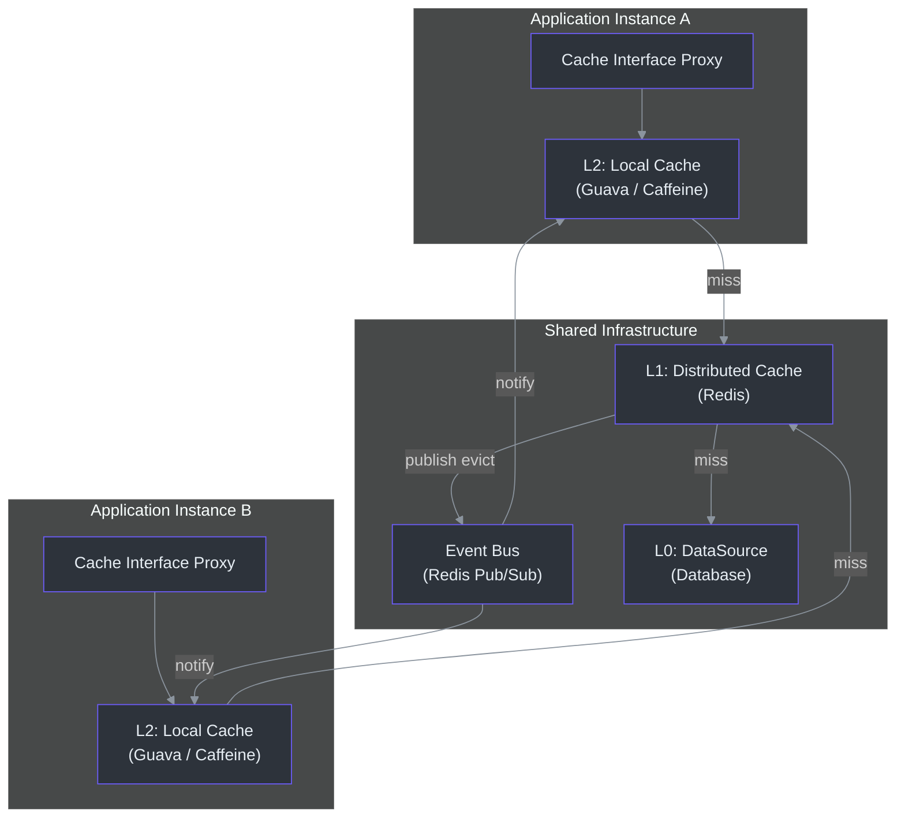
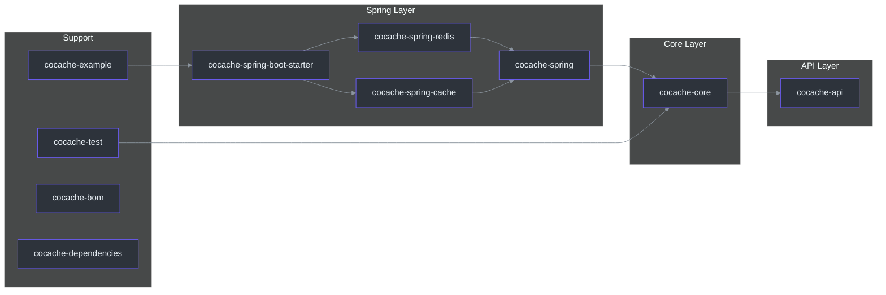
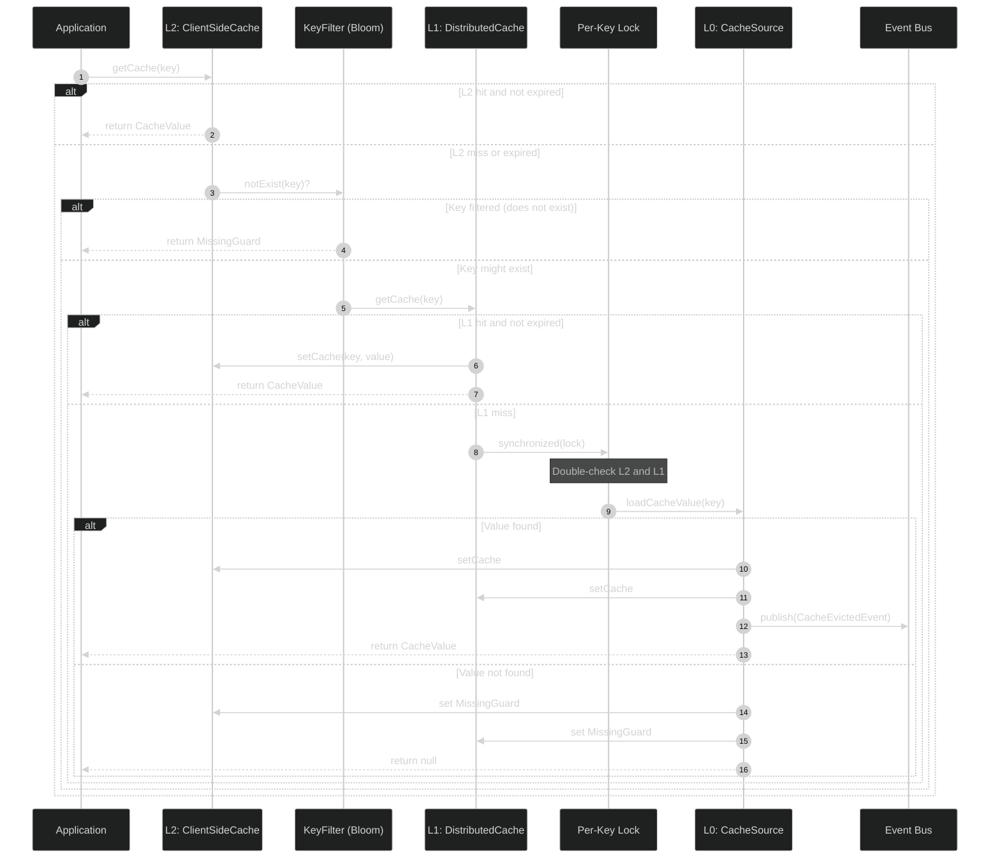
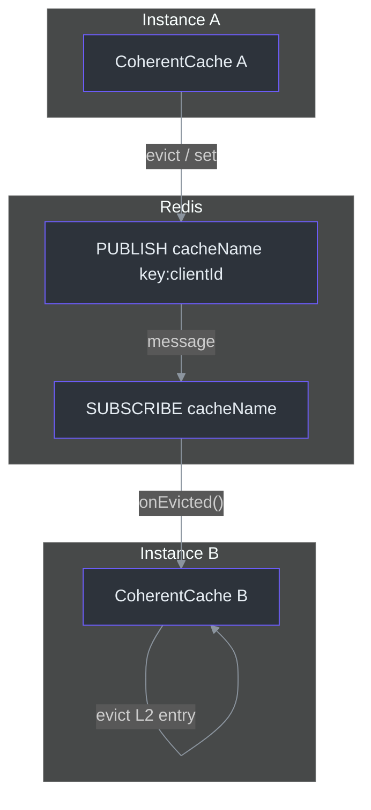
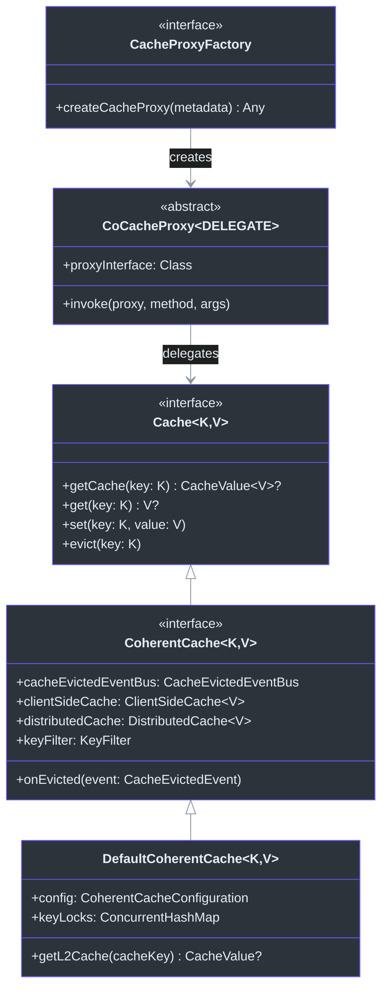
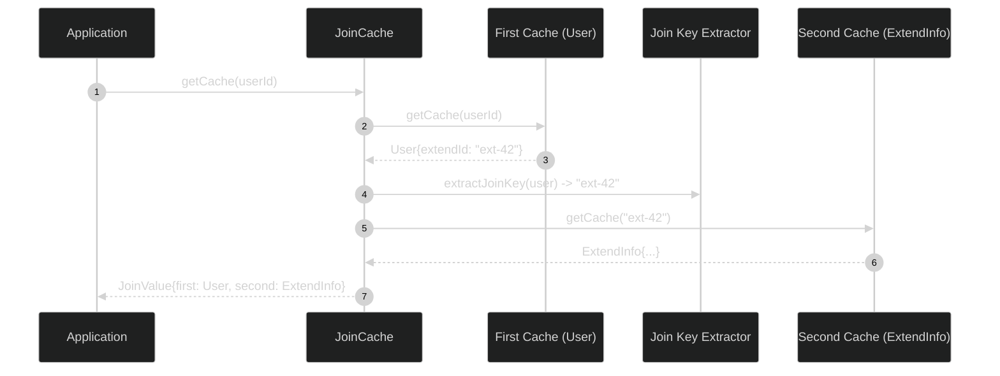

# 贡献者入门指南

欢迎阅读 CoCache 贡献者指南。本文档将引导你完成成为 CoCache 框架高效贡献者所需的一切内容——从语言和框架基础，到核心架构和领域模型，再到构建、测试和贡献工作流的实操指南。

---

## 目录

- [第一部分：语言与框架基础](#第一部分语言与框架基础)
  - [1.1 Kotlin 基础](#11-kotlin-基础)
  - [1.2 Java 互操作要点](#12-java-互操作要点)
  - [1.3 Gradle 构建系统](#13-gradle-构建系统)
  - [1.4 Spring Boot 集成](#14-spring-boot-集成)
  - [1.5 Guava 和 Caffeine 库](#15-guava-和-caffeine-库)
  - [1.6 Redis](#16-redis)
- [第二部分：CoCache 架构与领域模型](#第二部分cocache-架构与领域模型)
  - [2.1 高层架构](#21-高层架构)
  - [2.2 模块地图](#22-模块地图)
  - [2.3 L0 / L1 / L2 缓存层级](#23-l0--l1--l2-缓存层级)
  - [2.4 基于事件总线的缓存一致性](#24-基于事件总线的缓存一致性)
  - [2.5 基于代理的缓存机制](#25-基于代理的缓存机制)
  - [2.6 JoinCache 模式](#26-joincache-模式)
  - [2.7 缓存雪崩与穿透防护](#27-缓存雪崩与穿透防护)
- [第三部分：快速上手](#第三部分快速上手)
  - [3.1 环境搭建](#31-环境搭建)
  - [3.2 构建项目](#32-构建项目)
  - [3.3 运行测试](#33-运行测试)
  - [3.4 测试兼容性套件（TCK）](#34-测试兼容性套件tck)
  - [3.5 贡献工作流](#35-贡献工作流)
- [术语表](#术语表)
- [关键文件索引](#关键文件索引)

---

## 第一部分：语言与框架基础

### 1.1 Kotlin 基础

CoCache 完全使用 **Kotlin** 编写，目标运行环境为 **JDK 17+**。你不需要是 Kotlin 专家就可以参与贡献，但需要熟悉以下概念。

#### 空安全（Null Safety）

Kotlin 的类型系统区分可空类型（`T?`）和非空类型（`T`）。项目编译时启用了 `-Xjsr305=strict`，这意味着 JSR-305 注解（`@Nullable`、`@Nonnull`）会被视为 Kotlin 空安全约束。如果你编写了一个返回 `@Nullable` 的 Java 方法，Kotlin 调用方会将其视为 `T?`。

```kotlin
// 非空返回 -- 编译器强制执行此约束
fun getCache(key: K): CacheValue<V>?

// 你必须在调用处处理 null 的情况
val value = cache.getCache("user:123")
if (value != null) {
    // 使用 value
}
```

#### 扩展函数（Extension Functions）

CoCache 使用扩展函数来添加工具方法行为。例如，
[cocache-core/src/main/kotlin/me/ahoo/cache/MissingGuard.kt](https://github.com/Ahoo-Wang/CoCache/blob/main/cocache-core/src/main/kotlin/me/ahoo/cache/MissingGuard.kt)
中的伴生对象定义了 `Any?.isMissingGuard` 等扩展属性：

```kotlin
val Any?.isMissingGuard: Boolean
    get() {
        return when (this) {
            is String -> this.isMissingGuard()
            is Set<*> -> this.isMissingGuard()
            else -> this is MissingGuard
        }
    }
```

#### 委托模式（Delegation Pattern）

Kotlin 的 `by` 关键字在 CoCache 中被广泛使用。例如，
[cocache-core/src/main/kotlin/me/ahoo/cache/consistency/DefaultCoherentCache.kt](https://github.com/Ahoo-Wang/CoCache/blob/main/cocache-core/src/main/kotlin/me/ahoo/cache/consistency/DefaultCoherentCache.kt)
将 `DistributedClientId` 和 `NamedCache` 委托给其配置对象：

```kotlin
class DefaultCoherentCache<K, V>(
    val config: CoherentCacheConfiguration<K, V>,
    override val cacheEvictedEventBus: CacheEvictedEventBus
) : CoherentCache<K, V>, DistributedClientId by config, NamedCache by config
```

#### 协程（Coroutines）

CoCache **不使用**协程。所有缓存操作都是同步的。这是一个有意的设计选择：缓存命中预期在亚毫秒级别完成，框架使用 `synchronized` 块进行按键加锁，而非基于协程的并发模型。

### 1.2 Java 互操作要点

构建标志 `-Xjvm-default=all-compatibility` 确保 Kotlin 接口生成的默认方法实现可以直接从 Java 调用，无需 `DefaultImpls` 类。这一点至关重要，因为 CoCache 基于代理的架构使用了 `java.lang.reflect.InvocationHandler` 和 `java.lang.reflect.Method`。

以下是代码库中常见的互操作模式：

| 模式 | 使用位置 | 原因 |
|---------|-----------|-----|
| `@JvmStatic` 修饰伴生对象常量 | `CacheEvictedEvent.TYPE`、`MissingGuard.STRING_VALUE` | Java 调用方可以像 `CacheEvictedEvent.TYPE` 这样访问 |
| `operator fun get/set` | `CacheGetter`、`CacheSetter` | 在 Kotlin 中支持 `cache[key]` 语法，在 Java 中为 `cache.get(key)` |
| `@Subscribe` 注解 | `DefaultCoherentCache.onEvicted()` | Guava EventBus 注解，通过反射读取 |

### 1.3 Gradle 构建系统

CoCache 使用 **Gradle 9.6.1**（wrapper）。构建配置通过根目录的
[build.gradle.kts](https://github.com/Ahoo-Wang/CoCache/blob/main/build.gradle.kts) 定义，每个模块有各自的构建文件。

#### 根目录构建配置

```text
build.gradle.kts          -- 根构建：插件、项目分类、通用依赖
settings.gradle.kts       -- 模块引入、工具链解析器
gradle.properties          -- 项目元数据、版本号、sonatype URL
config/detekt/detekt.yml   -- Detekt 代码质量规则
config/logback.xml         -- 测试日志配置（JaCoCo 修复）
```

#### 常用 Gradle 命令

```bash
# 构建（跳过测试）
./gradlew build -x test

# 运行所有测试
./gradlew test

# 运行指定模块测试
./gradlew :cocache-core:test

# 运行单个测试类
./gradlew :cocache-core:test --tests "me.ahoo.cache.proxy.ProxyCacheTest"

# 完整检查（测试 + detekt + dokka）
./gradlew check

# Detekt 自动修复
./gradlew detektAutoFix

# 发布到本地 Maven 仓库
./gradlew publishToMavenLocal
```

#### 依赖管理

依赖统一集中在 `cocache-dependencies` 模块中管理，该模块充当版本目录。所有库项目声明：

```kotlin
dependencies {
    api(platform(dependenciesProject))
}
```

这确保了每个模块使用相同的依赖版本。

### 1.4 Spring Boot 集成

CoCache 与 **Spring Boot 4.1.0** 集成。Spring 集成部分分布在三个模块中：

- **`cocache-spring`** -- 核心 Spring 集成（`@EnableCoCache`、工厂 Bean、`CoCacheRegistrar`）
- **`cocache-spring-boot-starter`** -- Spring Boot 自动配置
- **`cocache-spring-cache`** -- 适配 Spring 的 `Cache` / `CacheManager` 抽象

#### Spring 集成工作原理

`@EnableCoCache` 注解触发一个自定义的 `ImportBeanDefinitionRegistrar`，它扫描带有 `@CoCache` 注解的接口，并为每个接口创建代理 Bean。代理拦截方法调用，并将其路由到一致性缓存层。

```kotlin
// 来自 cocache-example -- 定义缓存接口
@CoCache(keyPrefix = "user:", ttl = 120)
@GuavaCache(
    maximumSize = 1000_000,
    expireUnit = TimeUnit.SECONDS,
    expireAfterAccess = 120
)
interface UserCache : Cache<String, User>
```

`@EnableCoCache` 注解列出缓存接口：

```kotlin
@EnableCoCache(caches = [UserCache::class])
@Configuration
class AppConfig
```

Spring 通过匹配从接口推导出的缓存名称来自动装配 `ClientSideCache` 和 `CacheSource` Bean。

### 1.5 Guava 和 Caffeine 库

CoCache 的 L2 层支持两种本地缓存引擎：

| 引擎 | 注解 | 配置类 | 模块 |
|--------|-----------|-------------------|--------|
| **Guava** | `@GuavaCache` | `GuavaClientSideCache` | `cocache-core` |
| **Caffeine** | `@CaffeineCache` | `CaffeineClientSideCache` | `cocache-core` |
| **Map** | （无，仅支持编程方式） | `MapClientSideCache` | `cocache-core` |

Guava 和 Caffeine 通过缓存接口上的注解进行配置。`ClientSideCacheFactory` 读取这些注解并创建相应的实现。

`@GuavaCache` 注解支持以下设置：
- `maximumSize` -- 最大缓存条目数
- `expireAfterAccess` -- 最后访问后的驱逐超时
- `expireUnit` -- 过期时间单位

Caffeine 的设置遵循类似的模式。

### 1.6 Redis

Redis 是默认的 L1 分布式缓存。CoCache 使用 Spring Data Redis 的 `StringRedisTemplate` 与 Redis 交互。

`RedisDistributedCache` 实现（[cocache-spring-redis/src/main/kotlin/me/ahoo/cache/spring/redis/RedisDistributedCache.kt](https://github.com/Ahoo-Wang/CoCache/blob/main/cocache-spring-redis/src/main/kotlin/me/ahoo/cache/spring/redis/RedisDistributedCache.kt)）
使用 `CodecExecutor` 进行序列化/反序列化。它通过 Redis 原生的 `EXPIRE` 机制存储缓存条目并支持 TTL。

`RedisCacheEvictedEventBus`（[cocache-spring-redis/src/main/kotlin/me/ahoo/cache/spring/redis/RedisCacheEvictedEventBus.kt](https://github.com/Ahoo-Wang/CoCache/blob/main/cocache-spring-redis/src/main/kotlin/me/ahoo/cache/spring/redis/RedisCacheEvictedEventBus.kt)）
使用 Redis Pub/Sub 在所有应用实例间广播驱逐事件。每个缓存名称映射到一个独立的 Redis Pub/Sub 频道。

---

## 第二部分：CoCache 架构与领域模型

### 2.1 高层架构

CoCache 实现了一个**二级分布式一致性缓存**。其核心理念是：每个应用实例维护一个本地内存缓存（L2），并通过共享的分布式缓存（L1）和事件总线保持跨实例的一致性。



### 2.2 模块地图



| 模块 | 用途 |
|--------|---------|
| `cocache-api` | 核心接口：`Cache`、`CacheGetter`、`CacheSetter`、`ClientSideCache`、`CacheSource`、注解 |
| `cocache-core` | 默认实现：`DefaultCoherentCache`、`ComputedCache`、代理处理器、Guava/Caffeine 客户端、布隆过滤器 |
| `cocache-spring` | Spring 集成：`@EnableCoCache`、`CoCacheRegistrar`、`SpringCacheFactory` |
| `cocache-spring-redis` | Redis L1 缓存：`RedisDistributedCache`、`RedisCacheEvictedEventBus` |
| `cocache-spring-cache` | Spring Cache 桥接：`CoCacheManager`、`CoSpringCache` |
| `cocache-spring-boot-starter` | Spring Boot 自动配置 |
| `cocache-test` | TCK 抽象测试规范：`CacheSpec`、`DistributedCacheSpec`、`ClientSideCacheSpec`、`DefaultCoherentCacheSpec` |
| `cocache-example` | 展示使用模式的参考应用 |

### 2.3 L0 / L1 / L2 缓存层级

CoCache 使用三层术语来描述数据访问：

| 层级 | 名称 | 组件 | 延迟 | 是否共享 |
|-------|------|-----------|---------|---------|
| **L2** | 本地缓存 | `ClientSideCache<V>` | ~微秒 | 每实例独立 |
| **L1** | 分布式缓存 | `DistributedCache<V>` | ~毫秒（网络） | 所有实例共享 |
| **L0** | 数据源 | `CacheSource<K, V>` | ~毫秒到秒 | 不适用 |

#### 缓存读取流程



此流程的关键源码位于
[cocache-core/src/main/kotlin/me/ahoo/cache/consistency/DefaultCoherentCache.kt#L89](https://github.com/Ahoo-Wang/CoCache/blob/main/cocache-core/src/main/kotlin/me/ahoo/cache/consistency/DefaultCoherentCache.kt#L89)。

`getL2Cache()` 方法（[cocache-core/src/main/kotlin/me/ahoo/cache/consistency/DefaultCoherentCache.kt:50](https://github.com/Ahoo-Wang/CoCache/blob/main/cocache-core/src/main/kotlin/me/ahoo/cache/consistency/DefaultCoherentCache.kt#L50)）
首先检查 L2，然后检查布隆过滤器，再检查 L1。如果全部未命中，则获取按键锁并重复检查（双重检查锁定模式），最后才会回退到 L0。

#### 缓存写入流程

当写入一个值时，会同时设置到 L2 和 L1 两层：

```kotlin
// DefaultCoherentCache.setCache() -- 第 137 行
private fun setCache(cacheKey: String, cacheValue: CacheValue<V>) {
    clientSideCache.setCache(cacheKey, cacheValue)  // L2
    distributedCache.setCache(cacheKey, cacheValue)  // L1
}
```

然后发布驱逐事件以通知其他实例。

#### 缓存驱逐流程

驱逐操作会从 L2 和 L1 中同时移除条目，然后发布事件：

```kotlin
// DefaultCoherentCache.evict() -- 第 151 行
override fun evict(key: K) {
    val cacheKey = keyConverter.toStringKey(key)
    clientSideCache.evict(cacheKey)         // L2
    distributedCache.evict(cacheKey)        // L1
    cacheEvictedEventBus.publish(...)       // 通知其他实例
}
```

### 2.4 基于事件总线的缓存一致性

事件总线是 CoCache 一致性模型的核心骨干。没有它，当一个应用实例更新 L1 后，其他应用实例的 L2 缓存将变为过期状态。

#### 架构



#### 事件总线实现

| 实现 | 模块 | 传输方式 | 使用场景 |
|---------------|--------|-----------|----------|
| `GuavaCacheEvictedEventBus` | `cocache-core` | 进程内 Guava EventBus | 单实例或测试环境 |
| `NoOpCacheEvictedEventBus` | `cocache-core` | 无（事件丢弃） | 不需要一致性 |
| `RedisCacheEvictedEventBus` | `cocache-spring-redis` | Redis Pub/Sub | 多实例生产环境 |

#### 工作原理

1. 当任何实例执行 `setCache()` 或 `evict()` 时，会将一个
   [cocache-core/src/main/kotlin/me/ahoo/cache/consistency/CacheEvictedEvent.kt](https://github.com/Ahoo-Wang/CoCache/blob/main/cocache-core/src/main/kotlin/me/ahoo/cache/consistency/CacheEvictedEvent.kt)
   发布到事件总线。

2. 事件包含 `cacheName`、`key` 和 `publisherId`。

3. 在 Redis 实现中（[cocache-spring-redis/src/main/kotlin/me/ahoo/cache/spring/redis/RedisCacheEvictedEventBus.kt](https://github.com/Ahoo-Wang/CoCache/blob/main/cocache-spring-redis/src/main/kotlin/me/ahoo/cache/spring/redis/RedisCacheEvictedEventBus.kt)），
   事件通过 `redisTemplate.convertAndSend(cacheName, ...)` 发送。

4. 所有订阅了该缓存名称的实例通过
   `onEvicted()`（[cocache-core/src/main/kotlin/me/ahoo/cache/consistency/DefaultCoherentCache.kt#L159](https://github.com/Ahoo-Wang/CoCache/blob/main/cocache-core/src/main/kotlin/me/ahoo/cache/consistency/DefaultCoherentCache.kt#L159)）
   接收事件。

5. 每个实例检查：(a) 事件的 cacheName 是否与自身匹配？(b) 该事件是否由自身发布？如果 (a) 是且 (b) 否，则驱逐本地 L2 条目。

### 2.5 基于代理的缓存机制

CoCache 使用 JDK 动态代理来实现缓存接口。这意味着你永远不需要为缓存接口编写实现代码——只需声明接口、添加注解，CoCache 就会在运行时创建实现。

#### 类层次结构



#### 代理创建的工作原理

1. `@EnableCoCache` 触发 `EnableCoCacheRegistrar`（位于 `cocache-spring`）。
2. 注册器扫描带有 `@CoCache` 注解的接口。
3. 对每个接口，从注解中解析出 `CoCacheMetadata`。
4. `CacheProxyFactory.createCacheProxy()` 创建 JDK 动态代理。
5. 代理的 `InvocationHandler`（即 `CoCacheProxy` 子类）将所有方法调用委托给 `DefaultCoherentCache` 实例。

[cocache-core/src/main/kotlin/me/ahoo/cache/proxy/CoCacheProxy.kt](https://github.com/Ahoo-Wang/CoCache/blob/main/cocache-core/src/main/kotlin/me/ahoo/cache/proxy/CoCacheProxy.kt)
同时处理接口默认方法（通过 `InvocationHandler.invokeDefault()` 调用）和常规缓存方法（委托给 `CoherentCache`）。

### 2.6 JoinCache 模式

JoinCache 允许将两个不同缓存中的值组合在一起。例如，你可能有一个 `UserCache`（以 userId 为键）和一个 `UserExtendInfoCache`（以 extendId 为键）。`JoinCache` 可以将它们组合起来：给定一个用户，从用户对象中提取 extendId，然后获取扩展信息。



`JoinCache` 接口（[cocache-api/src/main/kotlin/me/ahoo/cache/api/join/JoinCache.kt](https://github.com/Ahoo-Wang/CoCache/blob/main/cocache-api/src/main/kotlin/me/ahoo/cache/api/join/JoinCache.kt)）
扩展了 `Cache<K1, JoinValue<V1, K2, V2>>`，并添加了 `joinKeyExtractor`，用于从主值中派生二级键。

示例模块通过
[cocache-example/src/main/kotlin/me/ahoo/cache/example/cache/UserExtendInfoJoinCache.kt](https://github.com/Ahoo-Wang/CoCache/blob/main/cocache-example/src/main/kotlin/me/ahoo/cache/example/cache/UserExtendInfoJoinCache.kt)
演示了这一模式。

### 2.7 缓存雪崩与穿透防护

CoCache 解决了三个经典的缓存问题：

#### 缓存雪崩（Breakdown）

**问题**：当一个热门缓存条目过期时，大量并发请求同时未命中缓存，全部涌入数据库。

**解决方案**：基于键的细粒度加锁。`DefaultCoherentCache` 维护一个 `ConcurrentHashMap<String, Any>` 锁对象映射。当缓存未命中时，通过 `synchronized(lock)` 获取特定键的锁。在锁内部重新检查缓存（双重检查锁定）。每个键只有一个线程会穿透到数据库。

```kotlin
// DefaultCoherentCache.getCache() -- 第 101-134 行
val lock = getLock(cacheKey)
synchronized(lock) {
    try {
        getL2Cache(cacheKey)?.let { return it }
        // ... 穿透到 CacheSource
    } finally {
        releaseLock(cacheKey)
    }
}
```

此实现位于
[cocache-core/src/main/kotlin/me/ahoo/cache/consistency/DefaultCoherentCache.kt#L101](https://github.com/Ahoo-Wang/CoCache/blob/main/cocache-core/src/main/kotlin/me/ahoo/cache/consistency/DefaultCoherentCache.kt#L101)。

#### 缓存穿透

**问题**：查询数据库中不存在的键时，每次都会未命中缓存并击中数据库。

**解决方案**：MissingGuard 哨兵值。当缓存查找在数据库中未返回值时，CoCache 会存储一个特殊的"缺失守卫"值（字符串类型为 `_nil_`，或是一个标记对象）。后续对同一键的查找会返回该哨兵值，调用方将其视为"未找到值"而不再访问数据库。

```kotlin
// DefaultCoherentCache.getCache() -- 第 129 行
setCache(cacheKey, DefaultCacheValue.missingGuard(ttl, ttlAmplitude))
return null
```

参见 [cocache-core/src/main/kotlin/me/ahoo/cache/MissingGuard.kt](https://github.com/Ahoo-Wang/CoCache/blob/main/cocache-core/src/main/kotlin/me/ahoo/cache/MissingGuard.kt)
中的哨兵值检测逻辑。

#### 缓存击穿（通过布隆过滤器）

**问题**：大量随机的不存在的键会压垮缓存。

**解决方案**：`KeyFilter` 接口，其实现 `BloomKeyFilter` 基于 Guava 的 `BloomFilter`。在访问 L1 之前，先检查布隆过滤器。如果某个键肯定不存在，则立即返回 MissingGuard，不会触及 Redis。

参见 [cocache-core/src/main/kotlin/me/ahoo/cache/filter/BloomKeyFilter.kt](https://github.com/Ahoo-Wang/CoCache/blob/main/cocache-core/src/main/kotlin/me/ahoo/cache/filter/BloomKeyFilter.kt)。

### 2.8 CacheValue 与 TTL 系统

理解 `CacheValue` 和 TTL（Time-To-Live）系统对于深入 CoCache 内部机制至关重要。

#### CacheValue 生命周期

缓存中的每个条目都被包装在一个 `CacheValue<V>` 中，携带元数据：

| 属性 | 类型 | 含义 |
|----------|------|---------|
| `value` | `V` | 实际缓存的数据（或 MissingGuard 哨兵） |
| `ttlAt` | `Long` | 该条目过期的绝对时间戳（自 epoch 以来的秒数） |
| `isExpired` | `Boolean` | 是否 `currentTime > ttlAt` |
| `isMissingGuard` | `Boolean` | 是否为哨兵"未找到"标记 |

实现位于 [cocache-core/src/main/kotlin/me/ahoo/cache/DefaultCacheValue.kt](https://github.com/Ahoo-Wang/CoCache/blob/main/cocache-core/src/main/kotlin/me/ahoo/cache/DefaultCacheValue.kt)，
它使用 `ComputedTtlAt`（[cocache-core/src/main/kotlin/me/ahoo/cache/ComputedTtlAt.kt](https://github.com/Ahoo-Wang/CoCache/blob/main/cocache-core/src/main/kotlin/me/ahoo/cache/ComputedTtlAt.kt)）
来计算过期时间。

#### TTL 抖动（Jitter）详解

`ComputedTtlAt.jitter()` 函数（[cocache-core/src/main/kotlin/me/ahoo/cache/ComputedTtlAt.kt:49](https://github.com/Ahoo-Wang/CoCache/blob/main/cocache-core/src/main/kotlin/me/ahoo/cache/ComputedTtlAt.kt#L49)）
在一定范围内随机化 TTL：

```kotlin
fun jitter(ttl: Long, amplitude: Long): Long {
    val low = ttl - amplitude
    val high = ttl + amplitude
    return (low..high).random()
}
```

对于一个 `ttl = 120` 且 `ttlAmplitude = 10` 的缓存，每个条目将在创建后 110 到 130 秒之间过期。这可以防止"缓存雪崩"场景——即流量高峰期间获取的所有条目同时过期。

`TtlConfiguration` 接口（[cocache-core/src/main/kotlin/me/ahoo/cache/TtlConfiguration.kt](https://github.com/Ahoo-Wang/CoCache/blob/main/cocache-core/src/main/kotlin/me/ahoo/cache/TtlConfiguration.kt)）
携带 `ttl` 和 `ttlAmplitude`，并由缓存实现来实现。
`getFirstTtlConfiguration()` 工具函数从第一个实现了该接口的缓存（L2 或 L1）中查找 TTL 配置。

#### `isForever` 特殊情况

当 `ttl` 为 `Long.MAX_VALUE`（`@CoCache` 中的默认值）时，条目永远不会过期。这由 `ComputedTtlAt.isForever()` 检测，条目的 `isExpired` 始终返回 `false`。在实际使用中，你几乎总是应该设置一个有限的 TTL。

### 2.9 键转换

CoCache 内部将所有缓存键存储为字符串，无论缓存接口上定义的键类型是什么。`KeyConverter<K>` 接口（[cocache-core/src/main/kotlin/me/ahoo/cache/converter/KeyConverter.kt](https://github.com/Ahoo-Wang/CoCache/blob/main/cocache-core/src/main/kotlin/me/ahoo/cache/converter/KeyConverter.kt)）
负责此转换。

| 转换器 | 行为 | 使用场景 |
|-----------|----------|----------|
| `ToStringKeyConverter` | 调用 `key.toString()` | 简单键（String、Long、UUID） |
| `ExpKeyConverter` | 对键求值 SpEL 表达式 | 复杂键或派生键格式 |

`@CoCache` 注解的 `keyExpression` 字段控制使用哪个转换器。如果为空，则使用 `ToStringKeyConverter`。如果设置为 SpEL 表达式（例如 `"#root.id"`），则 `ExpKeyConverter` 对其求值。

`@CoCache` 的 `keyPrefix` 字段会添加到所有键的前面，提供命名空间隔离。例如 `@CoCache(keyPrefix = "user:", ttl = 120)` 配合键 `"123"`，Redis 键将变为 `"user:123"`。

### 2.10 DistributedClientId

每个 `CoherentCache` 实例都有一个唯一的 `clientId`（通过 `DistributedClientId` 接口）。该 ID 用于：

1. **识别事件发布者**，以便发布实例可以在 `onEvicted()` 中忽略自身的事件。
2. **记录调试信息**，用于追踪哪个实例执行了哪个操作。

客户端 ID 由 `ClientIdGenerator` 的实现生成：
- `UUIDClientIdGenerator` -- 随机 UUID（默认）
- `HostClientIdGenerator` -- 基于主机名 + 端口

---

## 第三部分：快速上手

### 3.1 环境搭建

#### 前置条件

| 工具 | 版本 | 用途 |
|------|---------|---------|
| JDK | 17+ | 运行时和编译（Gradle 通过工具链自动配置） |
| Docker | latest | 运行 Redis 进行集成测试 |
| Git | 2.x | 版本控制 |

#### 克隆仓库与初始构建

```bash
# 克隆仓库
git clone https://github.com/Ahoo-Wang/CoCache.git
cd CoCache

# 验证构建是否可编译（跳过测试以加快速度）
./gradlew build -x test

# 运行 detekt 检查代码风格
./gradlew detekt
```

#### IDE 配置

CoCache 可以使用 IntelliJ IDEA（推荐）或任何支持 Kotlin 的 IDE。

1. 以 Gradle 项目打开项目根目录。
2. IntelliJ 会自动从 `settings.gradle.kts` 导入依赖。
3. 将 Gradle JVM 设置为 JDK 17+。
4. 启用 Kotlin 插件（IntelliJ 自带）。

### 3.2 构建项目

```bash
# 完整构建（跳过测试）-- 开发期间快速反馈
./gradlew build -x test

# 包含所有校验的完整检查（CI 模式）
./gradlew clean check

# 带代码覆盖率的构建
./gradlew test jacocoTestReport
```

#### 构建输出

每个模块产生：
- JAR 构件位于 `<module>/build/libs/`
- 测试结果位于 `<module>/build/reports/tests/`
- 代码覆盖率报告位于 `<module>/build/reports/jacoco/`

### 3.3 运行测试

#### 单元测试

```bash
# 所有测试
./gradlew test

# 指定模块
./gradlew :cocache-core:test

# 单个测试类
./gradlew :cocache-core:test --tests "me.ahoo.cache.proxy.ProxyCacheTest"

# 单个测试方法
./gradlew :cocache-core:test --tests "me.ahoo.cache.proxy.ProxyCacheTest.shouldGet"
```

#### 集成测试（需要 Redis）

```bash
# 通过 Docker 启动 Redis
docker run -d --name cocache-redis -p 6379:6379 redis:latest

# 运行依赖 Redis 的模块测试
./gradlew :cocache-spring-redis:check
./gradlew :cocache-spring-boot-starter:check

# 清理
docker stop cocache-redis && docker rm cocache-redis
```

#### 测试模式

CoCache 使用 **JUnit 5**（Jupiter），配合 **MockK** 进行模拟，以及 **fluent-assert** 进行断言。fluent-assert 的用法如下：

```kotlin
import me.ahoo.test.asserts.assert

// 在本项目中永远不要使用 AssertJ 的 assertThat()
myValue.assert().isEqualTo(expected)
list.assert().hasSize(3)
exception.assert().isInstanceOf(IllegalArgumentException::class.java)
```

### 3.4 测试兼容性套件（TCK）

`cocache-test` 模块提供了抽象测试规范类。任何新的缓存实现都必须通过这些规范：

| 规范类 | 测试内容 |
|-----------|---------------|
| `CacheSpec` | 基本的 get/set/evict 操作 |
| `ClientSideCacheSpec` | L2 缓存行为（大小、清除、过期） |
| `DistributedCacheSpec` | L1 缓存行为（共享状态） |
| `DefaultCoherentCacheSpec` | 包含事件总线的完整一致性缓存 |
| `MultipleInstanceSyncSpec` | 基于事件总线的多实例一致性 |
| `CacheEvictedEventBusSpec` | 事件总线的发布/订阅语义 |

要添加新的缓存实现，需继承相应的规范：

```kotlin
class MyNewClientSideCacheTest : ClientSideCacheSpec() {
    override fun createClientSideCache(): ClientSideCache<String> {
        return MyNewClientSideCache(ttl = 120, ttlAmplitude = 10)
    }
}
```

规范中的所有抽象方法将自动作为 JUnit 5 测试执行。

### 3.5 贡献工作流

#### 分支策略

- `main` 分支是主要开发分支。
- 从 `main` 创建功能分支：`feature/your-feature-name`。
- 保持分支短生命周期且聚焦。

#### 操作步骤

```bash
# 1. Fork 并克隆（如果有推送权限则直接创建分支）
git checkout -b feature/my-feature

# 2. 进行修改，确保 detekt 通过
./gradlew detekt

# 3. 编写或更新测试
./gradlew :cocache-core:test

# 4. 运行完整检查
./gradlew check

# 5. 提交并附带描述性消息
git add .
git commit -m "feat(module): describe your change"

# 6. 推送并创建 PR
git push origin feature/my-feature
```

#### 代码风格

- Detekt 规则配置位于 [config/detekt/detekt.yml](https://github.com/Ahoo-Wang/CoCache/blob/main/config/detekt/detekt.yml)。
- `MaxLineLength` 设置为 300（较为宽松）。
- `WildcardImport` 允许 `java.util.*`。
- `LongParameterList`、`TooManyFunctions` 和 `ReturnCount` 规则已禁用。
- 可使用自动修复：`./gradlew detektAutoFix`。

#### PR 要求

- 所有现有测试通过。
- 新功能需包含测试。
- Detekt 无问题报告。
- 代码覆盖率不下降。

---

## 术语表

| 术语 | 定义 |
|------|-----------|
| **L2 Cache** | 每个应用实例上的本地内存缓存（Guava、Caffeine 或简单 Map） |
| **L1 Cache** | 所有实例共享的分布式缓存（Redis） |
| **L0** | 底层数据源（通常是数据库），通过 `CacheSource` 加载 |
| **CoherentCache** | 编排 L2、L1、L0 和事件驱动一致性的核心缓存抽象 |
| **CacheEvictedEvent** | 缓存条目被修改或删除时发布的事件，用于跨实例失效 |
| **CacheEvictedEventBus** | 分发驱逐事件的发布/订阅机制（Guava EventBus 或 Redis Pub/Sub） |
| **ClientSideCache** | L2 本地缓存层的接口 |
| **DistributedCache** | L1 分布式缓存层的接口 |
| **CacheSource** | 从底层数据存储（L0）加载数据的接口 |
| **MissingGuard** | 存储在缓存中的哨兵值，表示某个键已查询但未在数据库中找到 |
| **KeyFilter** | 在访问 L1 之前检查键是否可能存在的布隆过滤器 |
| **CoCache Proxy** | 实现用户定义的缓存接口并委托给 `CoherentCache` 的 JDK 动态代理 |
| **JoinCache** | 使用连接键提取器将两个缓存中的值组合在一起的缓存 |
| **JoinValue** | JoinCache 的组合结果类型，包含主值和连接的二级值 |
| **TTL Amplitude** | 添加到 TTL 值上的随机抖动，用于防止同步过期（缓存雪崩） |
| **KeyConverter** | 将类型化键转换为字符串键以便在缓存中存储 |
| **CacheStampede** | 大量并发请求同时未命中缓存并压垮数据源的场景 |
| **TCK** | 测试兼容性套件——任何新的缓存实现都必须通过的抽象测试规范 |

---

## 关键文件索引

| 文件路径 | 描述 | 关键行 |
|-----------|-------------|-----------|
| [cocache-api/src/main/kotlin/me/ahoo/cache/api/Cache.kt](https://github.com/Ahoo-Wang/CoCache/blob/main/cocache-api/src/main/kotlin/me/ahoo/cache/api/Cache.kt) | 根缓存接口 | L21: `Cache<K, V> : CacheGetter<K, V>, CacheSetter<K, V>` |
| [cocache-api/src/main/kotlin/me/ahoo/cache/api/CacheGetter.kt](https://github.com/Ahoo-Wang/CoCache/blob/main/cocache-api/src/main/kotlin/me/ahoo/cache/api/CacheGetter.kt) | 读操作接口 | L21-38: `getCache`、`get`、`getTtlAt` |
| [cocache-api/src/main/kotlin/me/ahoo/cache/api/CacheSetter.kt](https://github.com/Ahoo-Wang/CoCache/blob/main/cocache-api/src/main/kotlin/me/ahoo/cache/api/CacheSetter.kt) | 写操作接口 | L17-30: `set`、`setCache`、`evict` |
| [cocache-api/src/main/kotlin/me/ahoo/cache/api/CacheValue.kt](https://github.com/Ahoo-Wang/CoCache/blob/main/cocache-api/src/main/kotlin/me/ahoo/cache/api/CacheValue.kt) | 带 TTL 元数据的缓存值 | 值 + ttlAt + isExpired 的接口 |
| [cocache-api/src/main/kotlin/me/ahoo/cache/api/client/ClientSideCache.kt](https://github.com/Ahoo-Wang/CoCache/blob/main/cocache-api/src/main/kotlin/me/ahoo/cache/api/client/ClientSideCache.kt) | L2 缓存接口 | L22: `ClientSideCache<V> : Cache<String, V>` |
| [cocache-api/src/main/kotlin/me/ahoo/cache/api/annotation/CoCache.kt](https://github.com/Ahoo-Wang/CoCache/blob/main/cocache-api/src/main/kotlin/me/ahoo/cache/api/annotation/CoCache.kt) | 缓存接口注解 | L29-45: `@CoCache` 注解 |
| [cocache-api/src/main/kotlin/me/ahoo/cache/api/annotation/GuavaCache.kt](https://github.com/Ahoo-Wang/CoCache/blob/main/cocache-api/src/main/kotlin/me/ahoo/cache/api/annotation/GuavaCache.kt) | Guava 缓存配置 | 包含 maximumSize、expireAfterAccess 的注解 |
| [cocache-api/src/main/kotlin/me/ahoo/cache/api/annotation/CaffeineCache.kt](https://github.com/Ahoo-Wang/CoCache/blob/main/cocache-api/src/main/kotlin/me/ahoo/cache/api/annotation/CaffeineCache.kt) | Caffeine 缓存配置 | 包含 Caffeine 设置的注解 |
| [cocache-api/src/main/kotlin/me/ahoo/cache/api/source/CacheSource.kt](https://github.com/Ahoo-Wang/CoCache/blob/main/cocache-api/src/main/kotlin/me/ahoo/cache/api/source/CacheSource.kt) | 数据源接口 | L0 加载器 |
| [cocache-api/src/main/kotlin/me/ahoo/cache/api/join/JoinCache.kt](https://github.com/Ahoo-Wang/CoCache/blob/main/cocache-api/src/main/kotlin/me/ahoo/cache/api/join/JoinCache.kt) | 连接缓存接口 | L23: `JoinCache<K1, V1, K2, V2>` |
| [cocache-api/src/main/kotlin/me/ahoo/cache/api/join/JoinValue.kt](https://github.com/Ahoo-Wang/CoCache/blob/main/cocache-api/src/main/kotlin/me/ahoo/cache/api/join/JoinValue.kt) | 连接结果值 | 组合值类型 |
| [cocache-core/src/main/kotlin/me/ahoo/cache/consistency/DefaultCoherentCache.kt](https://github.com/Ahoo-Wang/CoCache/blob/main/cocache-core/src/main/kotlin/me/ahoo/cache/consistency/DefaultCoherentCache.kt) | 核心一致性缓存实现 | L50: `getL2Cache`、L89: `getCache`、L137: `setCache`、L151: `evict`、L159: `onEvicted` |
| [cocache-core/src/main/kotlin/me/ahoo/cache/consistency/CoherentCache.kt](https://github.com/Ahoo-Wang/CoCache/blob/main/cocache-core/src/main/kotlin/me/ahoo/cache/consistency/CoherentCache.kt) | 一致性缓存接口 | L25: 扩展 `ComputedCache`、`DistributedClientId`、`NamedCache`、`CacheEvictedSubscriber` |
| [cocache-core/src/main/kotlin/me/ahoo/cache/consistency/CacheEvictedEventBus.kt](https://github.com/Ahoo-Wang/CoCache/blob/main/cocache-core/src/main/kotlin/me/ahoo/cache/consistency/CacheEvictedEventBus.kt) | 事件总线接口 | L20-24: `publish`、`register`、`unregister` |
| [cocache-core/src/main/kotlin/me/ahoo/cache/consistency/CacheEvictedEvent.kt](https://github.com/Ahoo-Wang/CoCache/blob/main/cocache-core/src/main/kotlin/me/ahoo/cache/consistency/CacheEvictedEvent.kt) | 驱逐事件数据类 | L21-39: `cacheName`、`key`、`publisherId` |
| [cocache-core/src/main/kotlin/me/ahoo/cache/consistency/GuavaCacheEvictedEventBus.kt](https://github.com/Ahoo-Wang/CoCache/blob/main/cocache-core/src/main/kotlin/me/ahoo/cache/consistency/GuavaCacheEvictedEventBus.kt) | 进程内事件总线 | 使用 Guava EventBus |
| [cocache-core/src/main/kotlin/me/ahoo/cache/consistency/NoOpCacheEvictedEventBus.kt](https://github.com/Ahoo-Wang/CoCache/blob/main/cocache-core/src/main/kotlin/me/ahoo/cache/consistency/NoOpCacheEvictedEventBus.kt) | 空操作事件总线 | 丢弃所有事件 |
| [cocache-core/src/main/kotlin/me/ahoo/cache/proxy/CoCacheProxy.kt](https://github.com/Ahoo-Wang/CoCache/blob/main/cocache-core/src/main/kotlin/me/ahoo/cache/proxy/CoCacheProxy.kt) | JDK 动态代理处理器 | L20-41: `InvocationHandler` 实现 |
| [cocache-core/src/main/kotlin/me/ahoo/cache/proxy/DefaultCacheProxyFactory.kt](https://github.com/Ahoo-Wang/CoCache/blob/main/cocache-core/src/main/kotlin/me/ahoo/cache/proxy/DefaultCacheProxyFactory.kt) | 代理工厂 | 创建 JDK 代理实例 |
| [cocache-core/src/main/kotlin/me/ahoo/cache/ComputedCache.kt](https://github.com/Ahoo-Wang/CoCache/blob/main/cocache-core/src/main/kotlin/me/ahoo/cache/ComputedCache.kt) | 带默认 `get`/`set` 的计算缓存 | L20-64: 添加 `get()`、`getTtlAt()`、`set()` 实现 |
| [cocache-core/src/main/kotlin/me/ahoo/cache/MissingGuard.kt](https://github.com/Ahoo-Wang/CoCache/blob/main/cocache-core/src/main/kotlin/me/ahoo/cache/MissingGuard.kt) | 缺失守卫哨兵 | L18: `STRING_VALUE = "_nil_"` |
| [cocache-core/src/main/kotlin/me/ahoo/cache/KeyFilter.kt](https://github.com/Ahoo-Wang/CoCache/blob/main/cocache-core/src/main/kotlin/me/ahoo/cache/KeyFilter.kt) | 布隆过滤器接口 | L22: `notExist(key: String): Boolean` |
| [cocache-core/src/main/kotlin/me/ahoo/cache/filter/BloomKeyFilter.kt](https://github.com/Ahoo-Wang/CoCache/blob/main/cocache-core/src/main/kotlin/me/ahoo/cache/filter/BloomKeyFilter.kt) | 布隆过滤器实现 | 使用 Guava `BloomFilter` |
| [cocache-core/src/main/kotlin/me/ahoo/cache/client/GuavaClientSideCache.kt](https://github.com/Ahoo-Wang/CoCache/blob/main/cocache-core/src/main/kotlin/me/ahoo/cache/client/GuavaClientSideCache.kt) | Guava L2 缓存 | 包装 Guava `Cache` |
| [cocache-core/src/main/kotlin/me/ahoo/cache/client/CaffeineClientSideCache.kt](https://github.com/Ahoo-Wang/CoCache/blob/main/cocache-core/src/main/kotlin/me/ahoo/cache/client/CaffeineClientSideCache.kt) | Caffeine L2 缓存 | 包装 Caffeine `Cache` |
| [cocache-core/src/main/kotlin/me/ahoo/cache/client/MapClientSideCache.kt](https://github.com/Ahoo-Wang/CoCache/blob/main/cocache-core/src/main/kotlin/me/ahoo/cache/client/MapClientSideCache.kt) | 简单 Map L2 缓存 | 基于 `ConcurrentHashMap` |
| [cocache-spring-redis/src/main/kotlin/me/ahoo/cache/spring/redis/RedisDistributedCache.kt](https://github.com/Ahoo-Wang/CoCache/blob/main/cocache-spring-redis/src/main/kotlin/me/ahoo/cache/spring/redis/RedisDistributedCache.kt) | Redis L1 缓存 | 使用 `StringRedisTemplate` |
| [cocache-spring-redis/src/main/kotlin/me/ahoo/cache/spring/redis/RedisCacheEvictedEventBus.kt](https://github.com/Ahoo-Wang/CoCache/blob/main/cocache-spring-redis/src/main/kotlin/me/ahoo/cache/spring/redis/RedisCacheEvictedEventBus.kt) | Redis 事件总线 | Redis Pub/Sub 实现 |
| [cocache-spring/src/main/kotlin/me/ahoo/cache/spring/EnableCoCache.kt](https://github.com/Ahoo-Wang/CoCache/blob/main/cocache-spring/src/main/kotlin/me/ahoo/cache/spring/EnableCoCache.kt) | 启用注解 | 触发注册器 |
| [cocache-spring/src/main/kotlin/me/ahoo/cache/spring/EnableCoCacheRegistrar.kt](https://github.com/Ahoo-Wang/CoCache/blob/main/cocache-spring/src/main/kotlin/me/ahoo/cache/spring/EnableCoCacheRegistrar.kt) | Bean 注册器 | 扫描 `@CoCache` 接口 |
| [cocache-spring-cache/src/main/kotlin/me/ahoo/cache/spring/cache/CoCacheManager.kt](https://github.com/Ahoo-Wang/CoCache/blob/main/cocache-spring-cache/src/main/kotlin/me/ahoo/cache/spring/cache/CoCacheManager.kt) | Spring CacheManager 桥接 | 将 CoCache 适配到 Spring Cache |
| [cocache-test/src/main/kotlin/me/ahoo/cache/test/CacheSpec.kt](https://github.com/Ahoo-Wang/CoCache/blob/main/cocache-test/src/main/kotlin/me/ahoo/cache/test/CacheSpec.kt) | TCK: 基本缓存操作 | 抽象测试规范 |
| [cocache-test/src/main/kotlin/me/ahoo/cache/test/DefaultCoherentCacheSpec.kt](https://github.com/Ahoo-Wang/CoCache/blob/main/cocache-test/src/main/kotlin/me/ahoo/cache/test/DefaultCoherentCacheSpec.kt) | TCK: 一致性缓存 | 完整一致性测试 |
| [cocache-test/src/main/kotlin/me/ahoo/cache/test/ClientSideCacheSpec.kt](https://github.com/Ahoo-Wang/CoCache/blob/main/cocache-test/src/main/kotlin/me/ahoo/cache/test/ClientSideCacheSpec.kt) | TCK: 客户端缓存 | L2 测试 |
| [cocache-test/src/main/kotlin/me/ahoo/cache/test/DistributedCacheSpec.kt](https://github.com/Ahoo-Wang/CoCache/blob/main/cocache-test/src/main/kotlin/me/ahoo/cache/test/DistributedCacheSpec.kt) | TCK: 分布式缓存 | L1 测试 |
| [cocache-test/src/main/kotlin/me/ahoo/cache/test/MultipleInstanceSyncSpec.kt](https://github.com/Ahoo-Wang/CoCache/blob/main/cocache-test/src/main/kotlin/me/ahoo/cache/test/MultipleInstanceSyncSpec.kt) | TCK: 多实例同步 | 跨实例一致性 |
| [cocache-test/src/main/kotlin/me/ahoo/cache/test/consistency/CacheEvictedEventBusSpec.kt](https://github.com/Ahoo-Wang/CoCache/blob/main/cocache-test/src/main/kotlin/me/ahoo/cache/test/consistency/CacheEvictedEventBusSpec.kt) | TCK: 事件总线 | 发布/订阅语义 |
| [cocache-example/src/main/kotlin/me/ahoo/cache/example/cache/UserCache.kt](https://github.com/Ahoo-Wang/CoCache/blob/main/cocache-example/src/main/kotlin/me/ahoo/cache/example/cache/UserCache.kt) | 示例缓存接口 | `@CoCache(keyPrefix = "user:", ttl = 120)` |
| [cocache-example/src/main/kotlin/me/ahoo/cache/example/config/UserCacheConfiguration.kt](https://github.com/Ahoo-Wang/CoCache/blob/main/cocache-example/src/main/kotlin/me/ahoo/cache/example/config/UserCacheConfiguration.kt) | 示例配置 | 自定义 `ClientSideCache` 和 `CacheSource` Bean |
| [cocache-example/src/main/kotlin/me/ahoo/cache/example/cache/UserExtendInfoJoinCache.kt](https://github.com/Ahoo-Wang/CoCache/blob/main/cocache-example/src/main/kotlin/me/ahoo/cache/example/cache/UserExtendInfoJoinCache.kt) | 示例 JoinCache | 演示连接模式 |
| [build.gradle.kts](https://github.com/Ahoo-Wang/CoCache/blob/main/build.gradle.kts) | 根构建配置 | 插件、项目分类、通用依赖 |
| [settings.gradle.kts](https://github.com/Ahoo-Wang/CoCache/blob/main/settings.gradle.kts) | 模块引入 | 列出全部 11 个模块 |
| [config/detekt/detekt.yml](https://github.com/Ahoo-Wang/CoCache/blob/main/config/detekt/detekt.yml) | Detekt 代码质量规则 | 覆盖配置 |

---

## 后续步骤

完成本指南后，你应该能够：

1. 理解代码库中使用的 Kotlin 模式。
2. 导航模块结构并知道每个部分的位置。
3. 追踪缓存读取流程经过 L2 -> L1 -> L0 的完整路径，包括加锁和事件发布。
4. 理解事件总线如何维护跨实例一致性。
5. 按照项目规范构建、测试并贡献代码变更。

如需更深入的架构分析，请参阅[高级工程师入门指南](./staff-engineer.md)。
如需非技术概览，请参阅[管理层入门指南](./executive.md)。
