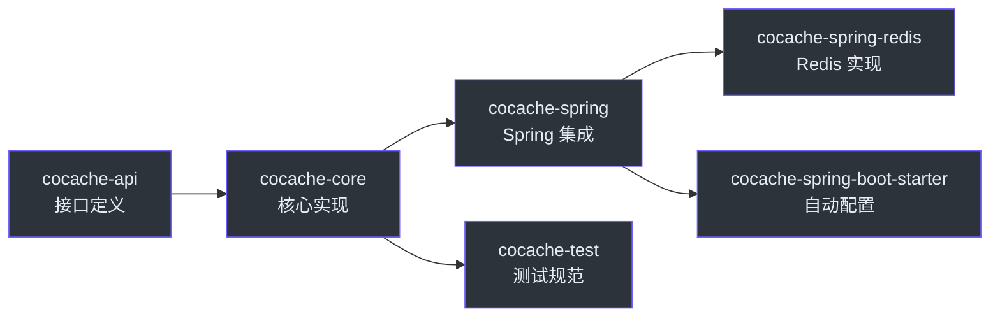

# 贡献者指南

欢迎加入 CoCache 贡献者团队！本指南帮助你快速了解项目并开始贡献代码。

## 项目简介

CoCache 是一个面向 Java/Kotlin 的二级分布式一致性缓存框架。核心特性：
- L2（本地内存）+ L1（Redis）二级缓存
- 事件驱动的缓存一致性
- 注解驱动的声明式配置
- 缓存击穿/穿透/雪崩防护

## 快速上手

### 1. 克隆并构建

```bash
git clone https://github.com/Ahoo-Wang/CoCache.git
cd CoCache
./gradlew build -x test
```

### 2. 运行测试

```bash
# 单元测试
./gradlew test

# 集成测试（需要 Redis）
docker run -d -p 6379:6379 redis:7
./gradlew :cocache-spring-redis:check
```

### 3. 运行示例应用

```bash
# 启动 Redis
docker run -d -p 6379:6379 redis:7

# 运行示例
./gradlew :cocache-example:bootRun
```

访问 http://localhost:8008 查看示例应用。

## 项目结构速览



## 核心概念

### 二级缓存

- **L2（ClientSideCache）**：本地内存缓存，Guava/Caffeine/Map 实现
- **L1（DistributedCache）**：分布式缓存，默认 Redis 实现
- **L0（CacheSource）**：数据源，通常为数据库

### 一致性机制

- `CacheEvictedEventBus`：事件总线
- `CacheEvictedEvent`：缓存失效事件
- 当一个实例修改缓存时，其他实例通过事件自动失效本地缓存

### 代理机制

- `@CoCache` 注解标记缓存接口
- `EnableCoCacheRegistrar` 解析注解并注册 Bean
- JDK 动态代理创建缓存实例

## 推荐入门路径

### 阅读顺序

1. `cocache-api/src/` - 理解核心接口
2. `cocache-core/src/` - 理解核心实现
3. `cocache-test/src/` - 理解测试规范
4. `cocache-example/src/` - 理解使用方式

### 关键文件

| 文件 | 说明 |
|------|------|
| `cocache-api/.../Cache.kt` | 基础缓存接口 |
| `cocache-core/.../DefaultCoherentCache.kt` | 核心实现（最重要） |
| `cocache-core/.../CacheEvictedEventBus.kt` | 事件总线接口 |
| `cocache-spring/.../EnableCoCacheRegistrar.kt` | Spring 注册器 |
| `cocache-test/.../CacheSpec.kt` | 基础测试规范 |
| `cocache-test/.../DefaultCoherentCacheSpec.kt` | 一致性缓存测试 |

## 常见贡献场景

### 添加新的 L2 缓存实现

1. 实现 `ClientSideCache<V>` 接口
2. 继承 `ClientSideCacheSpec` 编写测试
3. 在 `cocache-core/client/` 下添加实现类

### 添加新的 L1 缓存实现

1. 实现 `DistributedCache<V>` 接口
2. 继承 `DistributedCacheSpec` 编写测试
3. 创建对应的 `DistributedCacheFactory`

### 修复 Bug

1. 先编写能复现 Bug 的测试
2. 修复代码
3. 确保所有测试通过

## 代码风格提醒

- 使用 `me.ahoo.test.asserts.assert` 断言（不使用 AssertJ）
- Detekt 配置位于 `config/detekt/detekt.yml`
- 提交前运行 `./gradlew detekt`

## 获取帮助

- GitHub Issues：报告 Bug 或提出功能请求
- GitHub Discussions：讨论设计方案
- 查看 [贡献指南](../building/contributing.md) 了解详细流程

## 相关页面

- [高级工程师指南](./staff-engineer.md) - 深入架构设计
- [贡献指南](../building/contributing.md) - 贡献流程
- [架构概览](../architecture/index.md) - 系统架构
- [快速上手](../guide/quick-start.md) - 使用指南
