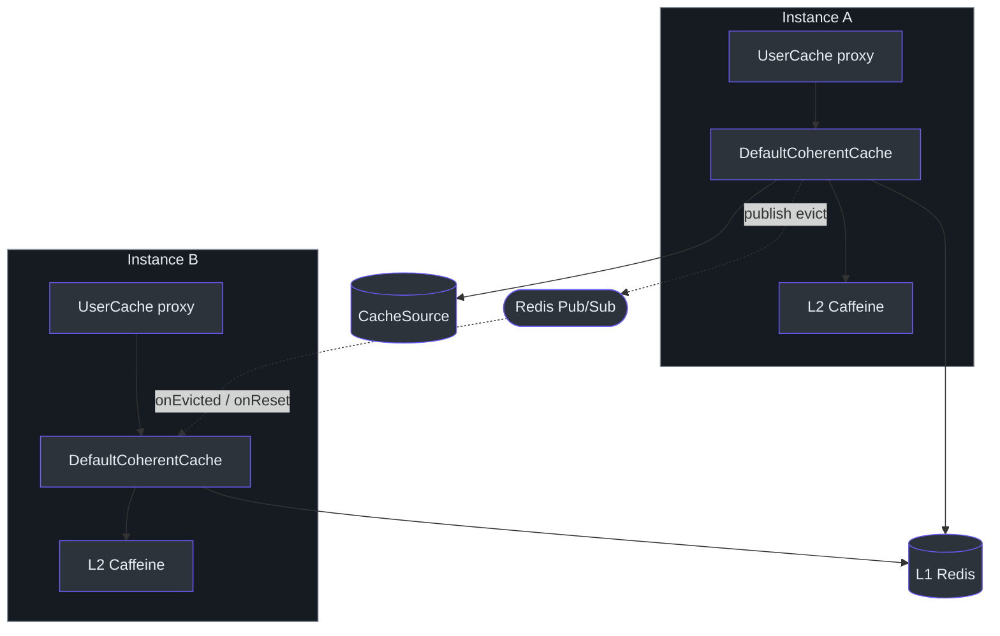
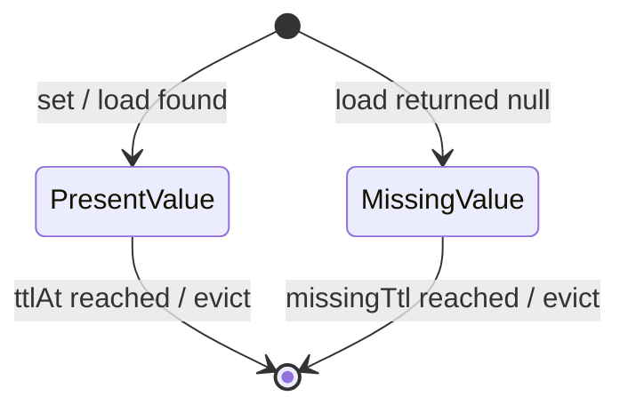

# 贡献者入门指南

本指南带你从一次全新的 clone 走到一个可合并的 PR。请同时阅读 [`docs/architecture.md`](https://github.com/Ahoo-Wang/CoCache/blob/main/docs/architecture.md)，它是设计目标与不变量的唯一事实来源。

## 目录

- [第一部分：基础](#第一部分-基础)
- [第二部分：架构与领域模型](#第二部分-架构与领域模型)
- [第三部分：快速上手](#第三部分-快速上手)
- [术语表](#术语表)

## 第一部分：基础

### 项目中使用的 Kotlin 惯用法

| 惯用法 | 位置 | 原因 |
|--------|------|------|
| `sealed interface` + `when` | `CacheValue` = `PresentValue` \| `MissingValue` | 负缓存是类型，可穷尽检查 |
| `fun interface` | `CacheSource`、`KeyConverter`、`KeyFilter`、`JoinKeyExtractor` | 用 lambda 实现 SPI |
| 接口默认方法 | `CacheGetter.get`、`CacheSetter.set(key, ttlAt, value)` | 实现者只需提供基本操作 |
| `data class` | `CoherentCacheConfiguration`、`TtlPolicy`、`JoinValue`、元数据 | 值语义 |
| 扩展函数 | `KClass.toCoCacheMetadata()` | 可读的解析入口 |

编译参数：`-Xjsr305=strict`（强制 Java API 的空安全）与 `-Xjvm-default=all-compatibility`（接口方法体编译为 Java 默认方法）。

### 依赖库

| 库 | 用途 | 模块 |
|----|------|------|
| Caffeine | 默认 L2（有界，条目级 `Expiry`） | cocache-core |
| Spring Expression | SpEL key / join key 模板（编译模式） | cocache-core |
| Spring Data Redis + Jackson 3 | L1 存储、Pub/Sub 通道 | cocache-spring-redis |
| Guava（compile-only） | `BloomKeyFilter` | cocache-core |
| CosId | 基于主机的 `ClientIdGenerator` | cocache-core |

## 第二部分：架构与领域模型

### 总体架构


```mermaid
graph TB
    subgraph inst1 ["Instance A"]
        P1["UserCache proxy"] --> C1["DefaultCoherentCache"]
        C1 --> L2a["L2 Caffeine"]
    end
    subgraph inst2 ["Instance B"]
        P2["UserCache proxy"] --> C2["DefaultCoherentCache"]
        C2 --> L2b["L2 Caffeine"]
    end
    C1 --> L1[("L1 Redis")]
    C2 --> L1
    C1 -.->|"publish evict"| PS(["Redis Pub/Sub"])
    PS -.->|"onEvicted / onReset"| C2
    C1 --> DB[("CacheSource")]

    style P1 fill:#2d333b,stroke:#6d5dfc,color:#e6edf3
    style C1 fill:#2d333b,stroke:#6d5dfc,color:#e6edf3
    style L2a fill:#2d333b,stroke:#6d5dfc,color:#e6edf3
    style P2 fill:#2d333b,stroke:#6d5dfc,color:#e6edf3
    style C2 fill:#2d333b,stroke:#6d5dfc,color:#e6edf3
    style L2b fill:#2d333b,stroke:#6d5dfc,color:#e6edf3
    style L1 fill:#2d333b,stroke:#6d5dfc,color:#e6edf3
    style PS fill:#2d333b,stroke:#6d5dfc,color:#e6edf3
    style DB fill:#2d333b,stroke:#6d5dfc,color:#e6edf3
    style inst1 fill:#161b22,stroke:#8b949e,color:#e6edf3
    style inst2 fill:#161b22,stroke:#8b949e,color:#e6edf3
```

### 模块地图

| 模块 | 职责 |
|------|------|
| `cocache-api` | 用户 API 与**全部 SPI**；无运行时依赖 |
| `cocache-core` | 编排（`DefaultCoherentCache`、`TtlPolicy`、`SingleFlight`）、默认存储与总线、代理、JoinCache |
| `cocache-spring` | `@EnableCoCache`、FactoryBean、按 bean 名解析组件 |
| `cocache-spring-redis` | `RedisDistributedCache`、codec、`RedisCacheEvictedEventBus` |
| `cocache-spring-cache` | Spring `CacheManager` 桥接 |
| `cocache-spring-boot-starter` | 自动配置、属性、actuator 端点 |
| `cocache-test` | TCK 规格 |

依赖严格单向：`api ← core ← spring ← {spring-redis, spring-cache} ← starter`。

### 各层职责

- **存储**（`CacheStore` → `ClientSideCache`、`DistributedCache`）按字符串 key 存取 `CacheValue`，不持有 TTL 策略。
- **策略**（`TtlPolicy`）：命中值用 `ttl ± ttlAmplitude`，负缓存用 `missingTtl`。
- **编排**（`DefaultCoherentCache`）：读穿透、按 key 合并回源、受戳保护的写回、广播。
- **通道**（`CacheEvictedEventBus`）：尽力而为的广播，每次（重新）订阅时回调 `onReset`。

### 读路径

```mermaid
sequenceDiagram
autonumber
    participant App
    participant C as DefaultCoherentCache
    participant L2
    participant SF as SingleFlight
    participant L1
    participant Src as CacheSource

    App->>C: getCache(key)
    C->>L2: getCache
    alt hit
        L2-->>App: value
    else miss
        C->>SF: execute(cacheKey)
        SF->>L1: getCache (stamp taken first)
        alt L1 hit
            SF->>L2: fill if stamp unchanged
        else L1 miss
            SF->>Src: load (null → MissingValue(missingTtl))
            SF->>L1: write if stamp unchanged
            SF->>L2: write; undo if stamp changed meanwhile
        end
        SF-->>App: value
    end
```

### 不可破坏的不变量

1. **L1 未命中绝不等于负缓存。** 只有存储中的哨兵记录才解码为 `MissingValue`。
2. **失效方先递增戳再淘汰；写回方在写入前后都检查戳。** 覆盖本地 `evict`/`setCache`、远端 `onEvicted` 和 `onReset`。
3. **`onReset` 清空 L2。** 这是应对断线期间 Pub/Sub 消息丢失的唯一手段。
4. **回源成功不广播。**
5. **代理重抛委托对象的原始异常。**
6. **有状态的 Spring 组件只按 bean 名解析。**
7. **Redis 线格式保持字节兼容**（`_nil_` 哨兵形态、`key@@publisherId` 消息）。

### JoinCache

`SimpleJoinCache(firstCache, joinCache, extractor)` 先读主值、提取关联 key，再读关联值，返回带较早 `ttlAt` 的 `JoinValue`。`evict(key)` 只淘汰主缓存；Join 缓存不持有组件的生命周期。

### CacheValue 与 TTL


```mermaid
stateDiagram-v2
    [*] --> PresentValue: set / load found
    [*] --> MissingValue: load returned null
    PresentValue --> [*]: ttlAt reached / evict
    MissingValue --> [*]: missingTtl reached / evict
```

`ttlAt` 是绝对纪元秒；`TtlAt.FOREVER = Long.MAX_VALUE`。时间来自 `TtlAt.currentTime()`，即 `System.currentTimeMillis() / 1000`。

### key 转换与 clientId

- `ToStringKeyConverter(prefix)` 或 `ExpKeyConverter(prefix, "#{...}")`，默认前缀为 `cocache:{cacheName}:`。
- 每个缓存实例都从 `ClientIdGenerator` 获得一个 `clientId`，默认为 `counter:pid@host`。订阅者用它忽略自己发布的事件，因此它绝不能包含 `@@`。

## 第三部分：快速上手

### 环境

- JDK 17+、Docker（用于 Redis）、Gradle wrapper。
- 用 `docker run -d --name cocache-redis -p 6379:6379 redis:7-alpine` 启动 Redis。
- 如果 shell 导出了 `SPRING_DATA_REDIS_CLUSTER_NODES` 等变量，运行 starter 测试前先 unset，否则测试会连接到那个集群。

### 构建与测试

```bash
./gradlew check                                   # 测试 + detekt + dokka（门禁）
./gradlew :cocache-core:test
./gradlew :cocache-core:test --tests "me.ahoo.cache.consistency.DefaultCoherentCacheTest"
./gradlew :cocache-spring-redis:check             # 需要 Redis
./gradlew detektAutoFix
```

### TCK

继承与你的实现相匹配的规格：`ClientSideCacheSpec`、`DistributedCacheSpec`、`CacheSpec`、`DefaultCoherentCacheSpec`、`MultipleInstanceSyncSpec` 或 `CacheEvictedEventBusSpec`。见[单元测试](../testing/unit-testing.md)。

### 贡献流程


```mermaid
flowchart LR
    Issue["Issue / design note"] --> Branch["Branch from main"]
    Branch --> Test["Reproducing test first<br>(for defects)"]
    Test --> Code["Change + update docs/architecture.md<br>if behavior changes"]
    Code --> Check["./gradlew check"]
    Check --> PR["PR (Conventional Commits),<br>squash-merge"]

    style Issue fill:#2d333b,stroke:#6d5dfc,color:#e6edf3
    style Branch fill:#2d333b,stroke:#6d5dfc,color:#e6edf3
    style Test fill:#2d333b,stroke:#6d5dfc,color:#e6edf3
    style Code fill:#2d333b,stroke:#6d5dfc,color:#e6edf3
    style Check fill:#2d333b,stroke:#6d5dfc,color:#e6edf3
    style PR fill:#2d333b,stroke:#6d5dfc,color:#e6edf3
```

- 使用 fluent-assert（`.assert()`），禁止使用 AssertJ `assertThat()`。
- 每个源文件都要有 Apache-2.0 许可证头；KDoc 用中文书写。
- 保持 wiki 中英文页面同步。

## 术语表

| 术语 | 含义 |
|------|------|
| L0 / L1 / L2 | 数据源 / 共享 Redis 存储 / 实例内 Caffeine 存储 |
| `MissingValue` | 负缓存条目（数据源确认不存在） |
| 戳（stamp） | 按 key 分段的失效计数，用于保护写回 |
| SingleFlight | 按 key 合并并发回源 |
| 重置（reset） | 事件通道（重新）订阅时清空 L2 |
| 哨兵 | `MissingValue` 在 Redis 中的编码（默认 `_nil_`） |

## 下一步

- [Staff Engineer 指南](./staff-engineer.md)
- [缓存一致性](../architecture/coherence.md)
- [测试概览](../testing/index.md)
