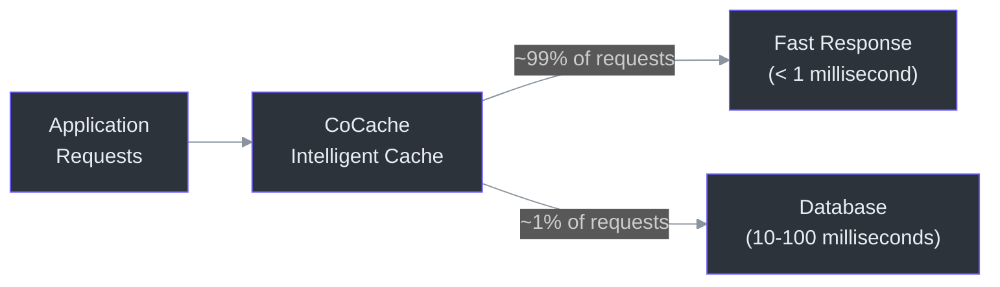
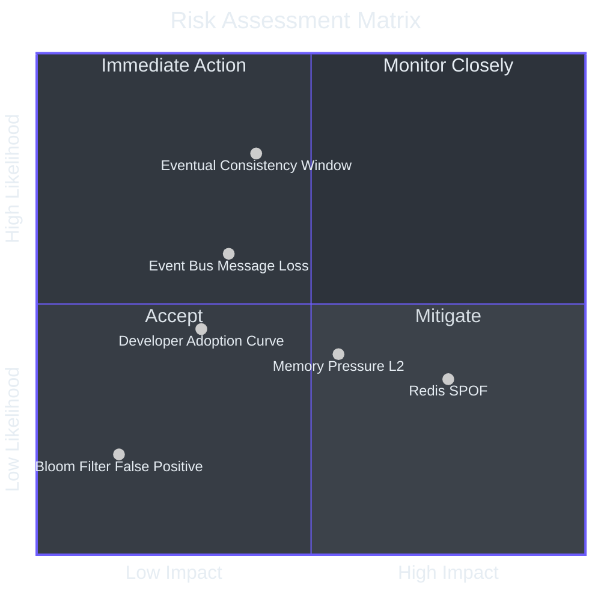
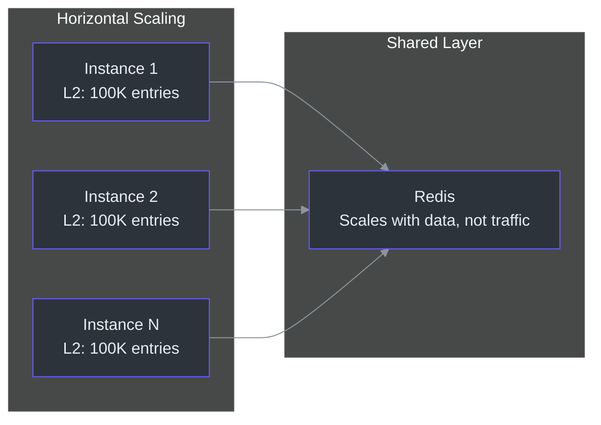

# 高管入门指南

本指南为评估或监督 CoCache 采纳的工程负责人提供战略概览。重点涵盖能力、风险、投资依据、成本建模和可操作建议——不涉及实现细节。

---

## 目录

- [CoCache 的作用](#cocache-的作用)
- [能力全景](#能力全景)
- [风险评估](#风险评估)
- [技术投资论点](#技术投资论点)
- [成本与扩展模型](#成本与扩展模型)
- [竞争优势分析](#竞争优势分析)
- [可操作建议](#可操作建议)

---

## CoCache 的作用

CoCache 是一个位于应用程序和数据库之间的缓存框架。当应用程序需要数据（例如用户资料）时，CoCache 首先检查快速的本地内存。如果数据不在那里，它会检查共享缓存（Redis）。只有当两者都没有数据时，才会查询数据库。

核心价值主张：**99% 的数据请求在 1 毫秒内完成响应，而非 10-100 毫秒**，大幅降低数据库负载并提升应用响应时间。

### 为什么这很重要

对于一个每秒处理 10,000 个请求的典型高流量服务：

- **无缓存**：每秒 10,000 次数据库查询。数据库成为瓶颈。每次查询耗时 10-100ms。用户体验到明显延迟。
- **使用 CoCache**：每秒约 100 次数据库查询（1% 未命中率）。数据库仅在 1% 负载下运行。缓存读取的响应时间降至亚毫秒级。基础设施成本降低。

---

## 能力全景

```mermaid
%%{init: {'theme': 'dark', 'themeVariables': {'primaryColor': '#2d333b', 'primaryBorderColor': '#6d5dfc', 'primaryTextColor': '#e6edf3', 'lineColor': '#8b949e', 'subgraphBgColor': '#161b22'}}}%%
graph TB
    subgraph sg_70 ["Core Capabilities"]
        direction TB
        C1["Two-Level Caching<br>Fast local + shared distributed"]
        C2["Automatic Coherence<br>All instances stay in sync"]
        C3["Stampede Protection<br>Prevents database overload"]
        C4["Penetration Protection<br>Blocks invalid key floods"]
        C5["Bloom Filter Pre-screen<br>Filters impossible lookups"]
        C6["Composite Caching<br>Joins data from multiple caches"]
    end

    subgraph sg_71 ["Integration Capabilities"]
        direction TB
        I1["Annotation-Driven<br>Declarative cache setup"]
        I2["Spring Boot Native<br>Auto-configuration"]
        I3["Pluggable Storage<br>Swap cache backends"]
        I4["Spring Cache Bridge<br>Drop-in replacement"]
    end

    subgraph sg_72 ["Operational Capabilities"]
        direction TB
        O1["Self-Healing<br>TTL bounds staleness"]
        O2["Graceful Degradation<br>Works without Redis"]
        O3["TTL Jitter<br>Prevents synchronized expiry"]
        O4["Per-Key Locking<br>Fine-grained concurrency"]
    end

    style C1 fill:#2d333b,stroke:#6d5dfc,color:#e6edf3
    style C2 fill:#2d333b,stroke:#6d5dfc,color:#e6edf3
    style C3 fill:#2d333b,stroke:#6d5dfc,color:#e6edf3
    style C4 fill:#2d333b,stroke:#6d5dfc,color:#e6edf3
    style C5 fill:#2d333b,stroke:#6d5dfc,color:#e6edf3
    style C6 fill:#2d333b,stroke:#6d5dfc,color:#e6edf3
    style I1 fill:#2d333b,stroke:#6d5dfc,color:#e6edf3
    style I2 fill:#2d333b,stroke:#6d5dfc,color:#e6edf3
    style I3 fill:#2d333b,stroke:#6d5dfc,color:#e6edf3
    style I4 fill:#2d333b,stroke:#6d5dfc,color:#e6edf3
    style O1 fill:#2d333b,stroke:#6d5dfc,color:#e6edf3
    style O2 fill:#2d333b,stroke:#6d5dfc,color:#e6edf3
    style O3 fill:#2d333b,stroke:#6d5dfc,color:#e6edf3
    style O4 fill:#2d333b,stroke:#6d5dfc,color:#e6edf3
```

### 能力详情

| 能力 | 业务影响 | 技术类别 |
|------|---------|---------|
| **两级缓存** | 数据读取延迟降低 10-100 倍 | 核心 |
| **自动一致性** | 所有应用实例无需人工干预即可看到一致的数据 | 核心 |
| **缓存击穿保护** | 防止缓存过期时级联数据库过载 | 韧性 |
| **缓存穿透保护** | 阻止查询不存在数据以压垮数据库的攻击 | 安全 |
| **布隆过滤器** | 通过预过滤不可能的键来减少不必要的缓存和数据库查找 | 效率 |
| **组合缓存 (JoinCache)** | 在单次缓存操作中组合来自多个数据源的关联数据 | 开发效率 |
| **注解驱动配置** | 将集成工作量从数天减少到数小时 | 开发效率 |
| **Spring Boot 自动配置** | 标准配置下零配置即可使用 | 运维效率 |
| **可插拔存储** | 面向未来：可将 Guava 替换为 Caffeine，将 Redis 替换为其他分布式缓存 | 灵活性 |
| **自我修复** | 过时数据在 TTL 窗口内自动纠正；无需人工干预 | 可靠性 |
| **优雅降级** | 如果 Redis 宕机，读取仍可通过本地缓存和直接数据库访问正常工作 | 可用性 |
| **TTL 抖动** | 防止可能级联到数据库的同步缓存过期风暴 | 稳定性 |

---

## 风险评估

### 风险矩阵

### 详细风险分析

#### 1. Redis 单点故障

- **风险**：Redis 宕机会导致所有实例的缓存同时退化为直接数据库查询。
- **可能性**：低至中等（取决于 Redis 部署成熟度）。
- **影响**：高——数据库负载增加 10-100 倍；缓存未命中请求的响应时间增加 10-100 倍。
- **缓解措施**：
  - 以 Sentinel 或 Cluster 模式部署 Redis 以实现自动故障转移。
  - 监控 Redis 可用性并在 95% 健康阈值时设置告警。
  - CoCache 可优雅降级：本地缓存命中仍然有效，数据库作为后备。
- **残余风险**：即使有 Redis Sentinel 故障转移，在故障转移期间仍有一个短暂的窗口（几秒），L1 不可用。本地 L2 缓存会继续提供服务。

#### 2. 事件总线可靠性（消息丢失）

- **风险**：Redis Pub/Sub 不保证消息投递。丢失的驱逐消息意味着远端实例的本地缓存会保持过时状态。
- **可能性**：中等——Redis Pub/Sub 在网络分区或 Redis 重启期间可能丢失消息。
- **影响**：低至中等——过时数据的范围受 TTL 限制。最坏情况是提供最多落后一个 TTL 窗口的数据（例如，120 秒 TTL 对应最多 2 分钟的过时）。
- **缓解措施**：
  - TTL 作为自我修复机制。过时条目会自然过期。
  - 对于不允许过时数据的关键数据，使用更短的 TTL。
  - 对于高一致性要求，考虑实现更强的事件总线（如 Kafka）。

#### 3. 最终一致性窗口

- **风险**：在实例 A 写入新数据和实例 B 使其本地缓存失效之间，实例 B 可能提供过时数据。
- **可能性**：高——这是架构固有的特性。
- **影响**：低——在数据中心内部，该窗口通常为亚毫秒级（Redis Pub/Sub 延迟）。
- **缓解措施**：这是架构权衡，而非缺陷。对于大多数业务数据（用户资料、商品目录），亚毫秒级的不一致性是不可感知的。对于金融交易或实时库存，应实现从 L1 的穿透读取（绕过 L2）或使用更短的 TTL。

#### 4. L2 缓存的内存压力

- **风险**：大型本地缓存会消耗大量 JVM 堆内存。
- **可能性**：中等——取决于 `maximumSize` 配置。
- **影响**：中等——过多的内存使用可能触发 GC 停顿或 OOM。
- **缓解措施**：
  - 为每个缓存设置适当的 `maximumSize`（参见注解配置文档）。
  - 使用 Caffeine（对于大型缓存，比 Guava 更节省内存）。
  - 监控 JVM 堆使用量并在 75% 阈值时设置告警。

#### 5. 布隆过滤器误判

- **风险**：布隆过滤器可能错误地指示某个键存在（而实际不存在），导致一次不必要的 L1 Redis 查找。
- **可能性**：低——布隆过滤器针对小于 1% 的误判率进行了调优。
- **影响**：可忽略——每次误判仅多一次 Redis GET 调用。
- **缓解措施**：这是概率数据结构的可接受权衡。无需采取行动。

#### 6. 开发者学习曲线

- **风险**：不熟悉 Kotlin 或基于注解的模型的团队可能错误地集成。
- **可能性**：中等——取决于团队经验。
- **影响**：中等——配置错误可能导致缓存击穿、内存泄漏或数据过时。
- **缓解措施**：
  - 使用贡献者入门指南进行团队培训。
  - 使用示例模块作为参考实现。
  - 对所有缓存接口定义和配置进行代码审查。

---

## 技术投资论点

### 问题陈述

现代微服务架构放大了缓存挑战：

1. **数据库成本**在无缓存的情况下随请求量线性增长。
2. **响应时间**直接影响用户体验和转化率。
3. **缓存一致性**在数十个服务实例间的正确实现运维复杂度极高。
4. **缓存击穿**在高流量事件（促销、发布）期间可能级联为数据库过载和全面宕机。

### 解决方案价值

| 价值维度 | 无 CoCache | 使用 CoCache |
|----------|-----------|-------------|
| 数据库查询负载 | 100% 的读取请求 | 约 1% 的读取请求 |
| 平均读取延迟 | 10-100ms（数据库） | <1ms（L2 缓存命中） |
| 缓存一致性 | 手动实现（数周工程量） | 通过事件总线自动实现 |
| 击穿保护 | 每个项目自定义（易出错） | 内置逐键锁定 |
| 缓存实现时间 | 每服务 2-4 周 | 每服务 1-2 天 |
| 运维负担 | 高（需要维护自定义缓存逻辑） | 低（标准框架） |

### 投资回报率

假设一个中等规模服务（5 个实例，5,000 RPS，平均每次请求 3 次数据库查询）：

**使用 CoCache 之前：**
- 每秒 15,000 次数据库查询
- 数据库需要 8 vCPU、32GB RAM 集群（约 $800/月云费用）
- 平均响应时间：50ms（受数据库限制）
- 自定义缓存的工程时间：每服务 3 周 x 4 个服务 = 12 周

**使用 CoCache 之后：**
- 每秒约 150 次数据库查询（99% 缓存命中率）
- 数据库可缩减至 2 vCPU、8GB RAM（约 $200/月）
- 平均响应时间：读取 <1ms
- 工程时间：每服务 2 天 x 4 个服务 = 2 周

**净节省：**
- 每月节省 $600 数据库费用
- 释放 10 周工程时间
- p99 读取延迟降低 50 倍
- 消除因自定义实现导致的缓存相关生产事故风险

---

## 成本与扩展模型

### 单实例内存成本

| 组件 | 每实例内存 | 备注 |
|------|-----------|------|
| L2 本地缓存 (Guava, 10 万条目) | 约 100MB 堆内存 | 取决于条目大小；平均 1KB |
| L2 本地缓存 (Caffeine, 10 万条目) | 约 90MB 堆内存 | 比 Guava 略高效 |
| 逐键锁映射 | 约 1-10MB | 临时性；仅在 L0 获取时存在 |
| 布隆过滤器 (100 万键, 1% 误判率) | 约 1.2MB | 固定；不随条目增长 |
| 事件总线订阅 | 可忽略 | 每个缓存名称一个 Redis 订阅 |
| **总开销** | **每实例约 100-115MB** | 10 万条目缓存 |

### Redis 成本模型

| 指标 | 计算公式 | 示例（1 万 RPS，99% 命中率） |
|------|---------|---------------------------|
| L1 操作/秒 | RPS x (1 - L2 命中率) | 10,000 x 0.01 = 100 ops/sec |
| Pub/Sub 消息/秒 | 写入/秒 x 实例数 | 100 x 5 = 500 msgs/sec |
| Redis 内存 | 条目数 x 平均大小 | 10 万 x 1KB = 100MB |
| Redis CPU | 每 100 ops/sec 约 0.01% | 可忽略 |

Redis 对于 CoCache 工作负载来说极其经济。单个 Redis 实例通常可以为数十个启用了 CoCache 的服务提供服务。

### 网络开销

| 操作 | 网络开销 | 频率 |
|------|---------|------|
| L1 缓存读取 | 1 次 Redis GET（约 1-2KB 往返） | 总请求的约 1% |
| L1 缓存写入 | 1 次 Redis SET（约 1-2KB 往返） | 每次缓存未命中 + 每次显式写入 |
| 事件总线发布 | 1 次 Redis PUBLISH（约 200 字节） | 每次缓存写入/驱逐 |
| 事件总线订阅 | 1 条 Redis SUBSCRIBE 消息 | 每次驱逐事件，每实例 |

对于一个具有 10,000 RPS 和 99% L2 命中率的服务：
- L1 读取：100/秒 x 2KB = 200KB/秒
- L1 写入：100/秒 x 2KB = 200KB/秒
- Pub/Sub：500/秒 x 200B = 100KB/秒
- **总计：约 500KB/秒**——对于现代网络基础设施来说可以忽略不计。

### 扩展特性

关键扩展特性：

- **增加实例**会增加总 L2 容量（更多本地缓存），同时 Pub/Sub 流量线性增长。
- **Redis 负载**随缓存未命中扩展，而非随总流量扩展。在 99% L2 命中率下，增加实例几乎不会增加 Redis 负载。
- **Pub/Sub 扩展**是在极高实例数（100+）时的主要关注点。每个实例订阅每个缓存通道。在 100 个实例和 10 种缓存类型的情况下，每次驱逐发布 100 条消息。Redis Pub/Sub 可以轻松处理这种情况。

---

## 竞争优势分析

| 特性 | CoCache | Spring Cache + Redis | Redisson 本地缓存 | 自定义实现 |
|------|---------|---------------------|------------------|-----------|
| 两级缓存 | 内置 | 手动配置 | 内置 | 手动 |
| 跨实例一致性 | 自动（事件总线） | 无（各实例独立） | 通过 Redis 同步 | 手动 |
| 击穿保护 | 逐键锁定 | 无 | RLock（分布式） | 不确定 |
| 穿透保护 | MissingGuard + 布隆过滤器 | 无 | 无 | 手动 |
| 注解驱动 | 接口上的 `@CoCache` | 方法上的 `@Cacheable` | 不适用 | 不适用 |
| 代理模式（接口级别） | 是 | 否（方法级别） | 否 | 不适用 |
| JoinCache（组合缓存） | 内置 | 不支持 | 不支持 | 手动 |
| TTL 抖动 | 内置（可配置） | 不可用 | 不可用 | 手动 |
| 运维开销 | 低（框架管理） | 中（手动维护一致性） | 中（分布式锁） | 高 |

---

## 可操作建议

### 对于采纳 CoCache 的团队

1. **从示例模块开始。** 克隆 `cocache-example` 模块并在本地运行。它演示了包含 `UserCache` 和 `UserExtendInfoJoinCache` 的完整配置。将其用作您服务的模板。

2. **先定义缓存接口。** 在编写任何代码之前，确定能从缓存中受益的数据实体（通常是：读多写少的数据）。创建带有 `@CoCache` 注解的接口。

3. **设置适当的 TTL。** 默认 TTL 实际上是无限期的（`Long.MAX_VALUE`）。始终根据数据可接受的过时窗口配置 TTL。使用 `ttlAmplitude` 参数（默认值：10 秒）来防止同步过期。

4. **保守地设置 L2 缓存大小。** 从 Guava 或 Caffeine 缓存的 `maximumSize = 100_000` 开始。监控堆使用量并调整。L2 过度配置浪费内存；配置不足则降低命中率。

5. **以 Sentinel 或 Cluster 模式部署 Redis。** 不要在生产环境中使用单个 Redis 实例。Redis Sentinel 提供自动故障转移，恢复时间 <5 秒。

### 对于架构治理

1. **所有新的 JVM 服务标准化使用 CoCache。** 该框架消除了每个服务数周的自定义缓存实现工作，并在整个组织中提供一致的缓存模型。

2. **建立缓存命名规范。** CoCache 使用缓存名称进行事件总线通道路由。定义命名标准：`<领域>.<实体>`（例如 `user.profile`、`product.catalog`）。

3. **定义数据过时 SLA。** 对于每个缓存实体，记录最大可接受过时窗口。这决定了 TTL 配置以及 CoCache 的最终一致性模型是否适用。

4. **监控 L2 命中率。** 在 85% L2 命中率时设置告警阈值。低于此值时，应排查：缓存大小、TTL 配置、键分布或访问模式变化。

### 对于风险管理

1. **缓解 Redis SPOF**：部署至少包含 3 个 Sentinel 和 1 个副本的 Redis Sentinel。对于高写入工作负载，考虑使用 Redis Cluster。

2. **制定 Redis 故障预案**：记录预期行为：读取通过 L2（缓存命中）和 L0（数据库）继续进行。数据库负载增加。缓存未命中请求的响应时间增加。无数据丢失。

3. **安全审查**：CoCache 以序列化形式将数据存储在 Redis 中。确保 Redis 部署包含身份认证、TLS 和网络隔离。审查缓存的数据——敏感数据（PII、凭据）不应被缓存或应进行加密。

4. **建立缓存预热流程**：在冷启动（新部署、Redis 故障转移）后，所有 L2 缓存为空。考虑在接受流量之前，通过调用高流量键的缓存源来预热关键缓存。

---

## 总结

CoCache 是一个成熟、架构良好的缓存框架，以最小的运维开销解决了分布式缓存问题。其三层模型（本地内存、Redis、数据库）配合自动一致性机制，在提供显著性能提升的同时，自我修复设计（基于 TTL 的过时边界、优雅降级）限制了运维风险。

主要投资考量：
- **Redis 基础设施成本**：对于典型工作负载来说可以忽略（约 100MB 内存，可忽略的 CPU）。
- **每实例内存开销**：典型缓存配置下每实例约 100MB。
- **工程时间节省**：每服务 2-4 周对比使用 CoCache 的 2 天。
- **运维风险**：低，得益于自我修复设计和优雅降级。

建议：**在所有新的和现有的基于 JVM 的服务中采纳 CoCache**，从非关键服务开始熟悉，然后逐步扩展到高流量核心服务。
