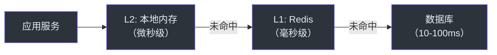

# 管理层指南

本指南帮助技术管理者了解 CoCache 项目的价值、技术特点和在团队中的应用。

## 项目价值

### 解决什么问题

在高并发分布式系统中，数据库往往是性能瓶颈。CoCache 通过二级缓存架构显著降低数据库压力：

- **降低延迟**：L2 本地缓存提供微秒级访问，L1 Redis 缓存提供毫秒级访问
- **降低数据库压力**：多级缓存过滤大部分请求
- **保证一致性**：事件驱动机制确保跨实例数据一致

### 业务收益

| 指标 | 无缓存 | 使用 CoCache |
|------|--------|-------------|
| 接口响应时间 | 50-200ms | 1-5ms（L2 命中） |
| 数据库 QPS | 高 | 显著降低 |
| 系统可用性 | 依赖数据库 | 缓存层提供缓冲 |

## 技术特点

### 二级缓存架构

### 开发效率

- **声明式配置**：通过注解配置缓存，无需编写管理代码
- **Spring Boot 集成**：自动配置，开箱即用
- **类型安全**：Kotlin 接口定义，编译期检查

### 运维友好

- **Actuator 端点**：实时监控缓存状态
- **可观测性**：缓存命中率、客户端大小等指标
- **灵活配置**：支持运行时调整缓存参数

## 技术选型对比

| 特性 | CoCache | Spring Cache + Redis | 自研方案 |
|------|---------|---------------------|----------|
| 二级缓存 | 原生支持 | 不支持 | 需要自行实现 |
| 一致性保证 | 事件驱动 | 无 | 需要自行实现 |
| 缓存击穿防护 | 内置 | 无 | 需要自行实现 |
| TTL 抖动 | 内置 | 无 | 需要自行实现 |
| 缓存穿透防护 | MissingGuard + KeyFilter | 无 | 需要自行实现 |
| 开发效率 | 高（注解驱动） | 中 | 低 |
| 维护成本 | 低（社区维护） | 低 | 高 |

## 团队协作

### 推荐使用方式

1. **新项目**：直接使用 `cocache-spring-boot-starter`
2. **已有项目**：逐步引入，先对热点接口启用缓存
3. **渐进式迁移**：支持与 Spring Cache 注解共存

### 团队技能要求

- Kotlin/Java 基础
- Spring Boot 经验
- Redis 基础知识（运维层面）
- 缓存设计模式理解（架构层面）

### 学习路径

1. **开发人员**：[快速上手](../guide/quick-start.md) -> [配置指南](../guide/configuration.md)
2. **架构师**：[架构概览](../architecture/index.md) -> [高级工程师指南](./staff-engineer.md)
3. **运维人员**：[Actuator 端点](../api/actuator.md) -> [集成测试](../testing/integration-testing.md)

## 成本评估

### 基础设施成本

- **Redis**：需要 Redis 实例（可复用现有 Redis）
- **内存**：L2 本地缓存占用应用内存
- **网络**：Redis Pub/Sub 增加少量网络开销

### 开发成本

- **接入成本**：低（注解 + 配置，通常 1-2 天）
- **学习成本**：低（接口设计直观）
- **维护成本**：低（框架自动管理缓存生命周期）

## 风险与缓解

| 风险 | 缓解措施 |
|------|----------|
| Redis 故障 | L2 本地缓存仍可用，降级但不中断 |
| 数据一致性 | 最终一致性保证，延迟通常毫秒级 |
| 内存溢出 | 合理设置 `maximumSize`，监控 L2 大小 |

## 相关页面

- [介绍](../guide/index.md) - CoCache 概述
- [快速上手](../guide/quick-start.md) - 快速接入
- [架构概览](../architecture/index.md) - 技术架构
- [产品经理指南](./product-manager.md) - 产品视角
