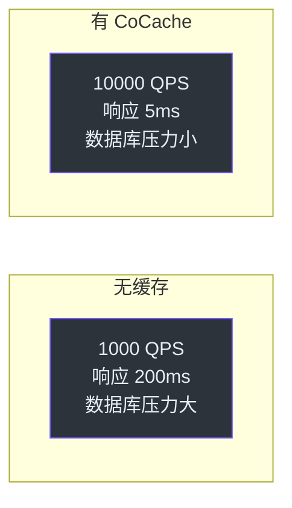

# 产品经理指南

本指南帮助产品经理理解 CoCache 缓存框架对产品性能和用户体验的影响。

## 什么是缓存？

缓存是一种将频繁访问的数据存储在高速存储层的技术。当用户请求数据时，系统先从缓存中查找，而不是每次都查询数据库。

### 生活类比

想象一个图书馆：
- **数据库**：书库（存储所有书籍，找书需要时间）
- **L1 缓存（Redis）**：借阅台旁边的推荐架（多人共享，找书较快）
- **L2 缓存（本地内存）**：你桌上的书（个人使用，瞬间获取）

## CoCache 对用户的影响

### 页面加载速度

| 场景 | 无缓存 | 有 CoCache |
|------|--------|-----------|
| 用户列表页 | 200-500ms | 5-20ms |
| 用户详情页 | 100-300ms | 1-10ms |
| 搜索结果页 | 300-800ms | 10-50ms |

### 用户体验提升

- **更快的响应**：页面加载时间降低 10-100 倍
- **更好的可用性**：即使数据库短暂不可用，缓存层仍能提供数据
- **更稳定的性能**：高峰期不会因为数据库压力导致响应变慢

### 并发支持能力

## 产品决策相关

### 何时使用缓存

适合使用缓存的场景：
- **读多写少**的数据（如用户信息、商品详情）
- **高频访问**的接口（如首页、列表页）
- **计算成本高**的数据（如统计报表、推荐结果）

不太适合的场景：
- 数据频繁变更（如实时库存）
- 数据敏感性极高（如银行余额，需要实时查询）
- 数据量极小且访问频率低

### 缓存一致性

CoCache 提供**最终一致性**保证：
- 数据更新后，所有节点在毫秒级内同步
- 极端情况下，用户可能短暂看到旧数据
- 适用于大多数业务场景

### 缓存策略选择

| 策略 | 适用场景 | 用户感知 |
|------|----------|----------|
| TTL 120s | 用户信息、配置数据 | 更新延迟 2 分钟 |
| TTL 300s | 商品信息、文章 | 更新延迟 5 分钟 |
| TTL 永久 | 字典数据、基础配置 | 需要手动刷新 |

## 业务指标监控

### 通过 Actuator 端点可监控

- **缓存命中率**：反映缓存效果
- **客户端缓存大小**：反映内存使用情况
- **缓存组件信息**：确认使用的实现

### 对业务指标的影响

- **P99 延迟**：缓存命中时显著降低
- **错误率**：数据库故障时缓存可提供降级
- **吞吐量**：系统可支持更高并发

## 常见问题

### Q: 缓存数据会过期吗？
A: 是的，每个缓存条目都有 TTL（生存时间）。过期后会自动从数据库重新加载。TTL 可以根据业务需求配置。

### Q: 用户能看到过期数据吗？
A: 在极短时间内（毫秒级）可能存在旧数据，但对大多数业务场景影响可忽略。

### Q: 缓存会影响数据准确性吗？
A: 不会。缓存只是数据的副本，原始数据仍然在数据库中。缓存过期后会自动更新。

### Q: Redis 挂了怎么办？
A: CoCache 的 L2 本地缓存仍然可用，系统会降级但不会完全中断。

## 相关页面

- [介绍](../guide/index.md) - CoCache 概述
- [管理层指南](./executive.md) - 技术管理视角
- [高级工程师指南](./staff-engineer.md) - 技术架构视角
- [配置指南](../guide/configuration.md) - 配置参数
