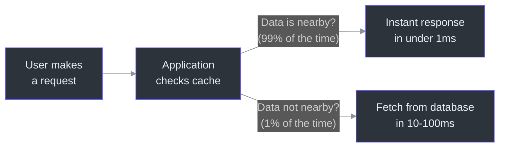
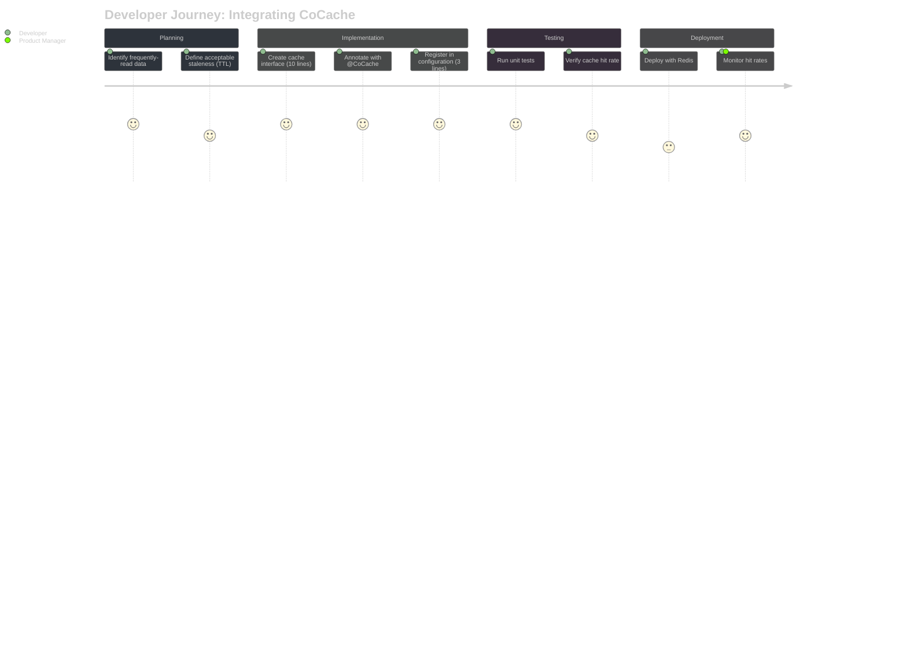
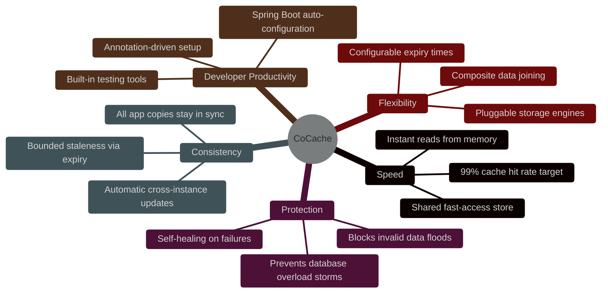
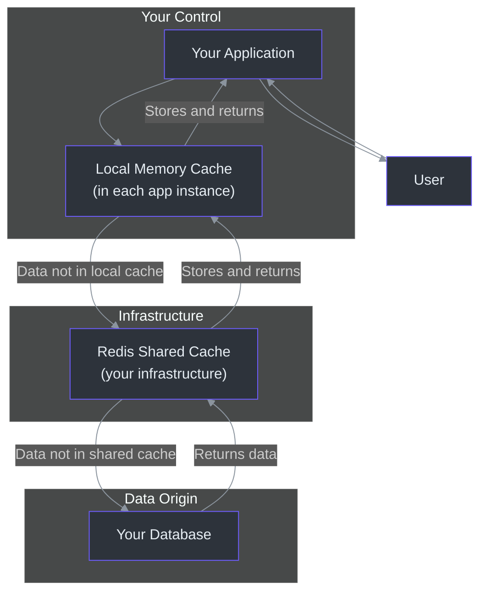

# 产品经理入门指南

本指南用通俗易懂的语言解释 CoCache。没有工程术语。如果你是一名产品经理，所在的团队正在使用或计划使用 CoCache，本文档将帮助你了解它的功能、为什么它很重要、它能做什么和不能做什么，以及它如何影响你的产品决策。

---

## 目录

- [什么是 CoCache？（通俗版）](#什么是-cocache通俗版)
- [它为什么存在？](#它为什么存在)
- [开发者体验](#开发者体验)
- [功能能力图](#功能能力图)
- [CoCache 对你的产品有什么影响](#cocache-对你的产品有什么影响)
- [已知限制](#已知限制)
- [数据与隐私概览](#数据与隐私概览)
- [常见问题](#常见问题)

---

## 什么是 CoCache？（通俗版）

想象一个图书馆。当你想要一本书时，你走到图书馆，在书架上找到它，然后阅读。这需要时间。现在想象你把最常用的书放在你的书桌上。你只有在需要一本不在书桌上的书时才去图书馆。这就是 CoCache 所做的事情——只不过它是为你的应用程序数据服务的。

你的应用程序需要数据（用户资料、商品信息、设置）来响应用户的每一个请求。没有 CoCache 时，每个请求都直接查询数据库（即"图书馆"）。有了 CoCache，常用数据会被就近存储——首先在应用程序自身的内存中（即"书桌"），然后在一个共享的快速访问存储中（即"走廊里的书车"），只有在最后不得已时才会去查询数据库（即"图书馆"）。

结果是：你的应用程序响应更快，数据库负载更低，基础设施成本更少。

---

## 它为什么存在？

### 它解决的问题

现代应用程序以多个副本（实例）运行来处理用户流量。当你有 5 个应用程序副本运行时，每个副本都需要相同的数据。如果没有共享缓存策略：

1. **每个副本都独立查询数据库。** 这会将数据库负载乘以实例数量。
2. **当一个副本更新数据时，其他副本不知道。** 它们继续提供旧（过期）数据，直到恰好再次查询数据库。
3. **热门数据过期时可能导致数据库"蜂拥"。** 如果 1,000 个用户都需要同一个商品页面，而缓存版本刚好过期，所有 1,000 个请求会同时涌向数据库。

手动解决这些问题成本很高。工程团队通常需要花费数周时间为每个项目构建自定义缓存方案。CoCache 提供了一个跨所有项目可用的标准解决方案。

### 问题的规模

| 场景 | 没有缓存 | 有 CoCache |
|------|---------|-----------|
| 每秒 10,000 用户浏览商品页面 | 每秒 10,000 次数据库查询 | 约 100 次数据库查询/秒 |
| 黑色星期五流量高峰（正常流量的 10 倍） | 数据库可能过载 | 缓存吸收高峰；数据库仅增长约 1% |
| 应用重启（新部署） | 所有数据需要重新获取 | 共享缓存仍有数据；本地缓存快速重建 |
| 多个应用实例（5 个副本） | 相同数据的 5 倍数据库查询 | 数据库只查询一次；结果通过缓存共享 |

---

## 开发者体验

### 开发者如何使用 CoCache

开发者通过定义一个简单的接口（一份契约，说明"这是用于此类数据的缓存"）来使用 CoCache。整个过程如下：

**第一步：确定缓存什么。** 开发者分析哪些数据被频繁读取但很少更改（用户资料、商品目录、配置设置）。

**第二步：定义缓存接口。** 这是一个简短的声明——通常是 5-10 行代码——说明"我想要一个针对用户对象的缓存，以用户 ID 为键，过期时间为 2 分钟。"

**第三步：注册缓存。** 几行配置告诉系统设置缓存。

**第四步：完成。** CoCache 自动处理其余所有事情：检查本地内存、检查共享存储、在需要时查询数据库、保持所有实例同步、防止过载。

### 集成时间

| 方式 | 每个服务耗时 | 持续维护 |
|------|------------|---------|
| 没有 CoCache（自定义缓存） | 2-4 周 | 高（需要维护和调试自定义代码） |
| 使用 CoCache | 1-2 天 | 低（框架管理；标准模式） |

### 开发者满意度影响

- **更少的样板代码**：开发者将时间花在业务逻辑上，而不是缓存管道代码。
- **更少的缓存 Bug**：缓存击穿、缓存穿透和一致性问题都由框架处理。
- **一致的模式**：每个服务使用相同的缓存模型，使新人上手更快、代码审查更容易。

---

## 功能能力图

### CoCache 提供什么

### 功能详情（非技术说明）

| 功能 | 它做什么 | 为什么对你的产品重要 |
|------|---------|-------------------|
| **两级缓存** | 将数据存储在两个位置：快速本地内存和共享存储 | 用户获得即时响应；你的数据库不会过载 |
| **跨副本自动同步** | 当一个副本更新数据时，所有其他副本都会收到通知 | 无论用户访问的是哪个副本，都能看到最新信息 |
| **过载防护** | 当热门数据过期时，只有一个请求查询数据库；其他请求等待结果 | 你的产品能在流量高峰（促销活动、病毒式传播）中幸存而不会崩溃 |
| **无效请求拦截** | 在请求到达数据库之前，拦截对不存在数据的请求 | 防止攻击或 Bug 导致数百万无效请求冲击数据库 |
| **过期时间抖动** | 略微随机化缓存数据的过期时间，防止所有数据同时过期 | 防止"缓存风暴"级联演变为服务中断 |
| **自愈能力** | 如果同步系统出现短暂中断，数据会在过期时间到期后自动刷新 | 轻微的基础设施问题无需人工干预 |
| **组合数据关联** | 在一个缓存结果中合并来自不同来源的相关数据 | 减少复杂数据所需的查询次数；更快的响应 |
| **Spring Boot 集成** | 与最流行的 Java Web 框架自动配合使用 | 开发者可以极低成本添加缓存；更快上市 |
| **可插拔存储** | 可使用不同的内存引擎（Guava、Caffeine）和共享存储（Redis） | 面向未来：无需代码修改即可适配不同基础设施 |

---

## CoCache 对你的产品有什么影响

### 性能影响

| 指标 | 使用前典型值 | 使用后典型值 | 用户体验 |
|------|------------|------------|---------|
| 页面加载时间（依赖数据的） | 200-500ms | 50-150ms | 更快、更灵敏的页面 |
| API 响应时间（读操作） | 50-100ms | 缓存数据 <1ms | 更流畅的应用体验 |
| 应对 10 倍流量高峰的时间 | 数据库过载风险 | 影响极小 | 活动期间无用户可感知的降级 |
| 冷启动恢复时间（新部署） | 数分钟（所有数据重新获取） | 数秒（共享缓存完好） | 更快的部署，更少的停机 |

### 成本影响

| 方面 | 影响 | 幅度 |
|------|-----|------|
| 数据库基础设施 | 负载降低允许使用更小的数据库实例 | 通常可降低 50-75% 成本 |
| 应用实例 | 略微增加（每个实例多使用约 100MB 内存） | 每个实例增加 5-10% |
| Redis 基础设施 | 必需（共享缓存存储） | 新增成本：每个环境约 $50-200/月 |
| 工程时间 | 大幅减少缓存实现工作量 | 每个服务节省 2-4 周 |

### 可靠性影响

| 关注点 | CoCache 的应对方式 |
|-------|------------------|
| 如果共享缓存（Redis）宕机了怎么办？ | 应用程序继续使用本地内存和直接数据库查询运行。速度会变慢，但功能正常。 |
| 如果网络问题导致副本之间无法同步怎么办？ | 每个副本使用自己的缓存数据提供服务。在同步恢复或缓存数据过期之前，数据可能略有延迟。 |
| 如果太多用户同时请求未缓存的数据怎么办？ | 对于每个唯一数据项，只有一个请求查询数据库。其他请求等待并接收结果。 |
| 如果有人发送数百万个请求查询不存在的数据怎么办？ | 请求拦截功能（布隆过滤器）阻止这些请求到达数据库。 |

---

## 已知限制

每项技术都有权衡。以下是 CoCache 做不到的事情，以便你做出明智的产品决策：

### 1. 最终一致性（不是即时一致性）

**这意味着什么**：当数据在一个应用副本上发生变化时，会有一段非常短暂的时刻（通常不到 1 毫秒），其他副本可能仍在提供旧版本。

**什么时候这很重要**：对于大多数产品数据（用户资料、商品目录、内容），这是不可感知的。对于实时金融交易、限时抢购中的实时库存计数或协同编辑，你可能需要额外的一致性机制。

**该怎么做**：为每种数据类型定义可接受的过期程度。对需要更高实时性的数据使用更短的过期时间。

### 2. Redis 依赖

**这意味着什么**：CoCache 需要 Redis 作为共享缓存存储和跨实例同步。Redis 是一项广泛使用、经过验证的技术，但它是一个需要运维的额外基础设施组件。

**什么时候这很重要**：如果你的组织目前没有运维 Redis，则需要将其添加到你的基础设施中。大多数云提供商提供托管 Redis 服务，可以减轻运维负担。

**该怎么做**：在基础设施预算和运维手册中为 Redis 做好规划。尽可能使用托管 Redis 服务（AWS ElastiCache、Azure Cache for Redis、Google Cloud Memorystore）。

### 3. 仅适用于读多写少的工作负载

**这意味着什么**：CoCache 为读取频率远高于写入频率的数据进行了优化（例如用户资料每天被读取 1000 次但每周只更新 1 次）。它对写多读少的工作负载没有帮助。

**什么时候这很重要**：对于频繁变更的数据（聊天消息、实时比分、动态消息流），CoCache 提供的收益有限，因为缓存数据很快就过期了。

**该怎么做**：对稳定、频繁读取的数据使用 CoCache。对写多读少的数据使用其他策略。

### 4. 没有内置缓存预热

**这意味着什么**：当你的应用程序的一个新副本启动时（部署或重启后），它的本地缓存是空的。需要一些时间（和一些数据库查询）来"预热"缓存。

**什么时候这很重要**：对于有严格冷启动延迟要求的应用，你可能需要在部署流程中实现一个缓存预热步骤。

**该怎么做**：对于关键缓存，实现一个预热步骤，在接收用户流量之前加载最频繁访问的数据。

### 5. 每实例内存开销

**这意味着什么**：你的应用程序的每个副本使用额外的内存（约 100MB）作为本地缓存。如果有 10 个实例，整个集群总共需要约 1GB。

**什么时候这很重要**：对于内存受限的环境（小型容器、边缘部署），这可能是显著的。

**该怎么做**：合理配置本地缓存大小（可配置的最大条目数）。从小规模开始，根据命中率监控逐步增加。

---

## 数据与隐私概览

### 数据存储在哪里

当使用 CoCache 时，你的数据最多存在于三个位置：

| 位置 | 存储什么数据 | 保留时长 | 谁可以访问 |
|------|-----------|---------|-----------|
| **本地应用内存**（L2） | 最近访问的数据 | 直到过期时间（可配置：几秒到几小时） | 仅特定的应用实例 |
| **Redis 共享存储**（L1） | 所有缓存数据 | 直到过期时间（可配置） | 连接到此 Redis 的所有应用实例 |
| **数据库**（L0） | 所有数据 | 永久（根据你的数据库策略） | 根据你的数据库访问控制 |

### 隐私考量

1. **缓存数据包含应用程序缓存的任何内容。** 如果你的应用程序缓存了用户资料，那么用户资料数据（姓名、电子邮件、偏好设置等）将同时存在于本地内存和 Redis 中。

2. **Redis 应被视为敏感数据存储。** 它应该启用身份验证、网络隔离（不暴露在公共互联网上）以及传输中加密（TLS）。

3. **本地内存本质上是临时的。** 当应用实例关闭时，其本地缓存会被销毁。数据不会在实例生命周期之后持久存在。

4. **没有内置的数据分类功能。** CoCache 不区分敏感数据和非敏感数据。应用开发者有责任仅缓存适当的数据并配置 Redis 安全性。

5. **法规合规**：如果你的产品受 GDPR、CCCPA 或类似法规约束，请确保：
   - 缓存的个人数据包含在数据删除请求中（缓存驱逐）。
   - 如果 Redis 中包含个人数据，其静态数据应被加密。
   - 数据保留策略应考虑缓存过期时间。

### 数据流图

---

## 常见问题

### 一般问题

**Q：用户会直接与 CoCache 交互吗？**
A：不会。CoCache 完全在幕后运行。用户与你的应用程序（网站、移动应用、API）交互。CoCache 通过优化应用程序检索数据的方式使这些交互更快。用户永远不会看到或知道 CoCache 的存在。

**Q：CoCache 会改变我们产品的外观或感觉吗？**
A：产品看起来一样，但感觉更快。页面加载更迅速，API 响应更快返回，应用程序在流量高峰时表现更好。没有视觉或功能上的变化。

**Q：CoCache 可以在移动设备上运行吗？**
A：CoCache 运行在服务器端（你的应用程序运行的地方），而不是用户设备上。移动用户从更快的服务器响应中受益。没有移动 SDK 或客户端组件。

### 性能问题

**Q：我们的应用程序能快多少？**
A：对于被缓存的数据，响应时间通常从 10-100ms 降低到 1ms 以下。对于整体应用响应时间，预计提升 30-70%，具体取决于你的响应时间中有多少来自数据库查询。主要受数据库瓶颈制约的应用会看到最大的改善。

**Q：什么是"缓存命中率"，我们的应该达到多少？**
A：缓存命中率是从缓存（快速）而不是数据库（慢速）提供服务的请求百分比。一个好的目标是 90-99%。低于 85% 说明缓存太小、过期时间太短，或者数据访问模式不太适合缓存。

**Q：流量高峰时会发生什么？**
A：CoCache 会吸收高峰流量，因为大多数请求都从缓存提供服务。数据库只看到一小部分流量。此外，内置的"过载防护"确保即使在高峰期间热门缓存数据过期时，也只有一个请求查询数据库，其他请求等待获取结果。

### 可靠性问题

**Q：CoCache 会导致服务中断吗？**
A：CoCache 被设计为安全地失败。如果共享缓存（Redis）宕机，应用程序会继续使用本地内存和直接数据库查询运行。速度会变慢但功能正常。CoCache 不会导致数据丢失，因为它不拥有权威数据——权威数据始终在你的数据库中。

**Q：我们如何处理必须完全最新的数据？**
A：对于即使短暂过期也不可接受的数据（如金融余额），开发者可以配置较短的过期时间（几秒）或完全绕过该特定数据的缓存。这是一个按数据类型做出的决策。

**Q：我们需要什么监控？**
A：工程团队应该监控：缓存命中率（目标：>90%）、Redis 健康状况和应用程序内存使用情况。这些指标告诉你缓存是否有效且健康。

### 采用问题

**Q：为一个服务采用 CoCache 需要多长时间？**
A：对于典型的服务：1-2 天的工程工作。这包括定义缓存接口、配置缓存设置、测试和部署。相比之下，构建自定义缓存方案需要 2-4 周。

**Q：我们可以逐步采用 CoCache 吗？**
A：可以。CoCache 是按数据实体配置的。你可以先缓存一种数据类型（如用户资料），评估效果，然后再扩展到其他数据类型。没有要求一次性缓存所有内容。

**Q：CoCache 需要我们更改数据库吗？**
A：不需要。CoCache 位于你的应用程序和数据库之间。它不会修改你的数据库模式、查询或访问模式。它只是减少了应用程序需要查询数据库的频率。

**Q：我们需要什么基础设施？**
A：你需要 Redis（一种广泛使用的开源数据存储）。大多数云提供商提供托管 Redis 服务。如果你已经将 Redis 用于其他目的，可以共享实例（需要适当配置）。如果没有，一个基本的 Redis 实例每月约 $50-200，具体取决于你的云提供商和所需大小。

### 数据问题

**Q：缓存数据存储在哪里？**
A：在两个地方：（1）每个应用实例的内存中（本地缓存），（2）Redis 中（共享缓存）。两个位置都在你的基础设施内。没有数据发送到外部服务。

**Q：缓存数据保存多久？**
A：你为每种数据类型配置过期时间。可以短至几秒，也可以长至数小时。一旦过期，数据会自动从本地缓存和 Redis 中删除。

**Q：缓存数据可以按需删除吗？**
A：可以。CoCache 支持显式驱逐（移除）特定的缓存条目。当数据库中的数据发生变化且缓存需要立即更新时（而不是等待过期时间），就会使用此功能。

**Q：缓存数据是加密的吗？**
A：CoCache 本身不添加加密。对于传输中加密，在你的 Redis 连接上配置 TLS。对于静态加密，使用 Redis 的内置加密功能或你的云提供商的加密存储。对于本地内存，数据的安全性与应用程序进程本身的安全性一致。

---

## 总结

CoCache 是一种使你的产品更快、更可靠的基础设施。它在幕后运行——用户永远不会看到它，但他们能感受到它的效果：更快的页面加载、流量高峰时更流畅的性能，以及更少的因数据库过载导致的故障。

产品经理的关键要点：

1. **你的产品变得更快**，只需最少的工程投入（几天，而不是几周）。
2. **流量高峰被缓存吸收**，而不是冲击数据库。
3. **数据新鲜度可按数据类型配置**——从几秒到几小时。
4. **系统具有自愈能力**——短暂的基础设施问题会自动解决。
5. **隐私和安全**在基础设施层面处理（Redis 配置、应用级数据选择）。
6. **采用是渐进式的**——一次缓存一种数据类型，随着信心增长逐步扩展。

关于特定产品场景或数据类型的问题，请咨询你的工程团队，或参考[贡献者指南](./contributor.md)了解技术细节。
