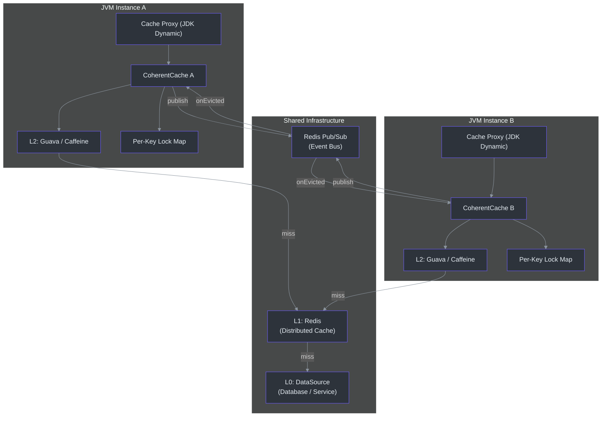
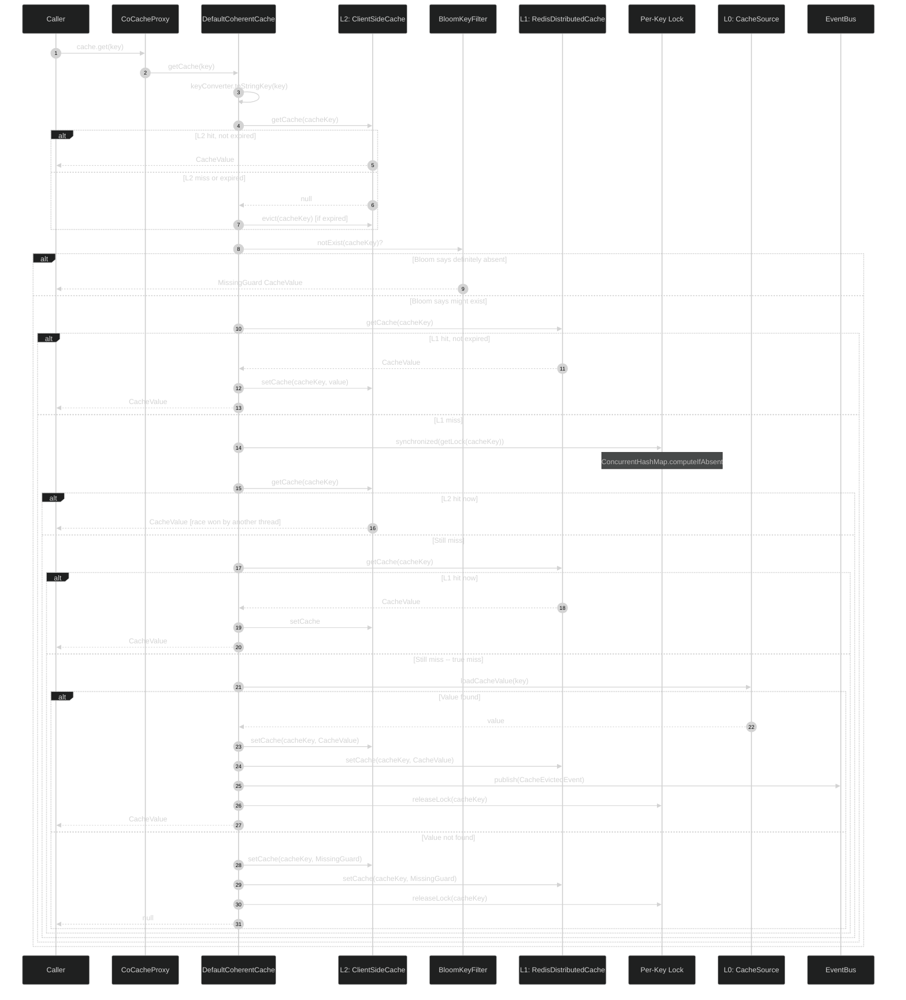
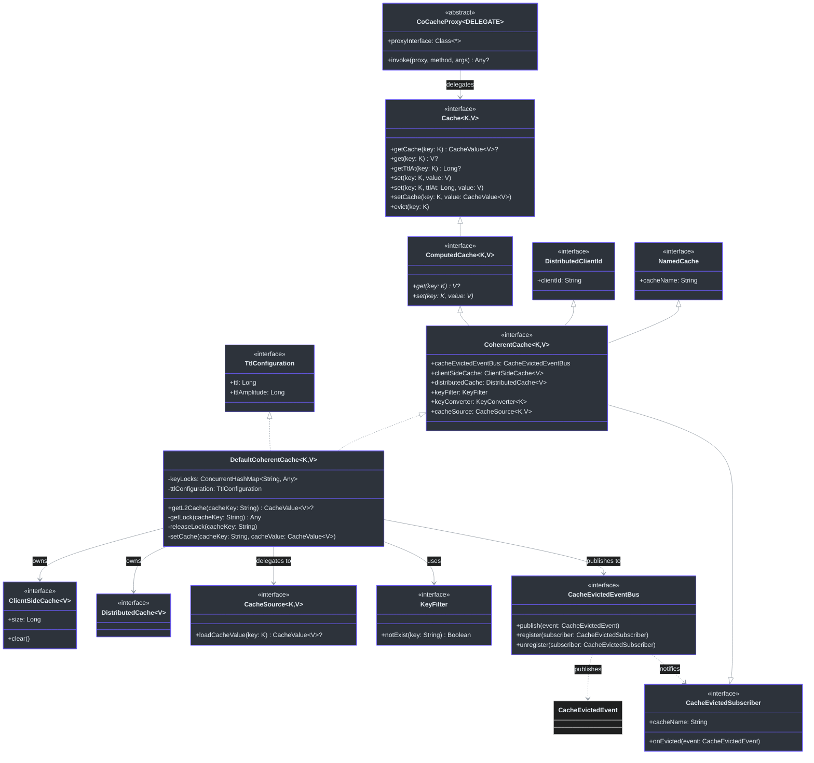
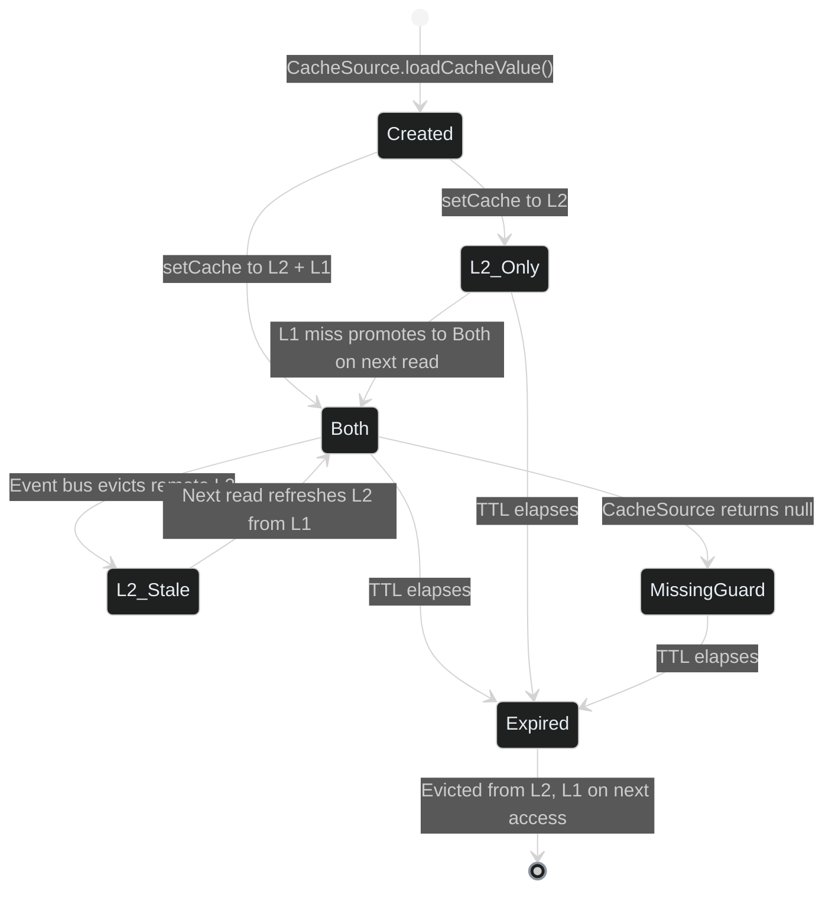
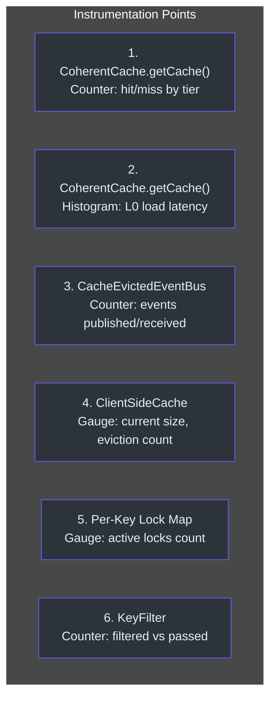

# 高级工程师入职指南

本指南面向评估或扩展 CoCache 的 Staff 和 Principal 级别工程师。
它提炼了最重要的架构洞察，映射了完整系统，审视了设计权衡，并提供了核心缓存模式的语言无关伪代码模型。

---

## 目录

- [核心架构洞察](#核心架构洞察)
- [系统架构图](#系统架构图)
- [缓存读取序列（完整路径）](#缓存读取序列完整路径)
- [类模型](#类模型)
- [设计权衡分析](#设计权衡分析)
- [决策日志](#决策日志)
- [核心模式伪代码](#核心模式伪代码)
- [扩展点](#扩展点)
- [性能特征](#性能特征)
- [运维考量](#运维考量)

---

## 核心架构洞察

CoCache 的架构建立在一个核心洞察之上：**具有事件驱动一致性和细粒度逐键锁定的三层缓存，可以在防止缓存击穿、穿透和雪崩的同时，实现亚毫秒级读取——而无需在应用实例之间进行分布式锁协调。**

这三个层级分别是：

1. **L2（客户端缓存）** -- 进程内内存（Guava/Caffeine）。最快路径。每个实例独立。不共享。当其他实例修改条目时，通过事件总线使其失效。

2. **L1（分布式缓存）** -- Redis。在所有实例之间共享。作为"已缓存"状态的唯一事实来源。提供一致性锚定。

3. **L0（数据源）** -- 数据库或服务。仅在真正的缓存未命中时才访问。受逐键锁保护，防止缓存击穿。

一致性模型是**最终一致的**：当实例 A 写入 L1 并发布驱逐事件时，实例 B 异步接收该事件并使其本地 L2 失效。不一致窗口受 Redis Pub/Sub 延迟限制（在同一数据中心内通常 < 1ms）。

该设计完全避免了分布式锁。每个实例独立管理自己的 L2，使用 L1 作为共享事实，使用事件总线作为失效信号。没有共识协议，没有分布式锁管理器，也没有读取时的跨实例协调。

---

## 系统架构图



从该图中可以得出以下关键观察：

- 每个 JVM 实例拥有自己的 `ConcurrentHashMap<String, Any>` 用于逐键锁定。这些锁**不**在实例间共享。该锁仅防止**同一**实例内对同一键的并发 L0 查询。
- Redis 扮演双重角色：既作为 L1 缓存存储，又作为驱逐事件的 Pub/Sub 传输。这两个逻辑上是独立的关注点，但共享相同的 Redis 基础设施。
- Cache Proxy 是一个 JDK 动态代理，实现了用户定义的缓存接口。所有方法调用都被拦截并通过 `CoherentCache` 路由。

---

## 缓存读取序列（完整路径）

此序列图展示了包含所有保护机制的完整读取路径：



### L0 的进入时机

请注意，L0（数据源）在每个实例中每个键只会被访问一次，受逐键锁保护。[cocache-core/src/main/kotlin/me/ahoo/cache/consistency/DefaultCoherentCache.kt#L110](https://github.com/Ahoo-Wang/CoCache/blob/main/cocache-core/src/main/kotlin/me/ahoo/cache/consistency/DefaultCoherentCache.kt#L110) 处的源代码注释明确说明了这一点：

```
/*
 * This is a heavy-duty operation.
 */
cacheSource.loadCacheValue(key)
```

加载后，该值会**同时**写入 L2 和 L1，然后发布驱逐事件。这种"双写穿透"策略确保即使其他实例的 L2 尚未收到事件，下一次请求在任何实例上都能从 L1 中找到该值。

---

## 类模型



### 类模型中的关键设计模式

**组合优于继承**：`DefaultCoherentCache` 组合了 L2、L1、L0、事件总线、键过滤器和键转换器。每个都是接口，允许插入任何实现。

**通过 Kotlin `by` 实现委托**：`DefaultCoherentCache` 将 `DistributedClientId` 和 `NamedCache` 委托给其 `CoherentCacheConfiguration` 对象，减少了样板代码。

**通过 `ComputedCache` 实现模板方法**：`ComputedCache` 接口提供了 `get()`、`getTtlAt()` 和 `set()` 的默认实现，这些方法与 `CacheValue` 对象一起工作（处理 MissingGuard、TTL 计算等）。`CoherentCache` 继承了这些默认实现，仅重写 `getCache()`（检查 L2/L1/L0 的原始查找方法）。

---

## 设计权衡分析

### 权衡 1：逐键锁 vs. 分布式锁

| 维度 | 逐键锁（已选方案） | 分布式锁（Redisson 等） |
|-----------|----------------------|-------------------------------------|
| **作用范围** | 仅限单个实例 | 跨实例 |
| **机制** | `ConcurrentHashMap.computeIfAbsent` + `synchronized` | Redis SETNX / Redlock |
| **延迟** | ~纳秒级 | ~毫秒级（网络往返） |
| **一致性** | 防止实例内的缓存击穿 | 防止所有实例间的缓存击穿 |
| **复杂度** | 零外部依赖 | 需要 Redis 锁基础设施 |
| **故障模式** | 线程退出时锁自动释放 | 锁 TTL 需要管理；存在脑裂风险 |

**CoCache 选择逐键锁的原因**：关键洞察是事件总线 + L1 写入穿透已经提供了跨实例一致性。如果实例 A 从 L0 加载值并写入 L1，实例 B 在下次访问时会在 L1 中找到它（即使在驱逐事件到达之前）。逐键锁只需要防止**同一**实例内的多个线程同时访问 L0。

跨实例的缓存击穿通过以下组合来防止：
1. L1（Redis）作为共享的"先写者获胜"存储
2. 驱逐事件触发其他实例上的 L2 失效
3. TTL 幅度（抖动）防止同步过期

逐键锁的代价是两个实例可能同时为同一个键访问 L0。这是可接受的，因为：
- 这种情况很少发生（需要两个实例同时未命中 L2 和 L1）
- 数据库可以通过正常的连接池处理这种情况
- 值将是相同的，因此第二次写入是幂等的

### 权衡 2：事件总线 vs. 直接失效

| 维度 | 事件总线（已选方案） | 直接失效（轮询/CRDT） |
|-----------|-------------------|-------------------------------------|
| **延迟** | ~亚毫秒级（数据中心内的 Redis Pub/Sub） | 可变：取决于轮询间隔或 CRDT 收敛速度 |
| **耦合度** | 松散 -- 实例只了解事件 | 紧密 -- 实例必须相互了解 |
| **一致性** | 最终一致（受网络延迟限制） | 最终一致（受轮询间隔限制） |
| **故障模式** | 事件丢失 = 过期 L2（通过 TTL 自愈） | 轮询失败 = 过期直到下次轮询 |
| **可扩展性** | 每事件 O(1)（广播） | O(N) 轮询或 O(N) Gossip 协议 |
| **复杂度** | 简单的发布/订阅 | 轮询需要定时器管理；CRDT 较复杂 |

**CoCache 选择事件总线的原因**：Redis Pub/Sub 提供近乎即时的通知，实例之间零耦合。实例不需要知道彼此的存在——它们只订阅以缓存名称命名的频道。如果 Pub/Sub 消息丢失（Redis 不保证投递），L2 条目会保留到其 TTL 过期，届时它会通过从 L1/L0 获取新数据来自愈。

关键属性：**过期数据始终受 TTL 限制**。即使最坏情况（事件总线完全故障），每个 L2 条目都会在配置的 TTL 窗口内过期。这使得系统具有自愈能力。

### 权衡 3：JDK 代理 vs. AOP（AspectJ / Spring AOP）

| 维度 | JDK 动态代理（已选方案） | Spring AOP | AspectJ |
|-----------|---------------------------|------------|---------|
| **机制** | `java.lang.reflect.Proxy` + `InvocationHandler` | CGLIB/Proxy + `@Around` | 编译期/加载期织入 |
| **接口要求** | 必须是接口 | 可以代理类 | 可以织入任何类 |
| **性能** | 每次调用~纳秒级开销 | 类似 | 零运行时开销（编译期） |
| **调试** | 通过 `InvocationHandler` 的清晰堆栈跟踪 | AOP 通知可能难以追踪 | 字节码变换可能干扰调试器 |
| **配置** | 显式：在接口上标注 `@CoCache` | 隐式：在方法上标注 `@Cacheable` | 需要 AspectJ 编译器 |
| **多方法支持** | 接口级别 -- 所有方法都被代理 | 逐方法注解 | 逐连接点 |

**CoCache 选择 JDK 动态代理的原因**：CoCache 在**接口级别**定义缓存行为，而不是方法级别。`UserCache` 接口声明它本身就是一个缓存，而不是个别方法恰好被缓存。这与 Spring 的 `@Cacheable`（注解个别方法）在根本上不同。

代理方式还支持：
- 清晰分离：用户定义接口，CoCache 提供实现
- 类型安全：`UserCache` 是类型化的 `Cache<String, User>`，而不是泛型的 `CacheManager`
- 统一行为：所有 `Cache` 方法（`get`、`set`、`evict`、`getTtlAt`）通过同一一致性缓存层一致处理

其代价是 JDK 代理需要接口（不能代理类）。这由 CoCache 强制执行：`@CoCache` 注解只能放在接口上。

### 权衡 4：TTL 幅度（抖动）vs. 固定 TTL

| 维度 | TTL 幅度（已选方案） | 固定 TTL |
|-----------|----------------------|-----------|
| **过期模式** | 交错 -- 条目在略微不同的时间过期 | 同步 -- 同时获取的所有条目同时过期 |
| **击穿风险** | 低 -- 过期时间分散 | 高 -- 过期时出现惊群效应 |
| **实现** | `ttlAt = computedTtlAt + random(0, ttlAmplitude)` | `ttlAt = computedTtlAt` |
| **复杂度** | 极低 -- 一次随机加法 | 无 |

CoCache 默认应用 TTL 幅度（`DEFAULT_TTL_AMPLITUDE = 10` 秒）。这意味着 TTL=120 秒的缓存条目将在 120 秒到 130 秒之间的某个时刻过期，防止在同一流量高峰期间获取的所有条目同时过期。

---

## 决策日志

| 决策 | 日期/理由 | 考虑的替代方案 | 结果 |
|----------|---------------|------------------------|---------|
| **三层架构（L2/L1/L0）** | 实现亚毫秒级读取，同时保持一致性 | 两层（仅 L1/L0）、两层（L2/L0 加广播） | 已在生产中大规模验证 |
| **逐键进程内锁定** | 纳秒级延迟，零外部依赖 | 分布式锁（Redisson）、无锁（允许击穿） | 可接受的实例内击穿防护；跨实例击穿由 L1 写入穿透防止 |
| **Redis Pub/Sub 作为事件总线** | 近乎即时，零耦合，利用现有 Redis | Kafka、RabbitMQ、基于轮询的失效 | 延迟足够好；有损投递可接受，因为 TTL 提供自愈能力 |
| **JDK 动态代理** | 接口级缓存语义，类型安全 | Spring AOP、CGLIB 类代理、注解处理器（KSP） | 清晰的 API：`interface UserCache : Cache<String, User>` |
| **MissingGuard 哨兵值** | 无需外部状态即可防止缓存穿透 | 对 null 值使用 TTL=0、单独的 null 缓存存储 | 简单；适用于所有序列化格式 |
| **Bloom Filter 作为 KeyFilter** | L1 查询前的概率性预过滤 | 无过滤、精确集合成员判断 | 防止不存在的键查询击穿 Redis |
| **TTL 幅度（抖动）** | 防止同步过期的惊群效应 | 固定 TTL、指数退避 | 默认 10 秒抖动；可按缓存配置 |
| **Kotlin 作为实现语言** | 简洁、空安全、扩展函数、Java 互操作 | 纯 Java、Scala | `-Xjvm-default=all-compatibility` 确保 Java 互操作性 |
| **`synchronized` 而非 `ReentrantLock`** | 更简单，足以满足用例需求 | `ReentrantLock`、`StampedLock` | 不需要 tryLock/超时/中断 -- 临界区执行很快 |
| **同时写入 L2 和 L1** | 确保 L1 始终具有最新值供其他实例使用 | 先写 L1 再写 L2；先写 L2 再写 L1 | 两次写入都很快；顺序不太重要；并行写入减少窗口期 |
| **基于缓存名称的事件路由** | 每个缓存有自己的 Pub/Sub 频道 | 单个全局频道加过滤 | 每缓存频道提供天然隔离；无串扰 |

---

## 核心模式伪代码

以下 Python 伪代码捕捉了 CoCache 缓存模式的精髓。故意使用 Python（而非 Kotlin）是为了证明该模式是语言无关的。

```python
import threading
from collections import defaultdict
from dataclasses import dataclass
from typing import Optional, Generic, TypeVar
import random

K = TypeVar("K")
V = TypeVar("V")


@dataclass
class CacheValue(Generic[V]):
    value: Optional[V]
    ttl_at: float       # absolute expiration timestamp
    is_missing_guard: bool = False

    @property
    def is_expired(self) -> bool:
        return time.time() > self.ttl_at


MISSING_GUARD = "_nil_"


class CoherentCache(Generic[K, V]):
    """
    Core CoCache pattern: three-tier cache with event-driven coherence
    and per-key fine-grained locking.
    """

    def __init__(
        self,
        cache_name: str,
        client_id: str,
        l2_cache,           # ClientSideCache: in-process memory
        l1_cache,           # DistributedCache: Redis
        cache_source,       # CacheSource: database loader
        event_bus,          # CacheEvictedEventBus: pub/sub
        key_filter,         # KeyFilter: bloom filter
        key_converter,      # KeyConverter: K -> str
        ttl: float,
        ttl_amplitude: float,
    ):
        self.cache_name = cache_name
        self.client_id = client_id
        self.l2 = l2_cache
        self.l1 = l1_cache
        self.source = cache_source
        self.event_bus = event_bus
        self.key_filter = key_filter
        self.key_converter = key_converter
        self.ttl = ttl
        self.ttl_amplitude = ttl_amplitude
        self._key_locks: dict[str, threading.Lock] = defaultdict(threading.Lock)

    def get(self, key: K) -> Optional[V]:
        """Main entry point: returns the cached value or None."""
        cache_value = self._get_cache(key)
        if cache_value is None or cache_value.is_missing_guard or cache_value.is_expired:
            return None
        return cache_value.value

    def _get_cache(self, key: K) -> Optional[CacheValue]:
        """
        Full three-tier lookup with double-check locking.

        This is the heart of CoCache. The algorithm:

        1. Check L2 (unlocked fast path)
        2. Check bloom filter (unlocked fast path)
        3. Check L1 (unlocked fast path)
        4. Acquire per-key lock
        5. Re-check L2 (double-check)
        6. Re-check L1 (double-check)
        7. Load from L0 (cache source)
        8. Write to L2 + L1
        9. Publish eviction event
        10. Release lock
        """
        cache_key = self.key_converter.to_string(key)

        # --- Step 1: L2 fast path (no lock) ---
        l2_result = self._check_l2(cache_key)
        if l2_result is not None:
            return l2_result

        # --- Step 2: Bloom filter gate ---
        if self.key_filter.not_exist(cache_key):
            return self._make_missing_guard()

        # --- Step 3: L1 fast path (no lock) ---
        l1_result = self.l1.get_cache(cache_key)
        if l1_result is not None and not l1_result.is_expired:
            self.l2.set_cache(cache_key, l1_result)  # promote to L2
            return l1_result

        # --- Step 4-7: Per-key locked path ---
        lock = self._key_locks[cache_key]
        with lock:
            # Double-check L2
            l2_result = self._check_l2(cache_key)
            if l2_result is not None:
                return l2_result

            # Double-check L1
            l1_result = self.l1.get_cache(cache_key)
            if l1_result is not None and not l1_result.is_expired:
                self.l2.set_cache(cache_key, l1_result)
                return l1_result

            # --- Step 7: Load from L0 (heavy operation) ---
            source_value = self.source.load_cache_value(key)
            if source_value is not None:
                self._set_both(cache_key, source_value)
                self.event_bus.publish(CacheEvictedEvent(
                    cache_name=self.cache_name,
                    key=cache_key,
                    publisher_id=self.client_id,
                ))
                return source_value

            # --- Step 8: Missing guard (prevent penetration) ---
            guard = self._make_missing_guard()
            self._set_both(cache_key, guard)
            return guard

    def set(self, key: K, value: V):
        """Write-through to both L2 and L1."""
        cache_key = self.key_converter.to_string(key)
        ttl_at = time.time() + self.ttl + random.uniform(0, self.ttl_amplitude)
        cache_value = CacheValue(value=value, ttl_at=ttl_at)
        self._set_both(cache_key, cache_value)
        self.event_bus.publish(CacheEvictedEvent(
            cache_name=self.cache_name,
            key=cache_key,
            publisher_id=self.client_id,
        ))

    def evict(self, key: K):
        """Remove from both layers and notify other instances."""
        cache_key = self.key_converter.to_string(key)
        self.l2.evict(cache_key)
        self.l1.evict(cache_key)
        self.event_bus.publish(CacheEvictedEvent(
            cache_name=self.cache_name,
            key=cache_key,
            publisher_id=self.client_id,
        ))

    def on_evicted(self, event):
        """
        Called when another instance evicts an entry.
        Only invalidates local L2 -- not L1 (which is already updated).
        """
        if event.cache_name != self.cache_name:
            return  # not my cache
        if event.publisher_id == self.client_id:
            return  # I published this -- already handled locally
        self.l2.evict(event.key)

    # --- Private helpers ---

    def _check_l2(self, cache_key: str) -> Optional[CacheValue]:
        cached = self.l2.get_cache(cache_key)
        if cached is not None:
            if not cached.is_expired:
                return cached
            self.l2.evict(cache_key)  # expired -- clean up
        return None

    def _set_both(self, cache_key: str, value: CacheValue):
        self.l2.set_cache(cache_key, value)
        self.l1.set_cache(cache_key, value)

    def _make_missing_guard(self) -> CacheValue:
        ttl_at = time.time() + self.ttl + random.uniform(0, self.ttl_amplitude)
        return CacheValue(
            value=MISSING_GUARD,
            ttl_at=ttl_at,
            is_missing_guard=True,
        )
```

### 如何阅读此伪代码

`get()` 方法是最重要的函数。它实现了完整的三层查找，包含所有四种保护机制：

1. **L2 快速路径**（"Step 1" 行）-- 大多数读取在此处以~纳秒级返回。
2. **Bloom Filter 门控**（"Step 2" 行）-- 防止对已知不存在的键进行 L1 查询。
3. **L1 快速路径**（"Step 3" 行）-- 共享缓存命中；提升到 L2。
4. **逐键锁**（"Step 4-7" 行）-- 双重检查锁定防止缓存击穿。
5. **L0 加载**（"Step 7" 行）-- 每个实例每个键只有一个线程会到达这里。
6. **MissingGuard**（"Step 8" 行）-- 防止不存在键的缓存穿透。

`on_evicted()` 方法实现了一致性协议。当其他实例发布驱逐事件时，事件总线调用此方法。两个守卫检查（缓存名称匹配、非自身发布）防止不必要的工作。

---

## 扩展点

CoCache 设计为通过接口替换实现扩展：

| 扩展点 | 接口 | 默认实现 | 替换方式 |
|----------------|-----------|----------------------|----------------|
| L2 缓存 | `ClientSideCache<V>` | `GuavaClientSideCache`、`CaffeineClientSideCache`、`MapClientSideCache` | 实现 `ClientSideCache` 或提供名为 `<CacheName>.ClientSideCache` 的 `@Bean` |
| L1 缓存 | `DistributedCache<V>` | `RedisDistributedCache` | 为非 Redis 后端实现 `DistributedCache` |
| 事件总线 | `CacheEvictedEventBus` | `GuavaCacheEvictedEventBus`、`RedisCacheEvictedEventBus` | 为 Kafka、RabbitMQ 等实现 |
| 数据源 | `CacheSource<K, V>` | `NoOpCacheSource` | 实现以从任何数据存储加载 |
| 键过滤器 | `KeyFilter` | `NoOpKeyFilter`、`BloomKeyFilter` | 为不同的概率数据结构实现 |
| 键转换器 | `KeyConverter<K>` | `ToStringKeyConverter`、`ExpKeyConverter` | 为自定义键格式实现 |

Spring 集成通过 Bean 名称匹配来解析这些组件：名为 `UserCache.ClientSideCache` 的 Bean 将被注入为 `UserCache` 的 L2 缓存。

---

## 性能特征

### 各路径预期延迟

| 路径 | 延迟 | 频率 |
|------|---------|-----------|
| L2 命中（热缓存） | ~100ns - 1us | ~90-99% 的读取 |
| L1 命中（L2 未命中，Redis 命中） | ~0.5 - 2ms | ~1-9% 的读取 |
| L0 加载（完全未命中） | ~5 - 100ms | <1% 的读取 |
| 驱逐事件处理 | ~0.5 - 1ms | 与写入速率成正比 |

### 内存考量

- **每实例 L2 内存**：取决于 `maximumSize` 和条目大小。对于 `GuavaCache(maximumSize = 1_000_000)` 且平均条目大小为 1KB 的情况，预计约 1GB 堆内存。
- **逐键锁映射**：`ConcurrentHashMap` 随并发唯一键获取数量增长。锁在 L0 加载完成后释放。
- **Bloom Filter**：在 1% 误判率下，每个元素约 1.2 字节。

### 可扩展性模型

- **水平扩展**：添加实例会增加 L2 容量（更多本地缓存），但也会增加事件总线流量（每个实例订阅所有缓存频道）。
- **Redis Pub/Sub 扇出**：每个驱逐事件广播给所有订阅者。对于 N 个实例和每秒 W 次写入，事件总线处理 N*W 条消息/秒。Redis Pub/Sub 每频道可处理 ~100K+ 条消息/秒。

---

## 运维考量

### Redis 依赖

Redis 是 L1 缓存和事件总线的**共享依赖**。Redis 故障影响：
- L1 缓存读取（降级为直接访问 L0）
- 一致性事件（L2 过期直到 TTL 到期）
- 对已本地缓存的 L2 读取无影响

系统优雅降级：如果 Redis 宕机，读取仍可通过 L2（缓存命中）和 L0（直接访问数据库）正常工作。写入和驱逐在本地继续工作。各实例的 L2 缓存将出现分歧，直到 Redis 恢复，届时恢复正常运行。

### 监控建议

| 指标 | 来源 | 意义 |
|--------|--------|-------------|
| L2 命中率 | `ClientSideCache` | 主要性能指标；应 >90% |
| L1 命中率 | `DistributedCache` | 次要命中率；反映 L2 有效性 |
| L0 调用率 | `CacheSource` | 应 <1%；峰值表示缓存问题 |
| 事件总线延迟 | `CacheEvictedEventBus` | 一致性滞后指标 |
| 逐键锁竞争 | `DefaultCoherentCache` | 线程竞争指标 |
| MissingGuard 比率 | `KeyFilter`/`CacheSource` | 缓存穿透攻击指标 |

### TTL 策略

- **根据数据易变性设置 TTL**：易变数据使用短 TTL（例如 60s）；静态数据使用长 TTL（例如 3600s）。
- **始终使用 TTL 幅度**：默认 10 秒抖动可防止惊群效应。对于高流量缓存，将幅度增加到 TTL 的 20-30%。
- **MissingGuard 的 TTL 应与数据 TTL 匹配**：对于可能稍后出现的键，其 MissingGuard 应在与常规条目大约相同的时间过期，以便系统可以重新检查。

---

## CacheValue 生命周期与序列化

理解缓存值在系统中的流转方式对于容量规划和调试至关重要。

### 值状态



### Redis 中的序列化

`RedisDistributedCache` 使用 `CodecExecutor` 将 `CacheValue` 对象序列化到 Redis。编解码器处理：
- 将值 `V` 序列化为字节/字符串
- 将 `ttlAt` 元数据与值一起编码
- 读取时反序列化回 `CacheValue<V>`

Redis 键包含配置的 `keyPrefix`（例如 `"user:123"`），值同时包含负载和过期时间戳。Redis 自身的 TTL 机制也被使用（通过 `EXPIRE`）以自动清理 Redis 中过期的条目。

### 每缓存条目的内存占用

| 组件 | 大小（近似） |
|-----------|-------------------|
| `CacheValue<V>` 包装器 | ~32 字节开销 |
| `ttlAt`（Long） | 8 字节 |
| 值负载 | 取决于类型（通常 100B - 10KB） |
| L2 键（String） | ~50 字节（例如 `"user:abc-123"`） |
| ConcurrentHashMap 锁条目 | ~64 字节（临时的，仅在 L0 获取期间存在） |
| **L2 中每条目总计** | **~200B + 负载大小** |

对于具有 10 万条目、平均 500B 负载的缓存：约 70MB L2 内存。

---

## 可观测性与监控

CoCache 不包含内置的指标监控。要在生产环境中观察缓存行为，团队必须在以下位置添加监控：

### 推荐的监控埋点位置



### 推荐指标（Micrometer/Prometheus 格式）

| 指标名称 | 类型 | 标签 | 用途 |
|-------------|------|--------|---------|
| `cocache.get.total` | Counter | `cache_name`、`tier`（L2/L1/L0/filtered/missing） | 各层命中率/未命中率 |
| `cocache.get.duration` | Histogram | `cache_name`、`tier` | 各层延迟 |
| `cocache.set.total` | Counter | `cache_name` | 写入吞吐量 |
| `cocache.evict.total` | Counter | `cache_name`、`source`（local/event） | 驱逐率和来源 |
| `cocache.event.published` | Counter | `cache_name` | 已发布事件数 |
| `cocache.event.received` | Counter | `cache_name` | 已接收事件数（一致性） |
| `cocache.l2.size` | Gauge | `cache_name` | 当前 L2 缓存大小 |
| `cocache.l2.eviction` | Counter | `cache_name` | L2 驱逐数（容量或 TTL） |
| `cocache.lock.active` | Gauge | `cache_name` | 活跃逐键锁数量 |
| `cocache.keyfilter.filtered` | Counter | `cache_name` | 被 Bloom Filter 拒绝的键数 |

### SLO 建议

| SLO | 目标 | 告警阈值 |
|-----|--------|----------------|
| L2 命中率 | >90% | <85% 持续 5 分钟 |
| L1 命中率（给定 L2 未命中） | >80% | <70% 持续 5 分钟 |
| L0 调用率 | <总读取的 1% | >2% 持续 5 分钟 |
| L0 延迟 p99 | <100ms | >200ms 持续 5 分钟 |
| 事件总线投递率 | >99% | <95% 持续 5 分钟 |
| MissingGuard 比率 | <L0 调用的 5% | >10% 持续 5 分钟 |

---

## 总结

CoCache 通过简洁的三层架构解决了分布式缓存问题，既简单易懂又在生产环境中稳健可靠。关键架构决策——逐键锁、事件总线一致性、JDK 代理和 TTL 抖动——共同创建了一个无需实例间分布式协调即可处理缓存击穿、穿透和雪崩的系统。

这些权衡经过深思熟虑：以最终一致性（受 TTL 限制）换取简洁性、性能和运维弹性。对于需要严格一致性的系统，可以通过更强失效机制来扩展架构，但对于绝大多数缓存用例，CoCache 的方法达到了恰到好处的平衡。
