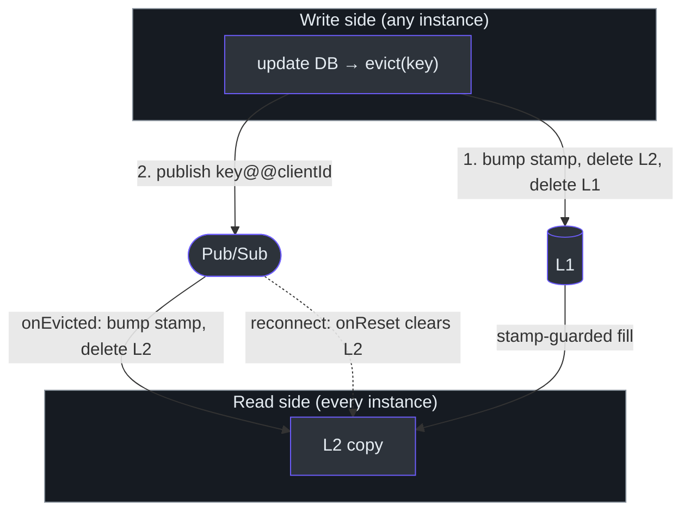

# Staff Engineer 指南

## 目录

- [核心洞察](#核心洞察)
- [一致性模型](#一致性模型)
- [读路径](#读路径)
- [设计权衡](#设计权衡)
- [扩展点](#扩展点)
- [性能特性](#性能特性)
- [运维考量](#运维考量)

## 核心洞察

二级缓存的本质是**用陈旧度换延迟**。CoCache 不笼统地声称“一致”，而是明确三条性质，并为每一条配置专门的机制：

| 性质 | 机制 |
|------|------|
| **陈旧度有上界**：任何不一致都在有限时间内自愈 | 有限的默认 `ttl`（3600 秒）；独立的短 `missingTtl`（60 秒）；事件通道每次（重新）订阅时清空 L2 |
| **失效不被吞没**：并发回源与乱序事件不会让旧值复活 | `InvalidationStamps` 保护每一次写回；L1 未命中绝不推断为“不存在” |
| **命中路径够便宜** | 有界 Caffeine L2（读取时判断过期，缓存时钟 `CacheClock`）；每次 L1 读取一次原子 Lua 往返；按 key 的 `SingleFlight` |

不使用分布式锁，也没有共识协议。每个实例各自合并回源，跨实例的重复由 L1 吸收。

## 一致性模型

```mermaid
graph TB
    subgraph writers ["Write side (any instance)"]
        W["update DB → evict(key)"]
    end
    subgraph readers ["Read side (every instance)"]
        L2["L2 copy"]
    end
    W -->|"1. bump stamp, delete L2, delete L1"| L1[("L1")]
    W -->|"2. publish key@@clientId"| PS(["Pub/Sub"])
    PS -->|"onEvicted: bump stamp, delete L2"| L2
    PS -.->|"reconnect: onReset clears L2"| L2
    L1 -->|"stamp-guarded fill"| L2

    style W fill:#2d333b,stroke:#6d5dfc,color:#e6edf3
    style L2 fill:#2d333b,stroke:#6d5dfc,color:#e6edf3
    style L1 fill:#2d333b,stroke:#6d5dfc,color:#e6edf3
    style PS fill:#2d333b,stroke:#6d5dfc,color:#e6edf3
    style writers fill:#161b22,stroke:#8b949e,color:#e6edf3
    style readers fill:#161b22,stroke:#8b949e,color:#e6edf3
```

各故障模式下的陈旧度上界：

| 故障 | 最长陈旧时长 | 原因 |
|------|--------------|------|
| 事件延迟 | Pub/Sub 延迟 | `onEvicted` 淘汰 L2；与事件竞争的填充会被撤销 |
| 连接期间事件丢失 | `ttl` | 连接基于 TCP，丢失意味着断线，断线会触发重置；否则由 TTL 兜底 |
| 断线 / 重连 | 重连耗时 | 重新订阅后 `onReset` 清空 L2 |
| 慢回源与并发更新竞争（cache-aside 竞态） | L1 中的 `ttl` | cache-aside 固有；事件到达后 L2 被撤销，L1 保留到过期 |
| 一次“不存在”查询之后新建了数据 | `missingTtl` | 负缓存使用独立 TTL |

写入方必须**先更新数据源，再淘汰缓存**。除非手里已经有提交后的值，否则优先淘汰而不是写入。

## 读路径

```mermaid
sequenceDiagram
autonumber
    participant App
    participant C as DefaultCoherentCache
    participant SF as SingleFlight
    participant L1 as Redis
    participant Src as CacheSource

    App->>C: getCache(key)
    C->>C: L2 hit? → return
    C->>C: keyFilter.notExist? → MissingValue
    C->>SF: execute(cacheKey)
    SF->>SF: stamp = current(cacheKey)
    SF->>L1: EVALSHA read-script → {TTL, value}
    alt hit
        SF->>C: fill L2 iff stamp unchanged (re-check after)
    else miss
        SF->>Src: loadCacheValue(key)
        Src-->>SF: value | null → MissingValue(missingTtl)
        SF->>L1: write iff stamp unchanged
        SF->>C: write L2; if stamp changed → undo L1+L2, publish
    end
    SF-->>App: value (followers share it)
```

## 设计权衡

### 按 key 的 SingleFlight vs 分布式锁 vs 分段锁

| | SingleFlight（采用） | 分段锁（4.x） | 分布式锁 |
|---|---|---|---|
| 范围 | 单实例，精确 key | 单实例，哈希分段 | 集群 |
| 无关 key 互相阻塞 | 从不 | 分段碰撞时 | 否 |
| 失败传播 | leader 的原始异常传给所有等待者 | 每个等待者各自重试回源 | 需管理锁 TTL |
| 成本 | 回源期间一个 `ConcurrentHashMap` 条目 | 固定锁数组 | 一次网络往返 |

接受跨实例的重复回源：它很少发生、是幂等的，并由 L1 吸收。

### 戳 vs 每 key 代际表 vs 锁住写入方

戳是固定大小的 `AtomicLongArray(4096)`：不需要按 key 分配，也不需要清理，并覆盖**所有**失效来源，包括本地失效。分段碰撞的代价只是多放弃一次写回。

### 订阅即重置 vs 可靠消息

Redis Pub/Sub 是至多一次投递。CoCache 没有引入持久化消息中间件，而是把每次（重新）订阅视为“消息可能已丢失”并丢弃 L2，代价是重连后短暂的命中率下降。

### 显式负缓存类型 vs 值内哨兵

4.x 根据值的形状（`"_nil_"`、`{"_nil_"}` ……）判断负缓存，真实数据可能被误判为“不存在”。5.0 使用密封的 `MissingValue`，哨兵只作为 Redis 的线格式编码存在。

### JDK 代理 vs AOP

缓存在接口级别声明（`UserCache : Cache<String, User>`），因此 JDK 代理已经足够。一个 `CacheInvocationHandler` 负责分派调用并重抛原始异常。

## 扩展点

| 扩展 | SPI（cocache-api） | 默认实现 | Spring 覆盖方式 |
|------|-------------------|----------|-----------------|
| L2 | `ClientSideCache<V>` | `CaffeineClientSideCache` | bean `{cacheName}.ClientSideCache` |
| L1 | `DistributedCache<V>` | `RedisDistributedCache` | bean `{cacheName}.DistributedCache` |
| 通道 | `CacheEvictedEventBus` | `RedisCacheEvictedEventBus` | `@Bean CacheEvictedEventBus`（（重新）订阅时必须调用 `onReset`） |
| 数据源 | `CacheSource<K, V>` | `noOp()` | bean `{cacheName}.CacheSource` 或唯一类型 bean |
| key 转换 | `KeyConverter<K>` | `ToStringKeyConverter` / `ExpKeyConverter` | bean `{cacheName}.KeyConverter` |
| 存在性过滤 | `KeyFilter` | `KeyFilter.NO_OP` | 通过 `CoherentCacheConfiguration` |

任何新实现都要用 `cocache-test` 中对应的 TCK 规格验证。

## 性能特性

| 路径 | 延迟 | 说明 |
|------|------|------|
| L2 命中 | ~100 ns – 1 µs | Caffeine 查找 + 过期检查 |
| L1 命中 | ~0.5 – 2 ms | 一次 Lua 往返 |
| L0 回源 | 数据源延迟 | 按 key 合并 |
| 写入 / 淘汰 | ~1 RTT + 发布 | 发布即发即忘 |

内存：L2 受 `maximumSize` 约束（默认每个缓存 10000 条），过期条目在读取时或按容量淘汰；在途回源每个占一个 map 条目。

扇出：N 个实例、每个缓存每秒 W 次写入时，该缓存频道上 Pub/Sub 每秒投递 N·W 条消息；回源成功不发布任何消息。

## 运维考量

### Redis 依赖

- 读失败降级为回源；写失败仅告警（`cocache.redis.strict-failure=false`）。
- 故障期间 L2 继续提供已持有的数据，直到 `ttl` 到期；恢复后重新订阅会清空 L2。

### 监控

| 信号 | 位置 | 关注点 |
|------|------|--------|
| L2 大小 | `/actuator/cocacheClient/{name}` | 持续达到 `maximumSize` → 调大或缩短 `ttl` |
| 缓存构成与 `ttlPolicy` | `/actuator/cocache/{name}` | 意外的默认值 |
| `Channel[...] subscribed - reset subscriber`（INFO） | 日志 | 频繁重置 = Redis 连接不稳定 |
| `Discard the loaded value ...`（WARN） | 日志 | 频率高 = 写热点 key 与回源竞争 |

### TTL 策略

- `ttl`：你能接受的“漏失效”最长陈旧时间。保持有限。
- `ttlAmplitude`：约为 `ttl` 的 2–10%。
- `missingTtl`：短（几秒到一分钟），它决定新建数据最多多久不可见。

## 相关页面

- [贡献者指南](./contributor.md)
- [缓存一致性](../architecture/coherence.md)
- [性能模式](../testing/performance-patterns.md)
