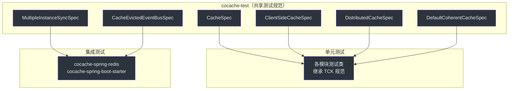

# 测试概览

CoCache 采用多层次的测试策略，包括共享测试规范（TCK）、单元测试和集成测试。

## 测试策略



## 测试规范（TCK）

`cocache-test` 模块定义了一组抽象测试规范（Technology Compatibility Kit），新的缓存实现只需继承这些规范即可获得完整的测试覆盖。

### CacheSpec

基础缓存测试规范，测试 `Cache<K, V>` 接口的基本操作：

- `get()` - 获取不存在的键返回 null
- `getWhenExpired()` - 获取已过期的键返回 null
- `set()` - 设置缓存值
- `setWithTtl()` - 设置带 TTL 的缓存值
- `setWithTtlAmplitude()` - 设置带 TTL 抖动的缓存值
- `evict()` - 驱逐缓存条目
- `setMissing()` - 设置缺失守卫值
- `setMissingTtl()` - 设置带 TTL 的缺失守卫值

**源码参考**：[`cocache-test/.../CacheSpec.kt`](https://github.com/Ahoo-Wang/CoCache/blob/main/cocache-test/src/main/kotlin/me/ahoo/cache/test/CacheSpec.kt)

### ClientSideCacheSpec

客户端缓存测试规范，继承 `CacheSpec`，增加客户端缓存特有测试。

**源码参考**：[`cocache-test/.../ClientSideCacheSpec.kt`](https://github.com/Ahoo-Wang/CoCache/blob/main/cocache-test/src/main/kotlin/me/ahoo/cache/test/ClientSideCacheSpec.kt)

### DistributedCacheSpec

分布式缓存测试规范，继承 `CacheSpec`，增加分布式缓存特有测试。

**源码参考**：[`cocache-test/.../DistributedCacheSpec.kt`](https://github.com/Ahoo-Wang/CoCache/blob/main/cocache-test/src/main/kotlin/me/ahoo/cache/test/DistributedCacheSpec.kt)

### DefaultCoherentCacheSpec

一致性缓存测试规范，测试完整的二级缓存流程：

- `getFromCacheSource()` - 从数据源加载
- `onEvicted()` - 事件驱动失效
- `onEvictedWhenLoop()` - 忽略自己发布的事件
- `onEvictedWhenCacheNameNotMatch()` - 忽略不匹配的事件
- `should prevent cache breakdown under high concurrency` - 高并发缓存击穿防护测试（参数化：10/100/1000 线程）

**源码参考**：[`cocache-test/.../DefaultCoherentCacheSpec.kt`](https://github.com/Ahoo-Wang/CoCache/blob/main/cocache-test/src/main/kotlin/me/ahoo/cache/test/DefaultCoherentCacheSpec.kt)

### MultipleInstanceSyncSpec

多实例同步测试规范，测试跨实例缓存一致性。

**源码参考**：[`cocache-test/.../MultipleInstanceSyncSpec.kt`](https://github.com/Ahoo-Wang/CoCache/blob/main/cocache-test/src/main/kotlin/me/ahoo/cache/test/MultipleInstanceSyncSpec.kt)

### CacheEvictedEventBusSpec

事件总线测试规范，测试事件发布和订阅。

**源码参考**：[`cocache-test/.../consistency/CacheEvictedEventBusSpec.kt`](https://github.com/Ahoo-Wang/CoCache/blob/main/cocache-test/src/main/kotlin/me/ahoo/cache/test/consistency/CacheEvictedEventBusSpec.kt)

## 测试工具

### 断言库

- **fluent-assert**：Kotlin 流式断言库，使用 `.assert()` 扩展函数
- 导入：`import me.ahoo.test.asserts.assert`
- 用法：`cache[key].assert().isEqualTo(value)`

### Mock 框架

- **mockk**：Kotlin Mock 框架
- 用于 Mock 外部依赖

### 测试框架

- **JUnit 5 (Jupiter)**：测试运行器
- **@ParameterizedTest**：参数化测试（如并发测试）

## 测试命令

```bash
# 运行所有测试
./gradlew test

# 运行特定模块测试
./gradlew :cocache-core:test
./gradlew :cocache-spring:test

# 运行集成测试（需要 Redis）
./gradlew :cocache-spring-redis:check
./gradlew :cocache-spring-boot-starter:check

# 运行单个测试类
./gradlew :cocache-core:test --tests "me.ahoo.cache.proxy.ProxyCacheTest"
```

## 相关页面

- [单元测试](./unit-testing.md) - 单元测试指南
- [集成测试](./integration-testing.md) - 集成测试指南
- [性能模式](./performance-patterns.md) - 性能测试模式
- [贡献指南](../building/contributing.md) - 贡献代码指南
