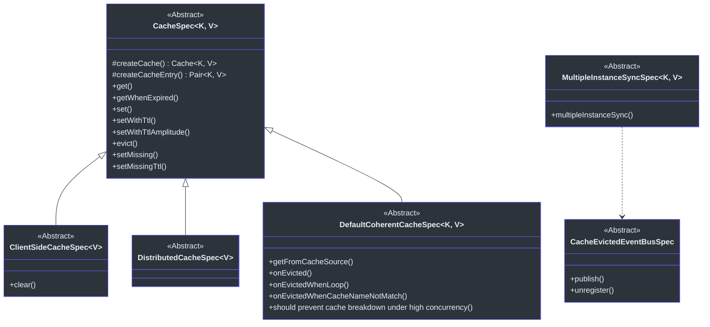
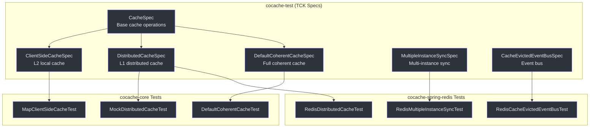
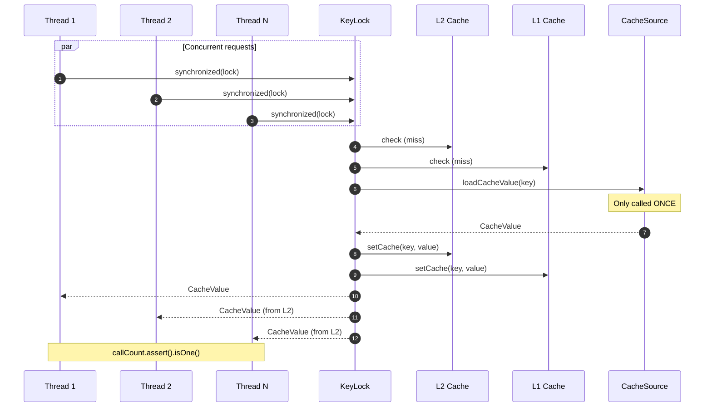

# 测试概览

CoCache 通过 `cocache-test` 模块提供了全面的**技术兼容性测试套件（TCK）**。这些抽象测试规范确保任何缓存实现——无论是内置的还是自定义的——在所有标准操作中行为正确。

## TCK 测试规范

`cocache-test` 模块包含定义缓存组件预期行为的抽象基类。新的缓存实现只需继承这些类并提供具体的工厂方法。

## 规范参考

### CacheSpec

所有缓存实现的基础测试规范，测试 `Cache<K, V>` 的基本契约。

| 测试方法 | 描述 | 源码 |
|----------|------|------|
| `get()` | 验证获取不存在的键返回 `null` | [CacheSpec.kt:36-39](https://github.com/Ahoo-Wang/CoCache/blob/main/cocache-test/src/main/kotlin/me/ahoo/cache/test/CacheSpec.kt#L36-L39) |
| `getWhenExpired()` | 验证已过期的条目不会被返回并被清理 | [CacheSpec.kt:41-47](https://github.com/Ahoo-Wang/CoCache/blob/main/cocache-test/src/main/kotlin/me/ahoo/cache/test/CacheSpec.kt#L41-L47) |
| `set()` | 验证基本的 set 和 get 往返操作 | [CacheSpec.kt:49-53](https://github.com/Ahoo-Wang/CoCache/blob/main/cocache-test/src/main/kotlin/me/ahoo/cache/test/CacheSpec.kt#L49-L53) |
| `setWithTtl()` | 验证设置显式 TTL 且 TTL 被正确存储 | [CacheSpec.kt:55-61](https://github.com/Ahoo-Wang/CoCache/blob/main/cocache-test/src/main/kotlin/me/ahoo/cache/test/CacheSpec.kt#L55-L61) |
| `setWithTtlAmplitude()` | 验证设置带 TTL 抖动幅度（jitter）的缓存 | [CacheSpec.kt:63-68](https://github.com/Ahoo-Wang/CoCache/blob/main/cocache-test/src/main/kotlin/me/ahoo/cache/test/CacheSpec.kt#L63-L68) |
| `evict()` | 验证驱逐操作会移除条目 | [CacheSpec.kt:70-75](https://github.com/Ahoo-Wang/CoCache/blob/main/cocache-test/src/main/kotlin/me/ahoo/cache/test/CacheSpec.kt#L70-L75) |
| `setMissing()` | 验证缺失守卫值被视为不存在 | [CacheSpec.kt:77-81](https://github.com/Ahoo-Wang/CoCache/blob/main/cocache-test/src/main/kotlin/me/ahoo/cache/test/CacheSpec.kt#L77-L81) |
| `setMissingTtl()` | 验证带 TTL 的缺失守卫值被视为不存在 | [CacheSpec.kt:83-89](https://github.com/Ahoo-Wang/CoCache/blob/main/cocache-test/src/main/kotlin/me/ahoo/cache/test/CacheSpec.kt#L83-L89) |

源码参考：[cocache-test/.../CacheSpec.kt](https://github.com/Ahoo-Wang/CoCache/blob/main/cocache-test/src/main/kotlin/me/ahoo/cache/test/CacheSpec.kt)

### ClientSideCacheSpec

继承 `CacheSpec`，增加针对 `ClientSideCache<V>` 接口（L2 本地缓存）的特有测试。

| 测试方法 | 描述 | 源码 |
|----------|------|------|
| `clear()` | 验证 `clear()` 移除所有条目并将大小重置为 0 | [ClientSideCacheSpec.kt:24-33](https://github.com/Ahoo-Wang/CoCache/blob/main/cocache-test/src/main/kotlin/me/ahoo/cache/test/ClientSideCacheSpec.kt#L24-L33) |
| (继承) | 所有 `CacheSpec` 测试 | [CacheSpec.kt](https://github.com/Ahoo-Wang/CoCache/blob/main/cocache-test/src/main/kotlin/me/ahoo/cache/test/CacheSpec.kt) |

源码参考：[cocache-test/.../ClientSideCacheSpec.kt](https://github.com/Ahoo-Wang/CoCache/blob/main/cocache-test/src/main/kotlin/me/ahoo/cache/test/ClientSideCacheSpec.kt)

### DistributedCacheSpec

继承 `CacheSpec`，使用 `String` 类型键，针对 `DistributedCache<V>` 接口（L1 分布式缓存）。继承所有 `CacheSpec` 测试。

源码参考：[cocache-test/.../DistributedCacheSpec.kt](https://github.com/Ahoo-Wang/CoCache/blob/main/cocache-test/src/main/kotlin/me/ahoo/cache/test/DistributedCacheSpec.kt)

### DefaultCoherentCacheSpec

测试完整的 `DefaultCoherentCache`，包含所有三层（L2 + L1 + DataSource）。包括并发和事件驱动一致性测试。

| 测试方法 | 描述 | 源码 |
|----------|------|------|
| `getFromCacheSource()` | 验证缓存未命中时从 `CacheSource` 加载数据 | [DefaultCoherentCacheSpec.kt:90-96](https://github.com/Ahoo-Wang/CoCache/blob/main/cocache-test/src/main/kotlin/me/ahoo/cache/test/DefaultCoherentCacheSpec.kt#L90-L96) |
| `onEvicted()` | 验证远程驱逐事件清除 L2 但保留 L1 | [DefaultCoherentCacheSpec.kt:98-109](https://github.com/Ahoo-Wang/CoCache/blob/main/cocache-test/src/main/kotlin/me/ahoo/cache/test/DefaultCoherentCacheSpec.kt#L98-L109) |
| `onEvictedWhenLoop()` | 验证自己发布的事件被忽略（无循环） | [DefaultCoherentCacheSpec.kt:111-122](https://github.com/Ahoo-Wang/CoCache/blob/main/cocache-test/src/main/kotlin/me/ahoo/cache/test/DefaultCoherentCacheSpec.kt#L111-L122) |
| `onEvictedWhenCacheNameNotMatch()` | 验证其他缓存的事件被忽略 | [DefaultCoherentCacheSpec.kt:124-136](https://github.com/Ahoo-Wang/CoCache/blob/main/cocache-test/src/main/kotlin/me/ahoo/cache/test/DefaultCoherentCacheSpec.kt#L124-L136) |
| `should prevent cache breakdown under high concurrency` | 参数化测试（10、100、1000 线程），验证逐键锁定机制防止对 `CacheSource` 的多次调用 | [DefaultCoherentCacheSpec.kt:138-179](https://github.com/Ahoo-Wang/CoCache/blob/main/cocache-test/src/main/kotlin/me/ahoo/cache/test/DefaultCoherentCacheSpec.kt#L138-L179) |

源码参考：[cocache-test/.../DefaultCoherentCacheSpec.kt](https://github.com/Ahoo-Wang/CoCache/blob/main/cocache-test/src/main/kotlin/me/ahoo/cache/test/DefaultCoherentCacheSpec.kt)

### MultipleInstanceSyncSpec

测试两个具有不同客户端 ID 的 `CoherentCache` 实例通过事件总线正确同步。

| 测试方法 | 描述 | 源码 |
|----------|------|------|
| `multipleInstanceSync()` | 模拟两个实例：在一个上设置值，验证另一个的 L2 通过事件总线被失效；测试 set 和 evict 的传播 | [MultipleInstanceSyncSpec.kt:86-138](https://github.com/Ahoo-Wang/CoCache/blob/main/cocache-test/src/main/kotlin/me/ahoo/cache/test/MultipleInstanceSyncSpec.kt#L86-L138) |

源码参考：[cocache-test/.../MultipleInstanceSyncSpec.kt](https://github.com/Ahoo-Wang/CoCache/blob/main/cocache-test/src/main/kotlin/me/ahoo/cache/test/MultipleInstanceSyncSpec.kt)

### CacheEvictedEventBusSpec

测试事件总线的发布/订阅机制。

| 测试方法 | 描述 | 源码 |
|----------|------|------|
| `publish()` | 验证发布事件后，已注册的订阅者能收到事件 | [CacheEvictedEventBusSpec.kt:29-48](https://github.com/Ahoo-Wang/CoCache/blob/main/cocache-test/src/main/kotlin/me/ahoo/cache/test/consistency/CacheEvictedEventBusSpec.kt#L29-L48) |
| `unregister()` | 验证取消注册订阅者后，事件不再被投递 | [CacheEvictedEventBusSpec.kt:50-73](https://github.com/Ahoo-Wang/CoCache/blob/main/cocache-test/src/main/kotlin/me/ahoo/cache/test/consistency/CacheEvictedEventBusSpec.kt#L50-L73) |

源码参考：[cocache-test/.../consistency/CacheEvictedEventBusSpec.kt](https://github.com/Ahoo-Wang/CoCache/blob/main/cocache-test/src/main/kotlin/me/ahoo/cache/test/consistency/CacheEvictedEventBusSpec.kt)

## 测试架构

## 测试工具

| 工具 | 用途 | 源码 |
|------|------|------|
| JUnit 5 (Jupiter) | 测试框架 | -- |
| mockk | Kotlin Mock 库 | -- |
| fluent-assert | `import me.ahoo.test.asserts.assert` 然后对任意值调用 `.assert()` | -- |
| JUnit `@ParameterizedTest` | 并发测试使用 `@ValueSource(ints = [10, 100, 1000])` | -- |

## 并发测试详情

`DefaultCoherentCacheSpec` 包含一个关键的并发测试，验证逐键锁定机制：

源码参考：[DefaultCoherentCacheSpec.kt:138-179](https://github.com/Ahoo-Wang/CoCache/blob/main/cocache-test/src/main/kotlin/me/ahoo/cache/test/DefaultCoherentCacheSpec.kt#L138-L179)

## 相关页面

- [单元测试](./unit-testing.md) -- 如何使用缓存规范基类和编写自定义实现
- [集成测试](./integration-testing.md) -- CI 中的 Redis 服务容器配置
- [性能模式](./performance-patterns.md) -- 缓存击穿、穿透和雪崩防护
- [简介](../guide/index.md) -- 架构概览
