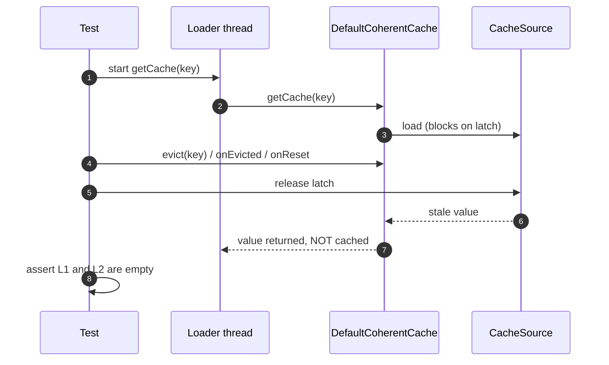

# 测试概览

CoCache 用 `cocache-test` 中的共享规格（技术兼容性套件，TCK）验证每一个实现。新的存储、缓存或事件通道都要通过与内置实现相同的契约测试。

## 规格层次

```mermaid
graph TB
    subgraph tck ["cocache-test (TCK)"]
        direction TB
        StoreSpec["CacheStoreSpec<br>store contract"]
        CSCSpec["ClientSideCacheSpec<br>+ clear / size"]
        DCSpec["DistributedCacheSpec"]
        CacheSpec["CacheSpec<br>Cache semantics"]
        CoherentSpec["DefaultCoherentCacheSpec<br>coherence invariants"]
        MISpec["MultipleInstanceSyncSpec<br>cross-instance sync"]
        EBSpec["CacheEvictedEventBusSpec<br>channel contract"]
    end

    subgraph core ["cocache-core tests"]
        Caffeine["CaffeineClientSideCacheTest"]
        Map["MapClientSideCacheTest"]
        InMem["InMemoryDistributedCacheTest"]
        Coherent["DefaultCoherentCacheTest"]
        Join["SimpleJoinCacheTest"]
        Local["LocalCacheEvictedEventBusTest"]
    end

    subgraph redis ["cocache-spring-redis tests"]
        RedisDC["RedisDistributedCachingTest"]
        RedisCoherent["RedisDefaultCoherentCacheTest"]
        RedisSync["RedisMultipleInstanceSyncTest"]
        RedisBus["RedisCacheEvictedEventBusTest"]
    end

    StoreSpec --> CSCSpec
    StoreSpec --> DCSpec
    CacheSpec --> CoherentSpec
    CSCSpec --> Caffeine
    CSCSpec --> Map
    DCSpec --> InMem
    DCSpec --> RedisDC
    CoherentSpec --> Coherent
    CoherentSpec --> RedisCoherent
    CacheSpec --> Join
    MISpec --> RedisSync
    EBSpec --> Local
    EBSpec --> RedisBus

    style StoreSpec fill:#2d333b,stroke:#6d5dfc,color:#e6edf3
    style CSCSpec fill:#2d333b,stroke:#6d5dfc,color:#e6edf3
    style DCSpec fill:#2d333b,stroke:#6d5dfc,color:#e6edf3
    style CacheSpec fill:#2d333b,stroke:#6d5dfc,color:#e6edf3
    style CoherentSpec fill:#2d333b,stroke:#6d5dfc,color:#e6edf3
    style MISpec fill:#2d333b,stroke:#6d5dfc,color:#e6edf3
    style EBSpec fill:#2d333b,stroke:#6d5dfc,color:#e6edf3
    style Caffeine fill:#2d333b,stroke:#6d5dfc,color:#e6edf3
    style Map fill:#2d333b,stroke:#6d5dfc,color:#e6edf3
    style InMem fill:#2d333b,stroke:#6d5dfc,color:#e6edf3
    style Coherent fill:#2d333b,stroke:#6d5dfc,color:#e6edf3
    style Join fill:#2d333b,stroke:#6d5dfc,color:#e6edf3
    style Local fill:#2d333b,stroke:#6d5dfc,color:#e6edf3
    style RedisDC fill:#2d333b,stroke:#6d5dfc,color:#e6edf3
    style RedisCoherent fill:#2d333b,stroke:#6d5dfc,color:#e6edf3
    style RedisSync fill:#2d333b,stroke:#6d5dfc,color:#e6edf3
    style RedisBus fill:#2d333b,stroke:#6d5dfc,color:#e6edf3
    style tck fill:#161b22,stroke:#8b949e,color:#e6edf3
    style core fill:#161b22,stroke:#8b949e,color:#e6edf3
    style redis fill:#161b22,stroke:#8b949e,color:#e6edf3
```

## 规格

| 规格 | 验证内容 | 源码 |
|------|----------|------|
| `CacheStoreSpec` | 不存在的 key → `null`；永久 / `ttlAt` 往返；写入已过期即淘汰；负缓存往返；淘汰 | [CacheStoreSpec.kt](https://github.com/Ahoo-Wang/CoCache/blob/main/cocache-test/src/main/kotlin/me/ahoo/cache/test/CacheStoreSpec.kt) |
| `ClientSideCacheSpec` | 额外验证 `clear()`、`size` | [ClientSideCacheSpec.kt](https://github.com/Ahoo-Wang/CoCache/blob/main/cocache-test/src/main/kotlin/me/ahoo/cache/test/ClientSideCacheSpec.kt) |
| `DistributedCacheSpec` | L1 的存储契约 | [DistributedCacheSpec.kt](https://github.com/Ahoo-Wang/CoCache/blob/main/cocache-test/src/main/kotlin/me/ahoo/cache/test/DistributedCacheSpec.kt) |
| `CacheSpec` | `get`/`set`/`getTtlAt`/`evict`，以及通过 `setCache` 写入负缓存 | [CacheSpec.kt](https://github.com/Ahoo-Wang/CoCache/blob/main/cocache-test/src/main/kotlin/me/ahoo/cache/test/CacheSpec.kt) |
| `DefaultCoherentCacheSpec` | 读穿透、`missingTtl`、L1 → L2 填充、事件处理、`onReset`、并发下只回源一次、原始异常传播、递归加载快速失败，以及所有在途失效竞态 | [DefaultCoherentCacheSpec.kt](https://github.com/Ahoo-Wang/CoCache/blob/main/cocache-test/src/main/kotlin/me/ahoo/cache/test/DefaultCoherentCacheSpec.kt) |
| `MultipleInstanceSyncSpec` | 共享 L1 与通道的两个实例在 set / evict 后最终一致 | [MultipleInstanceSyncSpec.kt](https://github.com/Ahoo-Wang/CoCache/blob/main/cocache-test/src/main/kotlin/me/ahoo/cache/test/MultipleInstanceSyncSpec.kt) |
| `CacheEvictedEventBusSpec` | `register` 触发 `onReset`；按缓存名路由发布；注销 | [CacheEvictedEventBusSpec.kt](https://github.com/Ahoo-Wang/CoCache/blob/main/cocache-test/src/main/kotlin/me/ahoo/cache/test/consistency/CacheEvictedEventBusSpec.kt) |

## 竞态测试

5.0 修复的每个一致性缺陷都在 `DefaultCoherentCacheSpec` 中有复现用例：

| 测试 | 复现的问题 |
|------|------------|
| `local evict during in-flight load discards stale write-back` | 4.x：本地 `evict` 无法阻止并发回源把旧值写回 |
| `local set during in-flight load keeps the newer value` | 并发回源不能覆盖显式 `set` |
| `remote eviction during in-flight load discards ...` | 回源期间到达的远端事件生效 |
| `reset during in-flight load discards stale write-back` | 通道重置使在途回源失效 |
| `remote eviction during distributed read discards client side fill` | L1 → L2 填充同样受保护 |
| `CodecExecutorSpec.absentKeyIsMiss`（Redis） | 4.x：读取期间被删除的 key 被解码为负缓存 |

```mermaid
sequenceDiagram
autonumber
    participant Test
    participant Loader as Loader thread
    participant Cache as DefaultCoherentCache
    participant Src as CacheSource

    Test->>Loader: start getCache(key)
    Loader->>Cache: getCache(key)
    Cache->>Src: load (blocks on latch)
    Test->>Cache: evict(key) / onEvicted / onReset
    Test->>Src: release latch
    Src-->>Cache: stale value
    Cache-->>Loader: value returned, NOT cached
    Test->>Test: assert L1 and L2 are empty
```

约定：

- 用 latch 编排交错，不用 sleep 制造时序。
- 等待 `finished` latch，使后台线程异常退出时测试失败，而不是空洞地通过。
- 对跨实例的最终效果，用带超时的轮询断言。

## 测试工具

| 工具 | 用途 |
|------|------|
| JUnit 5 | 测试框架；并发级别用 `@ParameterizedTest` |
| mockk | Mock |
| fluent-assert | `import me.ahoo.test.asserts.assert` 后使用 `.assert()`（禁止使用 AssertJ `assertThat`） |

## 相关页面

- [单元测试](./unit-testing.md)
- [集成测试](./integration-testing.md)
- [性能模式](./performance-patterns.md)
