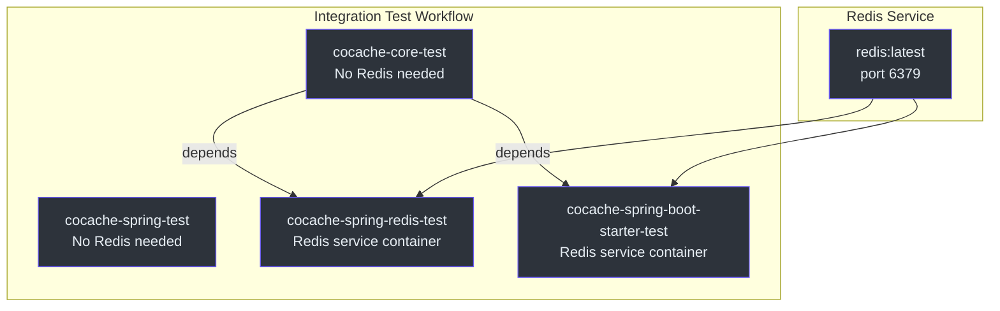
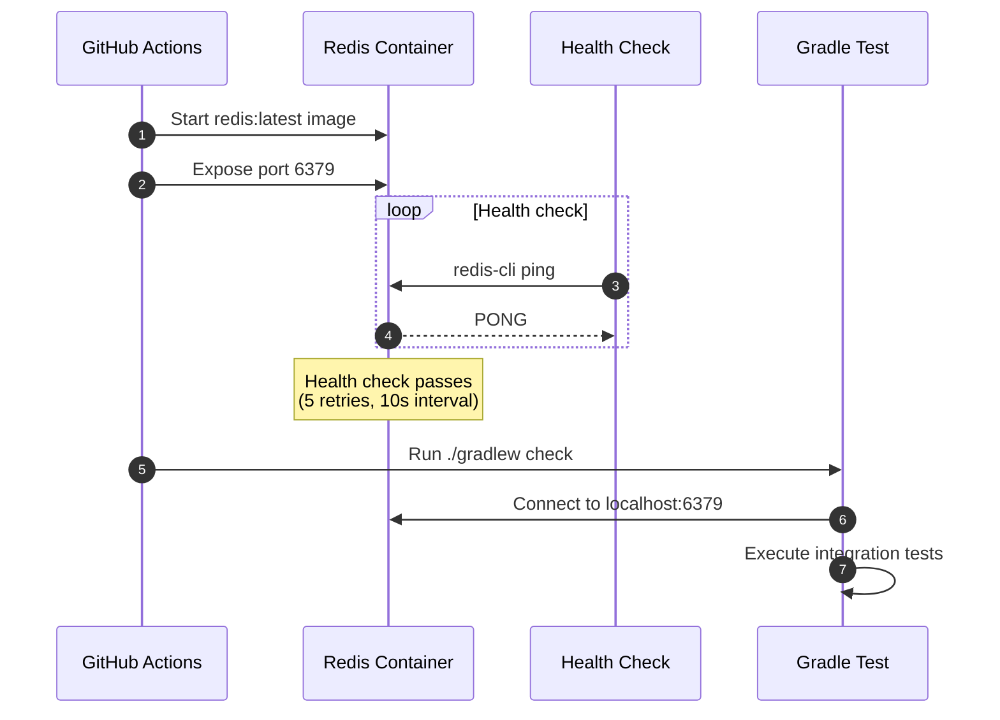
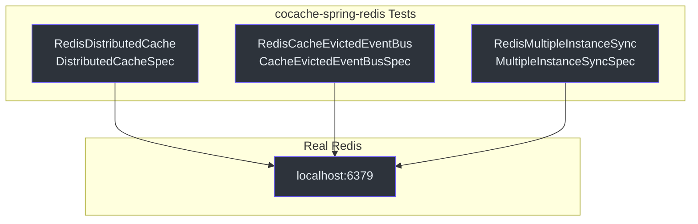
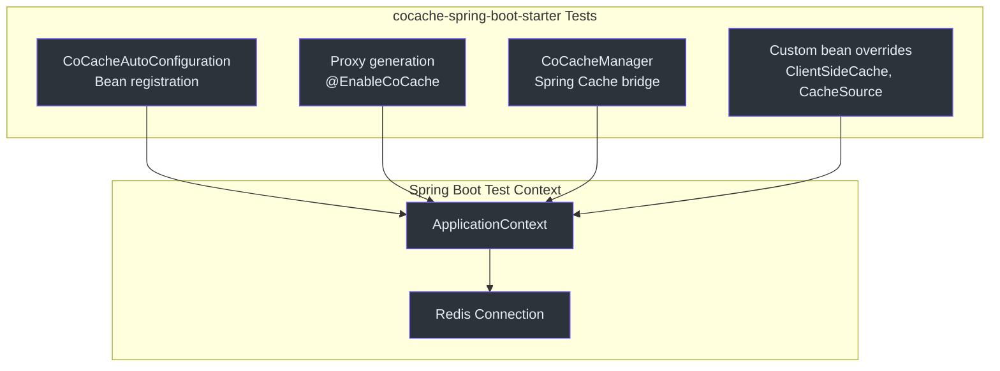
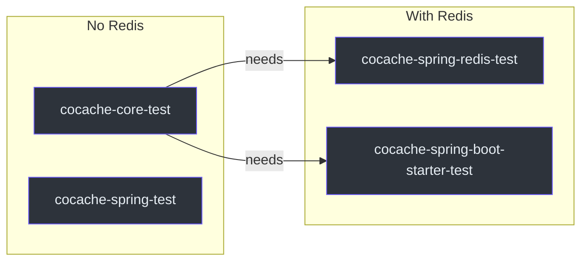

# 集成测试

CoCache 在真实的 Redis 实例上运行集成测试，验证完整的缓存栈。这些测试覆盖分布式缓存操作、发布/订阅事件传播以及 Spring Boot 自动配置的端到端流程。

## CI 流水线架构

集成测试在 GitHub Actions 中运行，单元测试和集成测试分为不同的 Job。依赖 Redis 的模块使用 Redis 服务容器。



## GitHub Actions 工作流

集成测试工作流定义在 `.github/workflows/integration-test.yml` 中，每个 Pull Request 都会触发。

### Job 1: cocache-core-test

运行核心单元测试，不需要 Redis：

```yaml
cocache-core-test:
  name: CoCache Core Test
  runs-on: ubuntu-latest
  steps:
    - uses: actions/checkout@master
    - uses: actions/setup-java@v5
      with:
        java-version: '17'
        distribution: 'temurin'
    - run: ./gradlew cocache-core:clean cocache-core:check
```

### Job 2: cocache-spring-test

运行 Spring 集成测试，不需要 Redis：

```yaml
cocache-spring-test:
  name: CoCache Spring Test
  runs-on: ubuntu-latest
  steps:
    - uses: actions/checkout@master
    - uses: actions/setup-java@v5
      with:
        java-version: '17'
        distribution: 'temurin'
    - run: ./gradlew cocache-spring:clean cocache-spring:check
```

### Job 3: cocache-spring-redis-test

使用服务容器运行 Redis 集成测试：

```yaml
cocache-spring-redis-test:
  name: CoCache Spring Redis Test
  needs: [cocache-core-test]
  runs-on: ubuntu-latest
  services:
    redis:
      image: redis
      options: >-
        --health-cmd "redis-cli ping"
        --health-interval 10s
        --health-timeout 5s
        --health-retries 5
      ports:
        - 6379:6379
  steps:
    - uses: actions/checkout@master
    - uses: actions/setup-java@v5
      with:
        java-version: '17'
        distribution: 'temurin'
    - run: ./gradlew cocache-spring-redis:clean cocache-spring-redis:check
```

### Job 4: cocache-spring-boot-starter-test

运行 Spring Boot 自动配置集成测试：

```yaml
cocache-spring-boot-starter-test:
  name: CoCache Spring Boot Starter Test
  needs: [cocache-core-test]
  runs-on: ubuntu-latest
  services:
    redis:
      image: redis
      options: >-
        --health-cmd "redis-cli ping"
        --health-interval 10s
        --health-timeout 5s
        --health-retries 5
      ports:
        - 6379:6379
  steps:
    - uses: actions/checkout@master
    - uses: actions/setup-java@v5
      with:
        java-version: '17'
        distribution: 'temurin'
    - run: ./gradlew cocache-spring-boot-starter:clean cocache-spring-boot-starter:check
```

源码参考：[.github/workflows/integration-test.yml](https://github.com/Ahoo-Wang/CoCache/blob/main/.github/workflows/integration-test.yml)

## Redis 服务容器

Redis 服务容器配置包含健康检查，确保在测试运行前 Redis 已就绪：



健康检查关键参数：

| 参数 | 值 | 用途 |
|------|-----|------|
| `--health-cmd` | `redis-cli ping` | 验证 Redis 是否响应的命令 |
| `--health-interval` | `10s` | 健康检查间隔时间 |
| `--health-timeout` | `5s` | 单次健康检查的最大等待时间 |
| `--health-retries` | `5` | 连续失败多少次后标记为不健康 |

## 集成测试模块

### cocache-spring-redis

测试 Redis 分布式缓存的实现，包括：

- `RedisDistributedCache` 操作（get、set、evict、TTL）
- `RedisCacheEvictedEventBus` 发布/订阅功能
- 通过 Redis 发布/订阅实现多实例同步



### cocache-spring-boot-starter

测试自动配置的端到端流程：

- `CoCacheAutoConfiguration` Bean 创建
- `@EnableCoCache` 代理生成
- 通过 `CoCacheManager` 实现 Spring Cache 集成
- 自定义 Bean 覆盖行为
- CosID 集成（当可用时）



## 本地运行集成测试

### 前提条件

需要一个运行中的 Redis 实例。最简单的方式：

```bash
# 使用 Docker
docker run -d --name cocache-redis -p 6379:6379 redis:latest

# 验证
redis-cli ping
# 预期输出：PONG
```

### 运行集成测试

```bash
# Redis 集成测试
./gradlew :cocache-spring-redis:check

# Spring Boot Starter 集成测试
./gradlew :cocache-spring-boot-starter:check

# 所有集成测试
./gradlew :cocache-spring-redis:check :cocache-spring-boot-starter:check
```

### 清理

```bash
docker stop cocache-redis && docker rm cocache-redis
```

## CI Job 依赖图



注意 `cocache-spring-test` 独立运行（无 Redis 依赖，也没有下游依赖）。`cocache-spring-redis-test` 和 `cocache-spring-boot-starter-test` 都依赖 `cocache-core-test` 先通过。

## 示例应用集成

`cocache-example` 模块演示了一个使用 CoCache 的完整 Spring Boot 应用：

```kotlin
@EnableCoCache(caches = [
    UserCache::class,
    UserExtendInfoCache::class,
    UserExtendInfoJoinCache::class
])
@EnableCaching
@SpringBootApplication
class AppServer
```

源码参考：[cocache-example/.../AppServer.kt](https://github.com/Ahoo-Wang/CoCache/blob/main/cocache-example/src/main/kotlin/me/ahoo/cache/example/AppServer.kt)

示例包含以下组件：

| 组件 | 描述 | 源码 |
|------|------|------|
| `UserCache` | 使用 `@CoCache` + `@GuavaCache` 的基础缓存 | [UserCache.kt](https://github.com/Ahoo-Wang/CoCache/blob/main/cocache-example/src/main/kotlin/me/ahoo/cache/example/cache/UserCache.kt) |
| `UserExtendInfoCache` | 扩展用户信息缓存 | [UserExtendInfoCache.kt](https://github.com/Ahoo-Wang/CoCache/blob/main/cocache-example/src/main/kotlin/me/ahoo/cache/example/cache/UserExtendInfoCache.kt) |
| `UserExtendInfoJoinCache` | 组合两个缓存的 JoinCache | [UserExtendInfoJoinCache.kt](https://github.com/Ahoo-Wang/CoCache/blob/main/cocache-example/src/main/kotlin/me/ahoo/cache/example/cache/UserExtendInfoJoinCache.kt) |
| `TestController` | 使用缓存的 REST API | [TestController.kt](https://github.com/Ahoo-Wang/CoCache/blob/main/cocache-example/src/main/kotlin/me/ahoo/cache/example/controller/TestController.kt) |
| `UserCacheConfiguration` | 自定义 ClientSideCache 和 CacheSource Bean | [UserCacheConfiguration.kt](https://github.com/Ahoo-Wang/CoCache/blob/main/cocache-example/src/main/kotlin/me/ahoo/cache/example/config/UserCacheConfiguration.kt) |
| `ClassDefinedCacheConfiguration` | 编程式创建 CoherentCache | [ClassDefinedCacheConfiguration.kt](https://github.com/Ahoo-Wang/CoCache/blob/main/cocache-example/src/main/kotlin/me/ahoo/cache/example/config/ClassDefinedCacheConfiguration.kt) |

## 相关页面

- [测试概览](./index.md) -- TCK 测试规范与架构
- [单元测试](./unit-testing.md) -- 使用 TCK 基类编写单元测试
- [性能模式](./performance-patterns.md) -- 并发与缓存保护模式
- [快速入门](../guide/quick-start.md) -- 搭建 CoCache 应用
