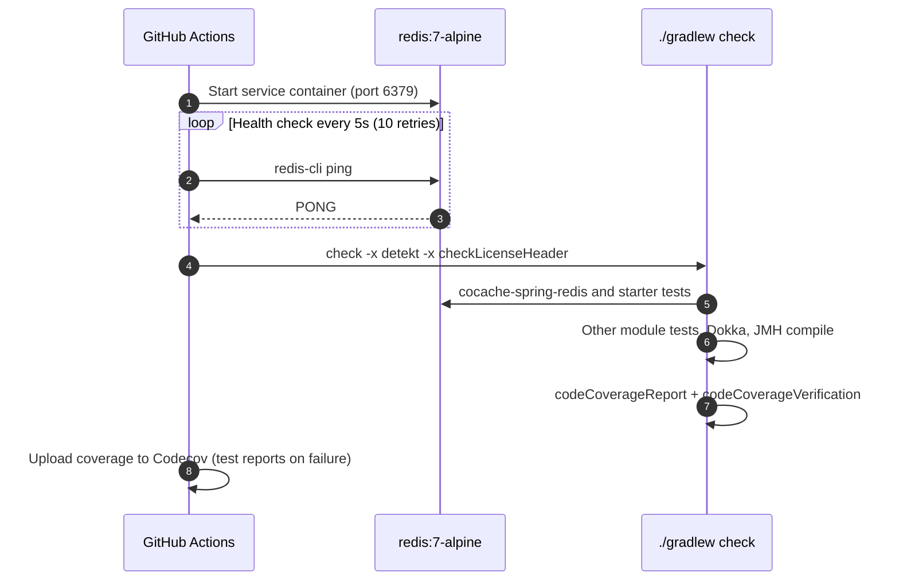
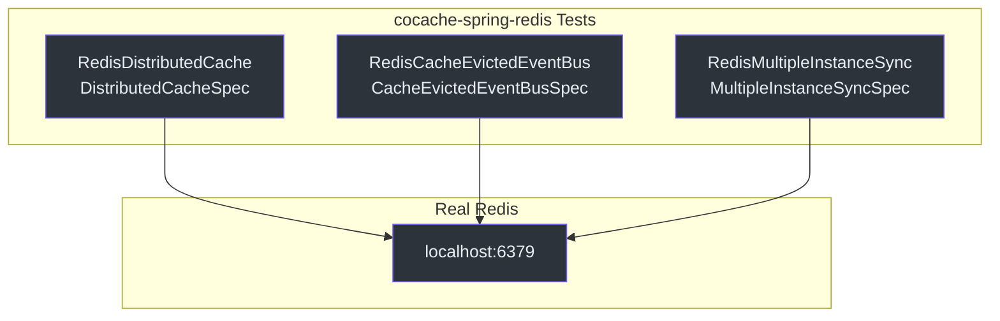
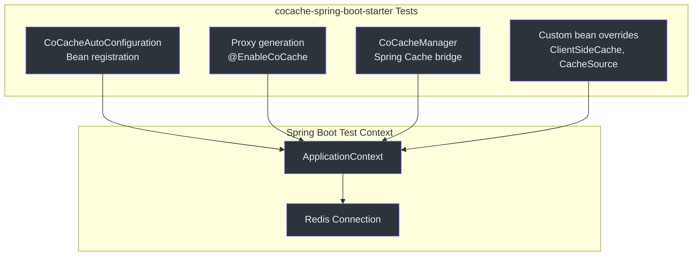

# 集成测试

CoCache 在真实的 Redis 实例上运行集成测试，验证完整的缓存栈。这些测试覆盖分布式缓存操作、发布/订阅事件传播以及 Spring Boot 自动配置的端到端流程。

## CI 流水线

集成测试运行在 [`ci.yml`](https://github.com/Ahoo-Wang/CoCache/blob/main/.github/workflows/ci.yml) 的 **Test & Coverage** 作业中，每个 Pull Request 和每次 push 到 `main` 都会触发。一次 `./gradlew check` 在同一个 Redis 服务容器下运行全部模块，单元测试与集成测试共用同一份聚合 JaCoCo 报告和覆盖率门禁，不会重复运行。


```mermaid
sequenceDiagram
autonumber
    participant GH as GitHub Actions
    participant Redis as redis:7-alpine
    participant Gradle as ./gradlew check

    GH->>Redis: Start service container (port 6379)
    loop Health check every 5s (10 retries)
        GH->>Redis: redis-cli ping
        Redis-->>GH: PONG
    end
    GH->>Gradle: check -x detekt -x checkLicenseHeader
    Gradle->>Redis: cocache-spring-redis and starter tests
    Gradle->>Gradle: Other module tests, Dokka, JMH compile
    Gradle->>Gradle: codeCoverageReport + codeCoverageVerification
    GH->>GH: Upload coverage to Codecov (test reports on failure)
```

```yaml
services:
  redis:
    image: redis:7-alpine
    options: >-
      --health-cmd "redis-cli ping"
      --health-interval 5s
      --health-timeout 5s
      --health-retries 10
    ports:
      - 6379:6379
```

Redis 测试使用 `RedisTestSupport`：其监听容器运行在 `SyncTaskExecutor` 上，订阅重置在 `register()` 内完成，测试结果确定。

## 集成测试模块

### cocache-spring-redis

测试 Redis 分布式缓存的实现，包括：

- `RedisDistributedCache` 操作（get、set、evict、TTL）
- `RedisCacheEvictedEventBus` 发布/订阅功能
- 通过 Redis 发布/订阅实现多实例同步


```mermaid
graph TB
    subgraph sg_87 ["cocache-spring-redis Tests"]
        direction TB
        RedisDC["RedisDistributedCache<br>DistributedCacheSpec"]
        RedisEB["RedisCacheEvictedEventBus<br>CacheEvictedEventBusSpec"]
        RedisSync["RedisMultipleInstanceSync<br>MultipleInstanceSyncSpec"]
    end

    subgraph sg_88 ["Real Redis"]
        direction TB
        Redis["localhost:6379"]
    end

    RedisDC --> Redis
    RedisEB --> Redis
    RedisSync --> Redis

    style RedisDC fill:#2d333b,stroke:#6d5dfc,color:#e6edf3
    style RedisEB fill:#2d333b,stroke:#6d5dfc,color:#e6edf3
    style RedisSync fill:#2d333b,stroke:#6d5dfc,color:#e6edf3
    style Redis fill:#2d333b,stroke:#6d5dfc,color:#e6edf3
```

### cocache-spring-boot-starter

测试自动配置的端到端流程：

- `CoCacheAutoConfiguration` Bean 创建
- `@EnableCoCache` 代理生成
- 通过 `CoCacheManager` 实现 Spring Cache 集成
- 自定义 Bean 覆盖行为
- CosID 集成（当可用时）


```mermaid
graph TB
    subgraph sg_89 ["cocache-spring-boot-starter Tests"]
        direction TB
        AutoConf["CoCacheAutoConfiguration<br>Bean registration"]
        ProxyTest["Proxy generation<br>@EnableCoCache"]
        CacheMgr["CoCacheManager<br>Spring Cache bridge"]
        BeanOverride["Custom bean overrides<br>ClientSideCache, CacheSource"]
    end

    subgraph sg_90 ["Spring Boot Test Context"]
        direction TB
        Context["ApplicationContext"]
        Redis["Redis Connection"]
    end

    AutoConf --> Context
    ProxyTest --> Context
    CacheMgr --> Context
    BeanOverride --> Context
    Context --> Redis

    style AutoConf fill:#2d333b,stroke:#6d5dfc,color:#e6edf3
    style ProxyTest fill:#2d333b,stroke:#6d5dfc,color:#e6edf3
    style CacheMgr fill:#2d333b,stroke:#6d5dfc,color:#e6edf3
    style BeanOverride fill:#2d333b,stroke:#6d5dfc,color:#e6edf3
    style Context fill:#2d333b,stroke:#6d5dfc,color:#e6edf3
    style Redis fill:#2d333b,stroke:#6d5dfc,color:#e6edf3
```

## 本地运行集成测试

### 前提条件

需要一个运行中的 Redis 实例。最简单的方式：

```bash
# 使用 Docker
docker run -d --name cocache-redis -p 6379:6379 redis:7-alpine

# 验证
redis-cli ping
# 预期输出：PONG
```

### 运行集成测试

```bash
# Redis 集成测试
./gradlew :cocache-spring-redis:check

# Spring Boot Starter 集成测试
./gradlew :cocache-spring-boot-starter:check

# 所有集成测试
./gradlew :cocache-spring-redis:check :cocache-spring-boot-starter:check
```

### 清理

```bash
docker stop cocache-redis && docker rm cocache-redis
```

## 示例应用集成

`cocache-example` 模块演示了一个使用 CoCache 的完整 Spring Boot 应用：

```kotlin
@EnableCoCache(caches = [
    UserCache::class,
    UserExtendInfoCache::class,
    UserExtendInfoJoinCache::class
])
@EnableCaching
@SpringBootApplication
class AppServer
```

源码参考：[cocache-example/.../AppServer.kt](https://github.com/Ahoo-Wang/CoCache/blob/main/cocache-example/src/main/kotlin/me/ahoo/cache/example/AppServer.kt)

示例包含以下组件：

| 组件 | 描述 | 源码 |
|------|------|------|
| `UserCache` | 使用 `@CoCache` + `@CaffeineCache` 的基础缓存 | [UserCache.kt](https://github.com/Ahoo-Wang/CoCache/blob/main/cocache-example/src/main/kotlin/me/ahoo/cache/example/cache/UserCache.kt) |
| `UserExtendInfoCache` | 扩展用户信息缓存 | [UserExtendInfoCache.kt](https://github.com/Ahoo-Wang/CoCache/blob/main/cocache-example/src/main/kotlin/me/ahoo/cache/example/cache/UserExtendInfoCache.kt) |
| `UserExtendInfoJoinCache` | 组合两个缓存的 JoinCache | [UserExtendInfoJoinCache.kt](https://github.com/Ahoo-Wang/CoCache/blob/main/cocache-example/src/main/kotlin/me/ahoo/cache/example/cache/UserExtendInfoJoinCache.kt) |
| `TestController` | 使用缓存的 REST API | [TestController.kt](https://github.com/Ahoo-Wang/CoCache/blob/main/cocache-example/src/main/kotlin/me/ahoo/cache/example/controller/TestController.kt) |
| `UserCacheConfiguration` | 自定义 ClientSideCache 和 CacheSource Bean | [UserCacheConfiguration.kt](https://github.com/Ahoo-Wang/CoCache/blob/main/cocache-example/src/main/kotlin/me/ahoo/cache/example/config/UserCacheConfiguration.kt) |
| `ClassDefinedCacheConfiguration` | 编程式创建 CoherentCache | [ClassDefinedCacheConfiguration.kt](https://github.com/Ahoo-Wang/CoCache/blob/main/cocache-example/src/main/kotlin/me/ahoo/cache/example/config/ClassDefinedCacheConfiguration.kt) |

## 相关页面

- [测试概览](./index.md) -- TCK 测试规范与架构
- [单元测试](./unit-testing.md) -- 使用 TCK 基类编写单元测试
- [性能模式](./performance-patterns.md) -- 并发与缓存保护模式
- [快速入门](../guide/quick-start.md) -- 搭建 CoCache 应用
