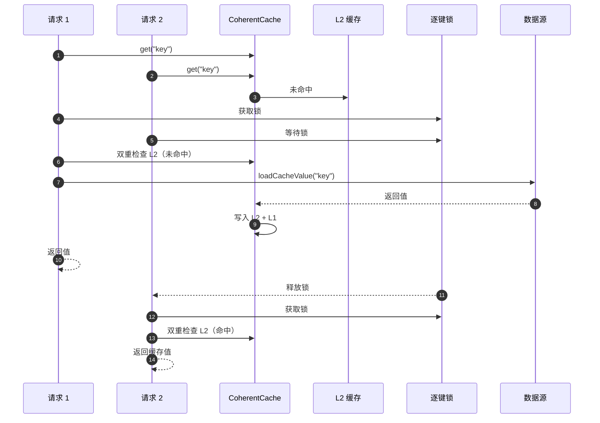

# 性能模式

CoCache 内置多种性能优化模式，防止常见的缓存问题。本页面介绍这些模式的设计原理和测试验证。

## 缓存击穿防护（Cache Breakdown Prevention）

### 问题

当缓存未命中时，大量并发请求同时查询数据源，造成数据源压力激增（惊群效应）。

### 解决方案

`DefaultCoherentCache` 使用逐键锁 + 双重检查模式：



### 关键实现

```kotlin
// DefaultCoherentCache
private val keyLocks = ConcurrentHashMap<String, Any>()

private fun getLock(cacheKey: String): Any {
    return keyLocks.computeIfAbsent(cacheKey) { Any() }
}

override fun getCache(key: K): CacheValue<V>? {
    val cacheKey = keyConverter.toStringKey(key)
    // 第一次检查（无锁）
    getL2Cache(cacheKey)?.let { return it }

    // 获取逐键锁
    val lock = getLock(cacheKey)
    synchronized(lock) {
        try {
            // 第二次检查（有锁）- 双重检查
            getL2Cache(cacheKey)?.let { return it }

            // 从数据源加载
            cacheSource.loadCacheValue(key)?.let {
                setCache(cacheKey, it)
                return it
            }
        } finally {
            releaseLock(cacheKey)
        }
    }
}
```

### 测试验证

`DefaultCoherentCacheSpec` 包含参数化并发测试：

```kotlin
@ParameterizedTest
@ValueSource(ints = [10, 100, 1000])
fun `should prevent cache breakdown under high concurrency`(threadCount: Int) {
    // 使用 CountDownLatch 同时释放所有线程
    // 验证 CacheSource 只被调用一次
    callCount.get().assert().isOne()
    // 验证所有线程获取到相同值
    results.all { it == value }.assert().isTrue()
}
```

## TTL 抖动（Cache Avalanche Prevention）

### 问题

大量缓存条目同时过期，导致瞬间大量请求打到数据源。

### 解决方案

通过 `ttlAmplitude` 参数为 TTL 添加随机偏移：

```kotlin
// DefaultCacheValue.ttlAt()
companion object {
    fun <V> ttlAt(value: V, ttl: Long, ttlAmplitude: Long = 0): CacheValue<V> {
        val computedTtl = ComputedTtlAt.at(ttl, ttlAmplitude)
        return DefaultCacheValue(value, computedTtl)
    }
}

// ComputedTtlAt
object ComputedTtlAt {
    fun at(ttl: Long, ttlAmplitude: Long = 0): Long {
        val currentTime = CacheSecondClock.INSTANCE.currentTime()
        val amplitude = if (ttlAmplitude > 0) {
            Random.nextLong(-ttlAmplitude, ttlAmplitude + 1)
        } else {
            0
        }
        return currentTime + ttl + amplitude
    }
}
```

### 效果

- `ttl = 120`, `ttlAmplitude = 10`
- 实际 TTL 范围：110s ~ 130s
- 不同缓存条目在不同时间点过期，分散数据源压力

## 缓存穿透防护（Cache Penetration Prevention）

### 问题

查询不存在的键，每次请求都穿透到数据源。

### 解决方案 - MissingGuard

缓存特殊标记值（`_nil_`），表示该键在数据源中不存在：

```kotlin
interface MissingGuard {
    companion object {
        const val STRING_VALUE = "_nil_"
    }
}

// DefaultCoherentCache 中的处理
// 数据源返回 null 时
setCache(cacheKey, DefaultCacheValue.missingGuard(ttl, ttlAmplitude))
return null

// 读取时判断
if (cacheValue.isMissingGuard || cacheValue.isExpired) {
    return null
}
```

### 解决方案 - KeyFilter（布隆过滤器）

`BloomKeyFilter` 基于 Guava 布隆过滤器，在查询 L1 之前预判键是否存在：

```kotlin
class BloomKeyFilter(private val bloomFilter: BloomFilter<String>) : KeyFilter {
    override fun notExist(key: String): Boolean {
        return !bloomFilter.mightContain(key)
    }
}
```

布隆过滤器特性：
- 如果判定"不存在"，则一定不存在
- 如果判定"可能存在"，则可能不存在（有误判率）
- 不会漏判实际存在的键

## 性能对比

| 模式 | 无优化 | CoCache 优化 |
|------|--------|-------------|
| 缓存击穿 | 所有并发请求穿透到数据源 | 仅一个请求穿透，其余等待 |
| 缓存雪崩 | 大量条目同时过期 | TTL 抖动分散过期时间 |
| 缓存穿透 | 每次查询不存在的键都穿透 | MissingGuard + KeyFilter |

## 相关页面

- [缓存层级](../architecture/cache-layers.md) - L0/L1/L2 架构
- [测试概览](./index.md) - 测试策略
- [单元测试](./unit-testing.md) - 测试编写指南
- [核心接口](../api/core-interfaces.md) - KeyFilter、MissingGuard 等接口
