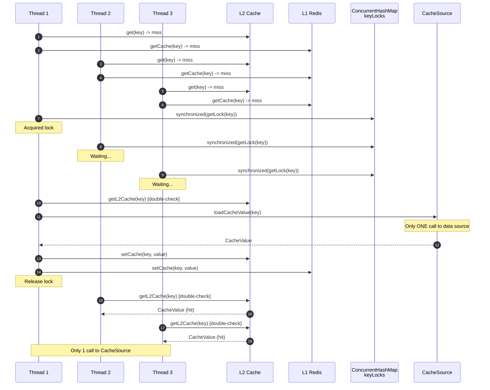
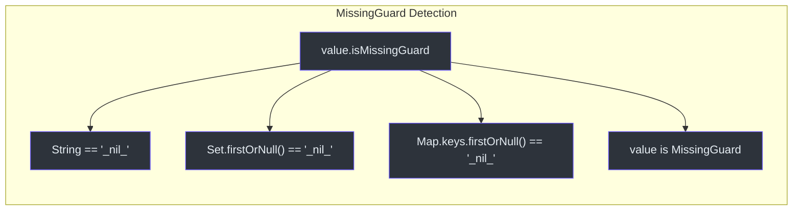
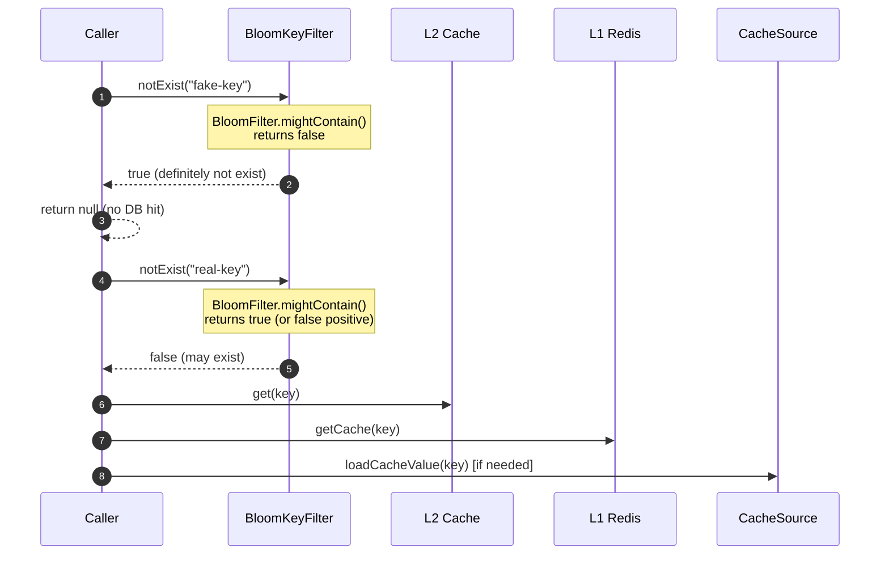
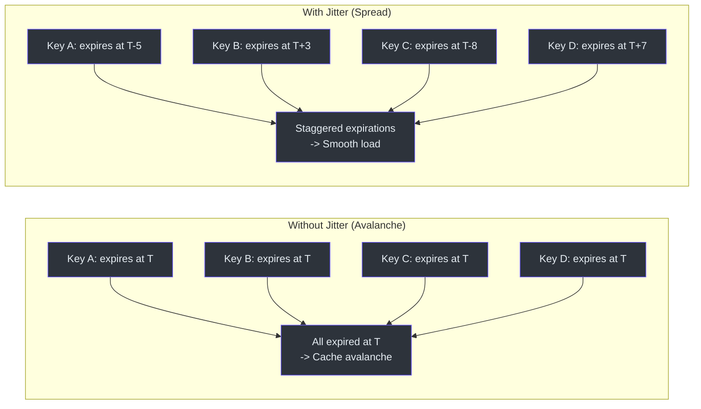
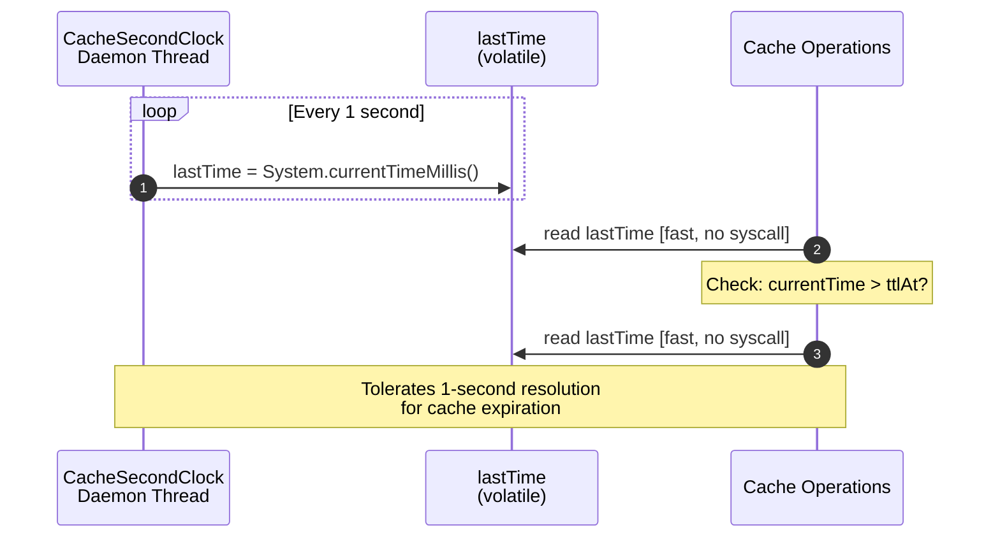
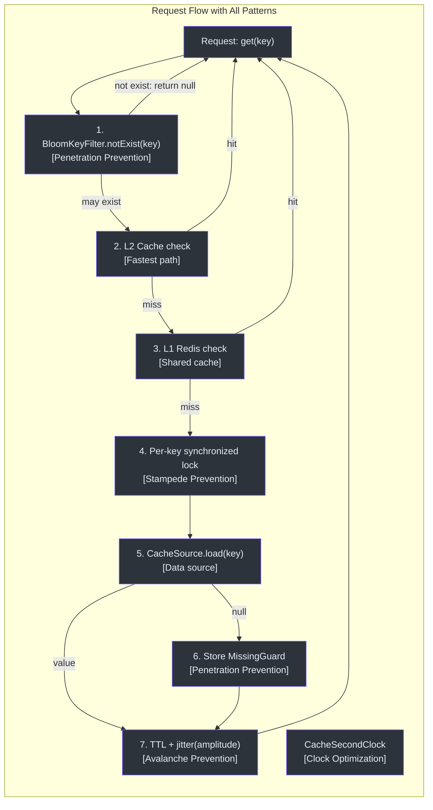

# 性能模式

CoCache 实现了多种关键性能模式来防御常见的分布式缓存问题：缓存击穿（惊群效应）、缓存穿透、缓存雪崩以及过高的时钟系统调用开销。

## 缓存击穿防护（逐键锁定）

缓存击穿发生在大量并发请求同时命中缓存未命中时，所有请求都会触发对数据源的高开销调用。CoCache 通过**细粒度的逐键同步锁**来防止此问题。

### 工作原理

当缓存未命中且键通过 `KeyFilter` 检查时，CoCache 会获取该缓存键的专属锁。只有第一个获取到锁的线程会调用数据源；其他所有请求同一键的线程会阻塞等待，然后从已填充的缓存中读取。



### 实现

逐键锁使用 `ConcurrentHashMap<String, Any>`，其中每个键都有各自的锁对象：

```kotlin
private val keyLocks = ConcurrentHashMap<String, Any>()

private fun getLock(cacheKey: String): Any {
    return keyLocks.computeIfAbsent(cacheKey) {
        Any()
    }
}

private fun releaseLock(cacheKey: String) {
    keyLocks.remove(cacheKey)
}
```

源码参考：[DefaultCoherentCache.kt:47](https://github.com/Ahoo-Wang/CoCache/blob/main/cocache-core/src/main/kotlin/me/ahoo/cache/consistency/DefaultCoherentCache.kt#L47), [DefaultCoherentCache.kt:78-86](https://github.com/Ahoo-Wang/CoCache/blob/main/cocache-core/src/main/kotlin/me/ahoo/cache/consistency/DefaultCoherentCache.kt#L78-L86)

`getCache` 方法在同步块内执行**双重检查**模式：

```kotlin
override fun getCache(key: K): CacheValue<V>? {
    val cacheKey = keyConverter.toStringKey(key)
    // 第一次检查（无锁）
    getL2Cache(cacheKey)?.let { return it }

    val lock = getLock(cacheKey)
    synchronized(lock) {
        try {
            // 第二次检查（有锁）- 其他线程可能已填充缓存
            getL2Cache(cacheKey)?.let { return it }

            // 仅在缓存仍缺失时：调用 CacheSource
            cacheSource.loadCacheValue(key)?.let {
                setCache(cacheKey, it)
                cacheEvictedEventBus.publish(CacheEvictedEvent(cacheName, cacheKey, clientId))
                return it
            }

            // 缓存缺失结果（null 守卫）
            setCache(cacheKey, DefaultCacheValue.missingGuard(ttl, ttlAmplitude))
            return null
        } finally {
            releaseLock(cacheKey)
        }
    }
}
```

源码参考：[DefaultCoherentCache.kt:88-135](https://github.com/Ahoo-Wang/CoCache/blob/main/cocache-core/src/main/kotlin/me/ahoo/cache/consistency/DefaultCoherentCache.kt#L88-L135)

### 并发验证

TCK 包含参数化并发测试，验证锁机制的正确性：

| 线程数 | 期望的 CacheSource 调用次数 | 结果 |
|--------|---------------------------|------|
| 10 | 1 | 通过 |
| 100 | 1 | 通过 |
| 1000 | 1 | 通过 |

```kotlin
@ParameterizedTest
@ValueSource(ints = [10, 100, 1000])
fun `should prevent cache breakdown under high concurrency`(threadCount: Int) {
    // ... 使用 CountDownLatch 和 AtomicInteger 进行 setup ...
    results.all { it == value }.assert().isTrue()
    callCount.get().assert().isOne() // CacheSource 只被调用一次
}
```

源码参考：[DefaultCoherentCacheSpec.kt:138-179](https://github.com/Ahoo-Wang/CoCache/blob/main/cocache-test/src/main/kotlin/me/ahoo/cache/test/DefaultCoherentCacheSpec.kt#L138-L179)

## 缓存穿透防护

缓存穿透发生在请求不存在的键时，这些请求完全绕过缓存，每次都命中数据源。CoCache 在两个层面解决此问题。

### MissingGuard（缓存空值）

当 `CacheSource` 返回 `null`（键在数据库中不存在）时，CoCache 存储一个 **MissingGuard 哨兵值**，而不是将缓存留空：

```kotlin
// 在 DefaultCoherentCache.getCache() 中：
setCache(cacheKey, DefaultCacheValue.missingGuard(ttl, ttlAmplitude))
return null
```

源码参考：[DefaultCoherentCache.kt:129](https://github.com/Ahoo-Wang/CoCache/blob/main/cocache-core/src/main/kotlin/me/ahoo/cache/consistency/DefaultCoherentCache.kt#L129)

`MissingGuard` 接口可跨不同类型检测哨兵值：



| 类型 | 哨兵值 | 检测方式 | 源码 |
|------|--------|----------|------|
| `String` | `"_nil_"` | 直接字符串比较 | [MissingGuard.kt:40-42](https://github.com/Ahoo-Wang/CoCache/blob/main/cocache-core/src/main/kotlin/me/ahoo/cache/MissingGuard.kt#L40-L42) |
| `Set<*>` | `{"_nil_"}` | 首元素检查 | [MissingGuard.kt:44-46](https://github.com/Ahoo-Wang/CoCache/blob/main/cocache-core/src/main/kotlin/me/ahoo/cache/MissingGuard.kt#L44-L46) |
| `Map<*, *>` | `{"_nil_": ...}` | 首个键检查 | [MissingGuard.kt:48-50](https://github.com/Ahoo-Wang/CoCache/blob/main/cocache-core/src/main/kotlin/me/ahoo/cache/MissingGuard.kt#L48-L50) |
| Object | 实现 `MissingGuard` 接口 | `is` 类型检查 | [MissingGuard.kt:36](https://github.com/Ahoo-Wang/CoCache/blob/main/cocache-core/src/main/kotlin/me/ahoo/cache/MissingGuard.kt#L36) |

源码参考：[MissingGuard.kt](https://github.com/Ahoo-Wang/CoCache/blob/main/cocache-core/src/main/kotlin/me/ahoo/cache/MissingGuard.kt)

### BloomKeyFilter（预过滤不存在的键）

在高流量场景中，可以使用布隆过滤器作为查询分布式缓存之前的预检。如果键不在布隆过滤器中，可以确定它不存在于数据源中，从而完全跳过昂贵的缓存查询。



`BloomKeyFilter` 封装了 Guava 的 `BloomFilter<String>`：

```kotlin
class BloomKeyFilter(
    private val bloomFilter: BloomFilter<String>
) : KeyFilter {
    override fun notExist(key: String): Boolean {
        return !bloomFilter.mightContain(key)
    }
}
```

源码参考：[BloomKeyFilter.kt](https://github.com/Ahoo-Wang/CoCache/blob/main/cocache-core/src/main/kotlin/me/ahoo/cache/filter/BloomKeyFilter.kt)

`KeyFilter` 在 `getL2Cache` 中查询分布式缓存之前进行检查：

```kotlin
private fun getL2Cache(cacheKey: String): CacheValue<V>? {
    // L2 检查
    clientSideCache.getCache(cacheKey)?.let {
        if (it.isExpired.not()) return it
        else clientSideCache.evict(cacheKey)
    }

    // KeyFilter 检查（布隆过滤器）
    if (keyFilter.notExist(cacheKey)) {
        return DefaultCacheValue.missingGuard(ttl, ttlAmplitude)
    }

    // L1 检查
    distributedCache.getCache(cacheKey)?.let {
        if (it.isExpired.not()) {
            clientSideCache.setCache(cacheKey, it)
            return it
        }
    }
    return null
}
```

源码参考：[DefaultCoherentCache.kt:49-76](https://github.com/Ahoo-Wang/CoCache/blob/main/cocache-core/src/main/kotlin/me/ahoo/cache/consistency/DefaultCoherentCache.kt#L49-L76)

## TTL 抖动（防缓存雪崩）

缓存雪崩发生在大量缓存条目同时过期时，导致请求瞬间涌向数据源。CoCache 通过为 TTL 添加**随机抖动**来防止此问题。

### 机制

```kotlin
fun jitter(ttl: Long, amplitude: Long): Long {
    if (amplitude == 0L) return ttl
    val low = ttl - amplitude
    val high = ttl + amplitude
    return (low..high).random()
}

fun at(ttl: Long, amplitude: Long = 0): Long {
    val jitteredTtl = jitter(ttl, amplitude)
    return CacheSecondClock.INSTANCE.currentTime() + jitteredTtl
}
```

源码参考：[ComputedTtlAt.kt:49-61](https://github.com/Ahoo-Wang/CoCache/blob/main/cocache-core/src/main/kotlin/me/ahoo/cache/ComputedTtlAt.kt#L49-L61)

### 效果可视化



### 配置

TTL 和抖动幅度通过 `@CoCache` 注解配置：

| 参数 | 效果 | 示例 |
|------|------|------|
| `ttl = 120` | 基础 TTL 为 120 秒 | 条目在大约 120 秒后过期 |
| `ttlAmplitude = 10` | +/- 10 秒的抖动 | 实际 TTL：110-130 秒（随机） |
| `ttlAmplitude = 0` | 无抖动 | 所有条目恰好在 120 秒后过期 |

源码参考：[CoCache.kt:35-36](https://github.com/Ahoo-Wang/CoCache/blob/main/cocache-api/src/main/kotlin/me/ahoo/cache/api/annotation/CoCache.kt#L35-L36)

## CacheSecondClock 优化

每个缓存值都需要通过将 `ttlAt` 与当前时间比较来检查是否过期。朴素实现会在每次检查时调用 `System.currentTimeMillis()`，这是一个系统调用，在高吞吐量下可能开销较大。

CoCache 通过 `CacheSecondClock` 解决此问题——一个守护线程每秒更新一次 volatile 的 `lastTime` 字段。所有缓存过期检查读取该 volatile 字段而不是调用系统时钟。



### 实现

```kotlin
enum class CacheSecondClock(private val actual: SecondClock) : SecondClock, Runnable {
    INSTANCE(SystemSecondClock);

    private val secondTimer: Thread
    @Volatile
    private var lastTime: Long = actual.currentTime()

    init {
        secondTimer = startTimer()
    }

    private fun startTimer(): Thread {
        val timer = Thread(this)
        timer.name = "CacheSecondClock"
        timer.isDaemon = true
        timer.start()
        return timer
    }

    override fun currentTime(): Long {
        return lastTime  // 无系统调用，仅 volatile 读取
    }

    override fun run() {
        while (!secondTimer.isInterrupted) {
            lastTime = actual.currentTime()  // 系统调用，每秒一次
            LockSupport.parkNanos(this, ONE_SECOND_PERIOD)
        }
    }

    companion object {
        val ONE_SECOND_PERIOD = Duration.ofSeconds(1).toNanos()
    }
}
```

源码参考：[CacheSecondClock.kt](https://github.com/Ahoo-Wang/CoCache/blob/main/cocache-core/src/main/kotlin/me/ahoo/cache/util/CacheSecondClock.kt)

### 在 ComputedTtlAt 中的使用

`ComputedTtlAt` 中的 `isExpired` 检查使用 `CacheSecondClock` 而非 `System.currentTimeMillis()`：

```kotlin
override val isExpired: Boolean
    get() = if (isForever) {
        false
    } else {
        CacheSecondClock.INSTANCE.currentTime() > ttlAt
    }
```

源码参考：[ComputedTtlAt.kt:24-29](https://github.com/Ahoo-Wang/CoCache/blob/main/cocache-core/src/main/kotlin/me/ahoo/cache/ComputedTtlAt.kt#L24-L29)

## 性能模式总览



| 模式 | 解决的问题 | 机制 | 源码 |
|------|-----------|------|------|
| 逐键锁定 | 缓存击穿（惊群效应） | `ConcurrentHashMap<String, Any>` + `synchronized(lock)` 双重检查 | [DefaultCoherentCache.kt:78-135](https://github.com/Ahoo-Wang/CoCache/blob/main/cocache-core/src/main/kotlin/me/ahoo/cache/consistency/DefaultCoherentCache.kt#L78-L135) |
| MissingGuard | 缓存穿透（不存在的键） | 缓存 `"_nil_"` 哨兵值并带 TTL | [MissingGuard.kt](https://github.com/Ahoo-Wang/CoCache/blob/main/cocache-core/src/main/kotlin/me/ahoo/cache/MissingGuard.kt) |
| BloomKeyFilter | 缓存穿透（高流量场景） | 查询分布式缓存前用布隆过滤器预过滤 | [BloomKeyFilter.kt](https://github.com/Ahoo-Wang/CoCache/blob/main/cocache-core/src/main/kotlin/me/ahoo/cache/filter/BloomKeyFilter.kt) |
| TTL 抖动 | 缓存雪崩（大量同时过期） | `ttl +/- random(ttlAmplitude)` | [ComputedTtlAt.kt:49-56](https://github.com/Ahoo-Wang/CoCache/blob/main/cocache-core/src/main/kotlin/me/ahoo/cache/ComputedTtlAt.kt#L49-L56) |
| CacheSecondClock | 系统调用开销 | 守护线程 + volatile 字段，1 秒精度 | [CacheSecondClock.kt](https://github.com/Ahoo-Wang/CoCache/blob/main/cocache-core/src/main/kotlin/me/ahoo/cache/util/CacheSecondClock.kt) |

## 相关页面

- [测试概览](./index.md) -- 验证这些模式的 TCK 测试规范
- [单元测试](./unit-testing.md) -- 并发测试详情
- [配置参考](../guide/configuration.md) -- TTL 和抖动幅度配置
- [简介](../guide/index.md) -- 架构概览
