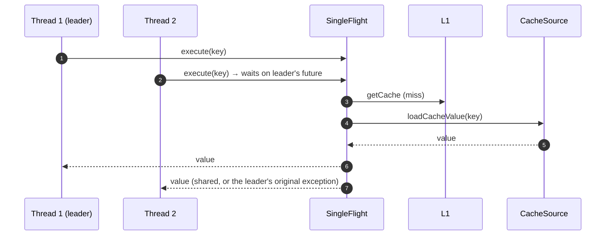
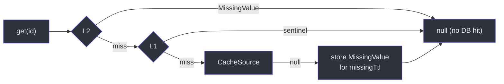

# 性能模式

## 防缓存击穿 -- SingleFlight

当大量线程同时未命中同一个 key 时，只有其中一个线程（**leader**）读取 L1 并回源，其余线程等待 leader 并共享它的结果。


```mermaid
sequenceDiagram
autonumber
    participant T1 as Thread 1 (leader)
    participant T2 as Thread 2
    participant SF as SingleFlight
    participant L1 as L1
    participant L0 as CacheSource

    T1->>SF: execute(key)
    T2->>SF: execute(key) → waits on leader's future
    SF->>L1: getCache (miss)
    SF->>L0: loadCacheValue(key)
    L0-->>SF: value
    SF-->>T1: value
    SF-->>T2: value (shared, or the leader's original exception)
```

| 特性 | 说明 |
|------|------|
| 粒度 | 精确到 key；无关的 key 永不互相阻塞（不同于分段锁） |
| 失败 | 等待者收到 leader 的**原始**异常 |
| 重入 | 同一线程重入同一 key 时快速失败，不会死锁 |
| 范围 | 单实例；跨实例的重复回源由 L1 吸收 |

由 `DefaultCoherentCacheSpec."concurrent misses load the source once"`（10 和 100 个线程）与 `SingleFlightTest` 验证。

## 防缓存穿透

### 负缓存

当 `CacheSource` 返回 `null` 时，CoCache 在 L1 和 L2 中写入 `MissingValue(now + missingTtl)`。在 `missingTtl`（默认 60 秒）到期或该 key 被淘汰之前，后续查询直接返回“不存在”，不访问数据库。


```mermaid
flowchart LR
    Q["get(id)"] --> L2{"L2"}
    L2 -->|"MissingValue"| N["null (no DB hit)"]
    L2 -->|miss| L1{"L1"}
    L1 -->|"sentinel"| N
    L1 -->|miss| DB["CacheSource"]
    DB -->|null| W["store MissingValue<br>for missingTtl"] --> N

    style Q fill:#2d333b,stroke:#6d5dfc,color:#e6edf3
    style L2 fill:#2d333b,stroke:#6d5dfc,color:#e6edf3
    style N fill:#2d333b,stroke:#6d5dfc,color:#e6edf3
    style L1 fill:#2d333b,stroke:#6d5dfc,color:#e6edf3
    style DB fill:#2d333b,stroke:#6d5dfc,color:#e6edf3
    style W fill:#2d333b,stroke:#6d5dfc,color:#e6edf3
```

`missingTtl` 独立于 `ttl`，并保持较短，因为它同时决定了新建数据最多多久不可见。

### BloomKeyFilter

key 空间被大量探测时，加一个 `KeyFilter`。被过滤器拒绝的 key 直接返回 `MissingValue`，不访问 L1 与数据源，也不写入：

```kotlin
val bloom = BloomFilter.create(Funnels.stringFunnel(UTF_8), 1_000_000, 0.01).apply { /* 放入已知 key */ }
CoherentCacheConfiguration(..., keyFilter = BloomKeyFilter(bloom))
```

## 防缓存雪崩 -- TTL 抖动

```
actualTtl = random(ttl - ttlAmplitude .. ttl + ttlAmplitude)，钳为 > 0
```

默认 `ttl = 3600`、`ttlAmplitude = 60`。同时写入的条目会分散在 2 分钟的窗口内到期，而不是在同一秒集中过期。

## 低成本命中路径

| 层级 | 成本 | 原因 |
|------|------|------|
| L2 命中 | 一次 Caffeine 查找 + `isExpired` 检查 | 有界 Caffeine；条目通过 `Expiry` 在自身 `ttlAt` 到期，过期条目被主动回收 |
| L1 命中 | 一次 Redis 往返 | 值与 TTL 在同一个 pipeline 中读取 |
| key 转换 | 编译后的 SpEL | `ExpKeyConverter` 使用 `SpelCompilerMode.MIXED` |
| 代理分派 | 对委托对象的反射调用 | 除参数数组外无额外分配 |
| 回源成功 | 不广播 | L1 为空时，其它实例不持有有效副本，无需发事件 |

时间取自 `System.currentTimeMillis()`，精度为秒。现代 JVM 上无需后台时钟线程。

## 模式总结

| 问题 | 模式 | 配置 |
|------|------|------|
| 击穿 | 按 key 的 `SingleFlight` | -- |
| 穿透 | `MissingValue` + 可选 `BloomKeyFilter` | `missingTtl`、`keyFilter` |
| 雪崩 | TTL 抖动 | `ttlAmplitude` |
| 内存无界 | 有界 L2 | `@CaffeineCache(maximumSize)` |
| 陈旧副本 | 有限 TTL、受戳保护的写回、重订阅时重置 | `ttl` |

## 相关页面

- [测试概览](./index.md)
- [缓存层级](../architecture/cache-layers.md)
- [配置](../guide/configuration.md)
