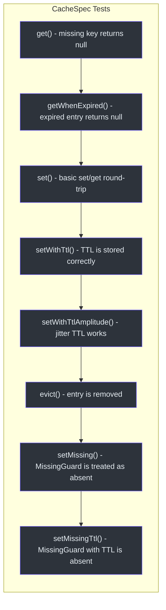
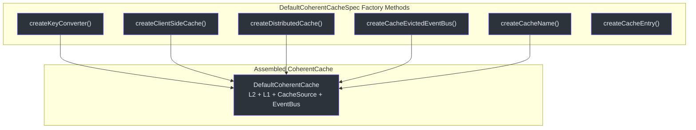
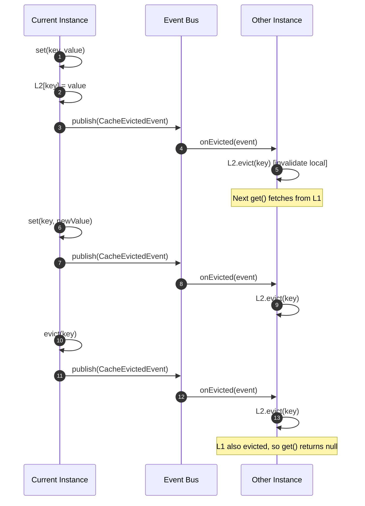
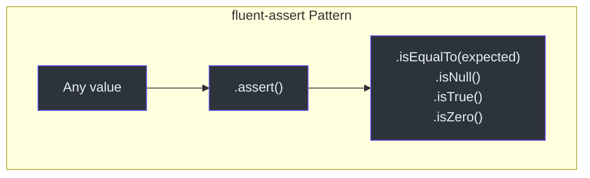
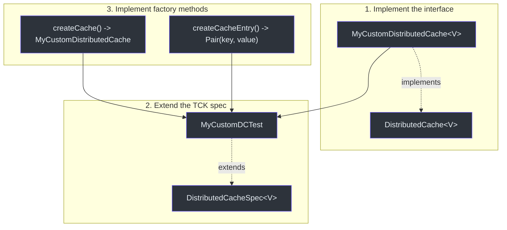

# 单元测试指南

CoCache 提供了抽象测试规范类（TCK）来验证缓存行为。本指南展示如何使用它们来测试自定义缓存实现。

## 配置测试依赖

将 `cocache-test` 模块添加为测试依赖：

```kotlin
// build.gradle.kts
dependencies {
    testImplementation("me.ahoo.cocache:cocache-test:4.2.0")
    testImplementation("me.ahoo.test:fluent-assert-core")
    testImplementation("io.mockk:mockk")
}
```

## 使用 CacheSpec（基础缓存测试）

要测试任何 `Cache<K, V>` 实现，继承 `CacheSpec` 并实现两个工厂方法：

```kotlin
class MyCacheTest : CacheSpec<String, String>() {
    override fun createCache(): Cache<String, String> {
        return MyCustomCache()
    }

    override fun createCacheEntry(): Pair<String, String> {
        return "test-key" to "test-value"
    }
}
```

这会自动运行 8 个测试，覆盖 get、set、evict、TTL 和缺失守卫行为。



源码参考：[cocache-test/.../CacheSpec.kt](https://github.com/Ahoo-Wang/CoCache/blob/main/cocache-test/src/main/kotlin/me/ahoo/cache/test/CacheSpec.kt)

## 测试 ClientSideCache（L2）

继承 `ClientSideCacheSpec<V>` 测试本地缓存实现。它在 `CacheSpec` 的基础上增加了 `clear()` 测试：

```kotlin
class MapClientSideCacheTest : ClientSideCacheSpec<String>() {
    override fun createCache(): ClientSideCache<String> {
        return MapClientSideCache()
    }

    override fun createCacheEntry(): Pair<String, String> {
        return "key-${UUID.randomUUID()}" to "value-${UUID.randomUUID()}"
    }
}
```

源码参考：[cocache-test/.../ClientSideCacheSpec.kt](https://github.com/Ahoo-Wang/CoCache/blob/main/cocache-test/src/main/kotlin/me/ahoo/cache/test/ClientSideCacheSpec.kt)

## 测试 DistributedCache（L1）

继承 `DistributedCacheSpec<V>` 测试分布式缓存实现：

```kotlin
class MockDistributedCacheTest : DistributedCacheSpec<String>() {
    override fun createCache(): DistributedCache<String> {
        return MockDistributedCache()
    }

    override fun createCacheEntry(): Pair<String, String> {
        return "dist-key-${UUID.randomUUID()}" to "dist-value-${UUID.randomUUID()}"
    }
}
```

源码参考：[cocache-test/.../DistributedCacheSpec.kt](https://github.com/Ahoo-Wang/CoCache/blob/main/cocache-test/src/main/kotlin/me/ahoo/cache/test/DistributedCacheSpec.kt)

## 测试 DefaultCoherentCache

继承 `DefaultCoherentCacheSpec<K, V>` 测试完整的一致性缓存。该规范需要为所有依赖项实现工厂方法：

```kotlin
class DefaultCoherentCacheTest : DefaultCoherentCacheSpec<String, String>() {
    override fun createKeyConverter(): KeyConverter<String> {
        return ToStringKeyConverter("test:")
    }

    override fun createClientSideCache(): ClientSideCache<String> {
        return MapClientSideCache()
    }

    override fun createDistributedCache(): DistributedCache<String> {
        return MockDistributedCache()
    }

    override fun createCacheEvictedEventBus(): CacheEvictedEventBus {
        return GuavaCacheEvictedEventBus()
    }

    override fun createCacheName(): String = "test-cache"

    override fun createCacheEntry(): Pair<String, String> {
        return "coherent-key" to "coherent-value"
    }
}
```



源码参考：[cocache-test/.../DefaultCoherentCacheSpec.kt](https://github.com/Ahoo-Wang/CoCache/blob/main/cocache-test/src/main/kotlin/me/ahoo/cache/test/DefaultCoherentCacheSpec.kt)

## 测试 CacheEvictedEventBus

继承 `CacheEvictedEventBusSpec` 测试事件总线实现：

```kotlin
class GuavaCacheEvictedEventBusTest : CacheEvictedEventBusSpec() {
    override fun createCacheEvictedEventBus(): CacheEvictedEventBus {
        return GuavaCacheEvictedEventBus()
    }
}
```

源码参考：[cocache-test/.../consistency/CacheEvictedEventBusSpec.kt](https://github.com/Ahoo-Wang/CoCache/blob/main/cocache-test/src/main/kotlin/me/ahoo/cache/test/consistency/CacheEvictedEventBusSpec.kt)

## 测试多实例同步

继承 `MultipleInstanceSyncSpec<K, V>` 验证两个缓存实例通过事件总线保持一致性：

```kotlin
class MultipleInstanceSyncTest : MultipleInstanceSyncSpec<String, String>() {
    override fun createKeyConverter(): KeyConverter<String> {
        return ToStringKeyConverter("sync:")
    }

    override fun createClientSideCache(): ClientSideCache<String> {
        return MapClientSideCache()
    }

    override fun createDistributedCache(): DistributedCache<String> {
        return MockDistributedCache()
    }

    override fun createCacheEvictedEventBus(): CacheEvictedEventBus {
        return GuavaCacheEvictedEventBus()
    }

    override fun createCacheName(): String = "sync-cache"

    override fun createCacheEntry(): Pair<String, String> {
        return "sync-key" to "sync-value"
    }
}
```



源码参考：[cocache-test/.../MultipleInstanceSyncSpec.kt](https://github.com/Ahoo-Wang/CoCache/blob/main/cocache-test/src/main/kotlin/me/ahoo/cache/test/MultipleInstanceSyncSpec.kt)

## Fluent Assert 模式

CoCache 使用 `fluent-assert` 库进行符合 Kotlin 习惯的断言。用法如下：

```kotlin
import me.ahoo.test.asserts.assert

// 替代 AssertJ 的 assertThat(value).isEqualTo(expected)：
value.assert().isEqualTo(expected)

// 空值检查：
value.assert().isNull()
value.assert().isNotNull()

// 布尔值：
result.assert().isTrue()

// 数值：
count.assert().isZero()
count.assert().isOne()
```

**重要**：始终使用 `import me.ahoo.test.asserts.assert` -- 不要使用 AssertJ 的 `assertThat()`。



## 使用 mockk

对于需要 Mock 依赖的测试：

```kotlin
import io.mockk.every
import io.mockk.mockk
import io.mockk.verify

// 创建 Mock CacheSource
val cacheSource = mockk<CacheSource<String, String>>()
every { cacheSource.loadCacheValue("key") } returns DefaultCacheValue.forever("value")

// 验证是否被调用
verify { cacheSource.loadCacheValue("key") }
```

## 使用 TCK 编写自定义缓存实现

当创建新的缓存实现时（例如，为不同的分布式存储），遵循以下模式：



## 测试运行命令

```bash
# 运行 cocache-core 的所有测试
./gradlew :cocache-core:test

# 运行单个测试类
./gradlew :cocache-core:test --tests "me.ahoo.cache.proxy.ProxyCacheTest"

# 运行特定模块的所有 TCK 测试
./gradlew :cocache-spring-redis:test
```

## 规范矩阵

| 规范 | 测试数量 | 适用对象 | 外部依赖 |
|------|----------|----------|----------|
| `CacheSpec<K, V>` | 8 | 任何 `Cache` 实现 | 无 |
| `ClientSideCacheSpec<V>` | 9（8 + clear） | 任何 `ClientSideCache` | 无 |
| `DistributedCacheSpec<V>` | 8 | 任何 `DistributedCache` | 无 |
| `DefaultCoherentCacheSpec<K, V>` | 12+（8 + 一致性 + 并发） | 完整的一致性缓存 | 所有子组件 |
| `MultipleInstanceSyncSpec<K, V>` | 1（综合性） | 多实例同步 | EventBus + DistributedCache |
| `CacheEvictedEventBusSpec` | 2 | 事件总线 | 无 |

## 相关页面

- [测试概览](./index.md) -- TCK 架构与规范详情
- [集成测试](./integration-testing.md) -- CI 中的 Redis 集成测试
- [性能模式](./performance-patterns.md) -- 并发测试详情
- [配置参考](../guide/configuration.md) -- 注解参数
