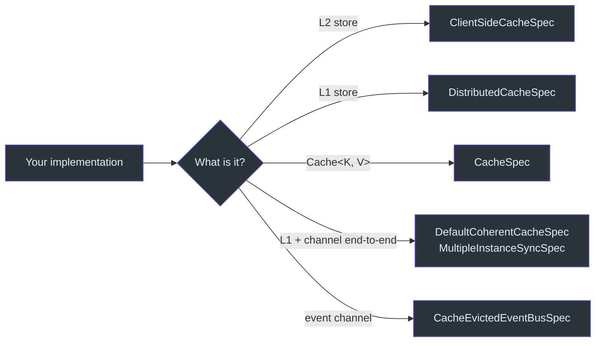
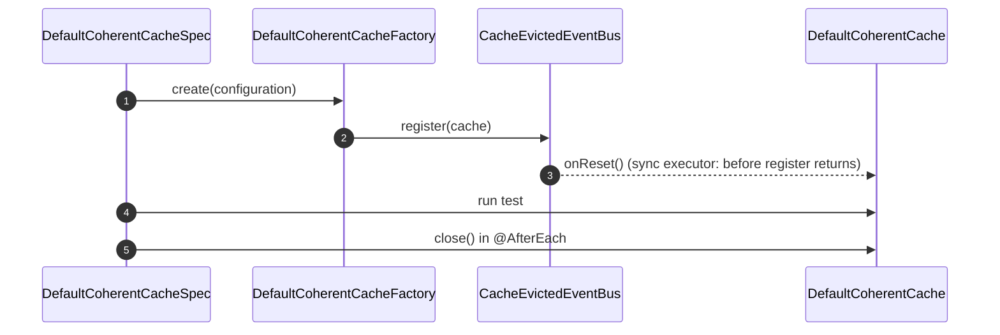

# 单元测试指南

## 配置测试依赖

```kotlin
dependencies {
    testImplementation("me.ahoo.cocache:cocache-test:5.0.0")
}
```

`cocache-test` 会带入 JUnit 5、fluent-assert 和 `cocache-core`。每个规格都是抽象 JUnit 类：继承它并实现工厂方法即可。


```mermaid
flowchart LR
    Impl["Your implementation"] --> Pick{"What is it?"}
    Pick -->|"L2 store"| CSC["ClientSideCacheSpec"]
    Pick -->|"L1 store"| DC["DistributedCacheSpec"]
    Pick -->|"Cache&lt;K, V&gt;"| C["CacheSpec"]
    Pick -->|"L1 + channel end-to-end"| CO["DefaultCoherentCacheSpec<br>MultipleInstanceSyncSpec"]
    Pick -->|"event channel"| EB["CacheEvictedEventBusSpec"]

    style Impl fill:#2d333b,stroke:#6d5dfc,color:#e6edf3
    style Pick fill:#2d333b,stroke:#6d5dfc,color:#e6edf3
    style CSC fill:#2d333b,stroke:#6d5dfc,color:#e6edf3
    style DC fill:#2d333b,stroke:#6d5dfc,color:#e6edf3
    style C fill:#2d333b,stroke:#6d5dfc,color:#e6edf3
    style CO fill:#2d333b,stroke:#6d5dfc,color:#e6edf3
    style EB fill:#2d333b,stroke:#6d5dfc,color:#e6edf3
```

## 测试存储（L2 / L1）

```kotlin
internal class CaffeineClientSideCacheTest : ClientSideCacheSpec<String>() {
    override fun createCacheStore(): ClientSideCache<String> = CaffeineClientSideCache.build()
    override fun createCacheEntry(): Pair<String, String> =
        UUID.randomUUID().toString() to UUID.randomUUID().toString()
}
```

对于从服务端过期时间重建 `ttlAt` 的存储（Redis），覆写 `open` 的 `setWithTtlAt` / `setMissingWithTtlAt`，允许 ±1 秒漂移：

```kotlin
@Test
override fun setWithTtlAt() {
    val (key, value) = createCacheEntry()
    val cacheValue = CacheValue.of(value, TtlAt.at(10))
    cacheStore.setCache(key, cacheValue)
    requireNotNull(cacheStore.getCache(key)).ttlAt.assert().isCloseTo(cacheValue.ttlAt, Offset.offset(1))
}
```

## 测试缓存

```kotlin
class ProxyCacheTest : CacheSpec<String, String>() {
    override fun createCache(): Cache<String, String> = createProxyCache<MockCache>()
    override fun createCacheEntry() = UUID.randomUUID().toString() to UUID.randomUUID().toString()
}
```

## 测试一致性

`DefaultCoherentCacheSpec` 用你提供的组件构建 `DefaultCoherentCache`。它的默认 `CacheSource` 由受保护的 `loader` 驱动，并用 `sourceCalls` 统计调用次数。

```kotlin
internal class RedisDefaultCoherentCacheTest : DefaultCoherentCacheSpec<String, String>() {
    private lateinit var redis: RedisTestSupport

    @BeforeEach
    override fun setup() { redis = RedisTestSupport(); super.setup() }

    @AfterEach
    override fun tearDown() { super.tearDown(); redis.close() }

    override fun createKeyConverter(): KeyConverter<String> = ToStringKeyConverter("coherent-test:")
    override fun createClientSideCache(): ClientSideCache<String> = MapClientSideCache()
    override fun createDistributedCache(): DistributedCache<String> =
        RedisDistributedCache(redis.redisTemplate, StringToStringCodecExecutor(redis.redisTemplate))
    override fun createCacheEvictedEventBus(): CacheEvictedEventBus = redis.newEventBus()
    override fun createCacheName(): String = "RedisDefaultCoherentCacheTest-" + UUID.randomUUID()
    override fun createCacheEntry() = UUID.randomUUID().toString() to UUID.randomUUID().toString()
}
```

> 覆写 JUnit 生命周期方法时必须重复标注 `@BeforeEach` / `@AfterEach`，否则 JUnit 不会执行该覆写方法。

异步通道会异步投递（重新）订阅时的 `onReset`，迟到的重置会在测试中途清空 L2。使用 Spring Data Redis 时，在测试中给 `RedisMessageListenerContainer` 配置 `SyncTaskExecutor`，这样 `register()` 返回时重置已经执行完。


```mermaid
sequenceDiagram
autonumber
    participant Spec as DefaultCoherentCacheSpec
    participant F as DefaultCoherentCacheFactory
    participant Bus as CacheEvictedEventBus
    participant C as DefaultCoherentCache

    Spec->>F: create(configuration)
    F->>Bus: register(cache)
    Bus-->>C: onReset() (sync executor: before register returns)
    Spec->>C: run test
    Spec->>C: close() in @AfterEach
```

## 测试事件通道

```kotlin
class LocalCacheEvictedEventBusTest : CacheEvictedEventBusSpec() {
    override fun createCacheEvictedEventBus(): CacheEvictedEventBus = LocalCacheEvictedEventBus()
}
```

## Fluent Assert 与 mockk

```kotlin
import me.ahoo.test.asserts.assert

cache[key].assert().isEqualTo(value)
requireNotNull(cache.getCache(key)).isMissing.assert().isTrue()
runCatching { cache[key] }.exceptionOrNull().assert().isSameAs(failure)
```

- 禁止使用 AssertJ `assertThat()`；`Offset.offset(n)` 作为参数可以使用。
- `assert()` 接受可空接收者。优先用 `requireNotNull(...)`，而不是 `!!`。
- 每个模块的测试 classpath 都有 mockk，例如 `mockk<DistributedCache<String>>(relaxUnitFun = true)`。

## 测试命令

```bash
./gradlew :cocache-core:test
./gradlew :cocache-core:test --tests "me.ahoo.cache.consistency.DefaultCoherentCacheTest"
./gradlew :cocache-spring-redis:test   # 需要 localhost:6379 的 Redis
```

## 相关页面

- [测试概览](./index.md)
- [集成测试](./integration-testing.md)
